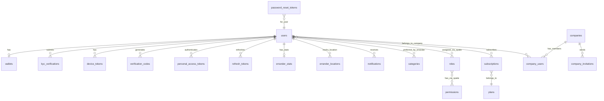
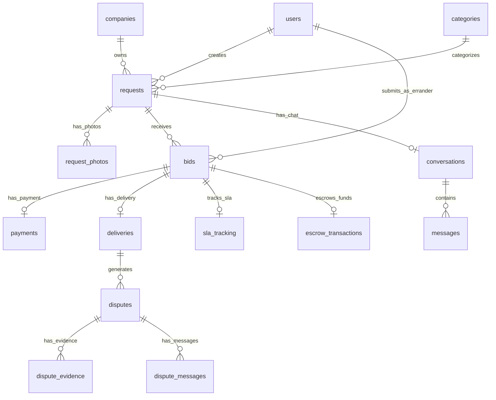
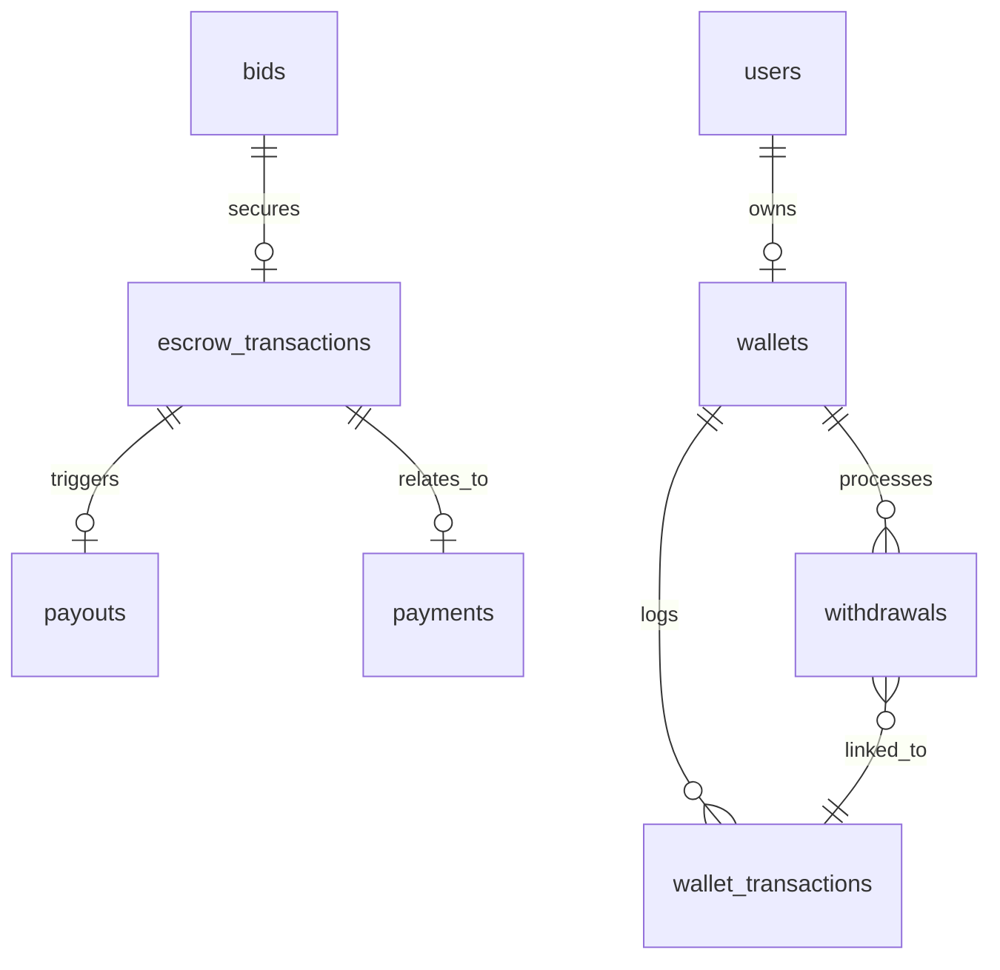
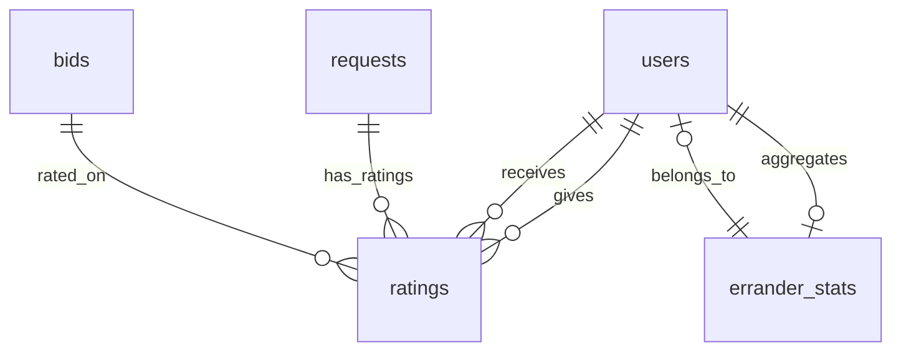

# Errand Boy v2.0 — Architecture & Implementation Plan

> **Lead Architect Review — June 2026**
> **Status:** Awaiting stakeholder approval before Phase 1 code generation.

---

## 1. Specification Gap Analysis

### 1.1 Critical Issues Found

| # | Issue | Severity | Recommendation |
|---|---|---|---|
| G1 | **No `roles` table migration.** Spatie requires a `roles` table. The schema defines only the `users` table with a `role` column — this cannot support multi-role users or company_admin/company_member scoping. | Critical | Add full Spatie migrations: `roles`, `permissions`, `model_has_roles`, `model_has_permissions`, `role_has_permissions` |
| G2 | **`device_tokens` table missing.** `fcm_token` is stored on the `users` table as a single column — a user with multiple devices (phone + tablet) will lose push notifications on one. | High | Create a `device_tokens` table: `id, user_id, token, device_type, device_name, last_used_at, created_at`. Support multiple tokens per user. |
| G3 | **No `refresh_tokens` table.** Sanctum's `personal_access_tokens` table handles API tokens, but there is no refresh token mechanism defined. The spec mentions `/auth/refresh` endpoint but no storage or rotation strategy. | High | Implement refresh token rotation: `refresh_tokens` table with `id, access_token_id, token, expires_at, revoked_at`. |
| G4 | **`company_invitations` table missing.** The API references `POST /invitations/{token}/accept` but no invitations table exists in the schema. | Critical | Add `company_invitations`: `id, company_id, email, role, department, token, expires_at, accepted_at, created_at`. |
| G5 | **`password_reset_tokens` table not in schema.** The spec defines forgot/reset password endpoints but the schema omits the password reset token table (Laravel's default `password_reset_tokens`). | High | Add Laravel's default `password_reset_tokens` table. |
| G6 | **`email_verification_tokens` / OTP storage missing.** Tier 0 KYC requires email and phone OTP verification but there is no table for OTP storage. The spec also mentions phone OTP via Termii. | Medium | Create `verification_codes` table: `id, user_id, type (email|phone|password_reset), code, expires_at, used_at`. |
| G7 | **No `category_errander` pivot table.** The matching engine references "filter by category preferences" and `erranders->categories->contains()`, but there is no table linking erranders to their preferred categories. | Medium | Add `category_errander` pivot: `errander_id, category_id`. |
| G8 | **Missing `banned` user status handling.** The `users.status` CHECK constraint allows `banned` but there is no `banned_at` or `ban_reason` column (mentioned in admin stories but missing from the DDL). Actually, checking again, the DDL does have `banned_at` and `ban_reason`. OK — this is fine. | — | No action. |
| G9 | **`sessions` table missing for session management.** The spec references `GET /auth/sessions` and `DELETE /auth/sessions/{id}`. Sanctum API tokens are stateless — for session listing per device, we need a sessions table or use `personal_access_tokens` with device metadata. | Medium | Extend `personal_access_tokens` with `device_name`, `device_type`, `ip_address`, `last_used_at`; use this for session listing. |
| G10 | **Payment idempotency key missing from API.** The `POST /payments/initiate` endpoint has no idempotency key in the request — a double-click could create duplicate payments. | High | Add `idempotency_key` header requirement for all payment initiation endpoints. |

### 1.2 Design Improvements

| # | Area | Current State | Proposed Improvement |
|---|---|---|---|
| I1 | **Domain Events** | Events are plain Laravel events | Add a `StoredEvent` table for event sourcing. Allows replay, audit, and debugging. Critical for wallet transactions where every state change must be traceable. |
| I2 | **API Versioning** | No versioning strategy defined | Add `Accept: application/vnd.errandboy.v2+json` header-based versioning. URL path versioning (`/v1/`) is already in the base URL — formalize this. |
| I3 | **Idempotency** | Only payment webhooks have provider_ref dedup | Add idempotency key middleware for all mutating endpoints: `Idempotency-Key` header, stored in Redis with 24h TTL, returns cached response for duplicate keys. |
| I4 | **Soft Deletes** | Inconsistently applied | Standardize: All user-generated content (requests, bids, companies, ratings) should use soft deletes. System tables (transactions, audit logs, notifications) should not. |
| I5 | **Money Handling** | DECIMAL(15,2) used throughout | Add a Value Object for Money (using `moneyphp/money`). Avoids floating-point issues, handles currency conversion for future multi-currency. |
| I6 | **Enum Consistency** | Mix of VARCHAR CHECK constraints and potential PHP enums | Use PHP 8.4 native enums (Backed Enums) for all status fields. Store as strings in DB but validate/enforce at the application layer. |
| I7 | **Pagination Consistency** | Cursor-based for chat, offset-based for everything else | Standardize: Use cursor-based pagination for all real-time/large datasets (requests feed, notifications). Use offset-based for admin tables and small datasets. |
| I8 | **API Rate Limiting Headers** | Not documented | Add `X-RateLimit-Limit`, `X-RateLimit-Remaining`, `X-RateLimit-Reset`, `Retry-After` headers to all responses. |
| I9 | **Health Check Endpoint** | Referenced in ECS task definition but not in API spec | Add `GET /health` (public) and `GET /health/detailed` (admin-only with DB, Redis, S3, Reverb connectivity checks). |
| I10 | **Bulk Operations** | None defined | Add bulk endpoints for admin operations: `POST /admin/users/bulk-suspend`, `POST /admin/disputes/bulk-assign`. |

### 1.3 Missing Features for Production

| # | Feature | Priority |
|---|---|---|
| M1 | **Rate limit headers on all responses** | P0 |
| M2 | **Correlation ID propagation** (`X-Correlation-ID` header) across all services | P0 |
| M3 | **Circuit breaker for external services** (Flutterwave, Paystack, Termii, FCM) | P0 |
| M4 | **Feature flags** using a dedicated service (LaunchDarkly or Laravel Pennant) | P1 |
| M5 | **GDPR/NDPR** data export and deletion automation | P1 |
| M6 | **API changelog** and deprecation notice headers (`Sunset`, `Deprecation`) | P1 |
| M7 | **Webhook signing secret rotation** automation | P2 |
| M8 | **Database migration testing** (test all migrations rollback cleanly) | P1 |
| M9 | **Load testing baseline** (k6 scripts in the repo) | P1 |
| M10 | **SLA monitoring dashboard** for internal platform health (separate from business SLA) | P2 |

---

## 2. System Architecture

### 2.1 High-Level Architecture (C4 Context)

```
┌─────────────────────────────────────────────────────────────────────┐
│                          Errand Boy Platform                         │
│                                                                      │
│  ┌──────────┐  ┌──────────┐  ┌──────────┐  ┌──────────────────────┐ │
│  │ Next.js   │  │ iOS App  │  │ Android  │  │ Admin Dashboard      │ │
│  │ Web App   │  │ SwiftUI  │  │ Kotlin   │  │ Next.js /admin       │ │
│  └────┬─────┘  └────┬─────┘  └────┬─────┘  └──────────┬───────────┘ │
│       │             │             │                    │             │
│       └─────────────┴──────┬──────┴────────────────────┘             │
│                            │                                        │
│                   ┌────────▼────────┐                               │
│                   │   CloudFront CDN │                               │
│                   └────────┬────────┘                               │
│                            │                                        │
│                   ┌────────▼────────┐                               │
│                   │  AWS WAF + ALB   │                               │
│                   └────────┬────────┘                               │
│                            │                                        │
│              ┌─────────────┼─────────────┐                          │
│              │             │             │                          │
│     ┌────────▼───┐  ┌──────▼──────┐  ┌──▼──────────┐               │
│     │ Laravel API │  │   Reverb    │  │  Next.js SSR │               │
│     │  (ECS x3)   │  │  (ECS x2)   │  │  (ECS x2)    │               │
│     └──────┬──────┘  └──────┬──────┘  └─────────────┘               │
│            │                │                                        │
│     ┌──────┴──────┐  ┌──────▼──────┐                               │
│     │  PostgreSQL  │  │    Redis    │                               │
│     │  RDS MultiAZ │  │ ElastiCache │                               │
│     └─────────────┘  └─────────────┘                               │
│                                                                      │
└─────────────────────────────────────────────────────────────────────┘

External Services:
┌──────────┐ ┌──────────┐ ┌──────────┐ ┌──────────┐ ┌──────────┐
│Flutterwave│ │ Paystack  │ │   FCM    │ │  Termii  │ │  AWS S3  │
└──────────┘ └──────────┘ └──────────┘ └──────────┘ └──────────┘
```

### 2.2 Domain Boundary Map

```
┌──────────────────────────────────────────────────────────────────┐
│                     Errand Boy Domain                             │
│                                                                   │
│  ┌─────────────┐  ┌─────────────┐  ┌──────────────────────────┐  │
│  │   Identity   │  │ Marketplace │  │     Financial Core       │  │
│  │   Domain     │  │   Domain    │  │        Domain            │  │
│  │              │  │              │  │                          │  │
│  │ • Auth       │  │ • Requests   │  │ • Wallet                 │  │
│  │ • KYC        │  │ • Bids       │  │ • Escrow                 │  │
│  │ • Profiles   │  │ • Matching   │  │ • Payments               │  │
│  │ • Roles      │  │ • SLA        │  │ • Payouts                │  │
│  │ • Companies  │  │ • Delivery   │  │ • Withdrawals            │  │
│  │ • Subscriptions│ │ • Urgent    │  │ • Subscriptions Billing  │  │
│  └──────┬──────┘  └──────┬──────┘  └────────────┬─────────────┘  │
│         │                │                       │                │
│  ┌──────┴──────┐  ┌──────┴──────┐  ┌─────────────┴─────────────┐ │
│  │  Trust &     │  │ Communication│  │    Admin & Operations    │ │
│  │  Reputation  │  │   Domain    │  │         Domain           │ │
│  │              │  │              │  │                          │ │
│  │ • Ratings    │  │ • Chat       │  │ • Dispute Resolution     │ │
│  │ • Reviews    │  │ • Notifications│ │ • Analytics             │ │
│  │ • Trust Score│  │ • FCM        │  │ • Audit Log             │ │
│  │ • Stats      │  │ • Reverb     │  │ • Fraud Detection       │ │
│  └─────────────┘  └─────────────┘  │ • Settings               │ │
│                                     └──────────────────────────┘ │
└──────────────────────────────────────────────────────────────────┘

Cross-Cutting Concerns:
┌──────────┐ ┌──────────┐ ┌──────────┐ ┌──────────┐ ┌──────────┐
│  Logging  │ │  Metrics │ │  Tracing │ │  Rate    │ │ Idempot- │
│ (CloudWatch)│ (Prometheus)│  (X-Ray) │ │ Limiting │ │  ency    │
└──────────┘ └──────────┘ └──────────┘ └──────────┘ └──────────┘
```

### 2.3 Request Flow (Inbound)

```
Client Request
    │
    ▼
┌─────────────────┐
│  CloudFront CDN  │── Cache Hit ──► Response
└────────┬────────┘
         │ Cache Miss
         ▼
┌─────────────────┐
│   AWS WAF        │── DDoS/SQLi/XSS check; Block if malicious
└────────┬────────┘
         ▼
┌─────────────────┐
│      ALB         │── TLS termination; Health check routing
└────────┬────────┘
         ▼
┌─────────────────┐
│  Laravel API     │
│                  │
│  1. CORS Middleware
│  2. Trust Proxies
│  3. Rate Limiter  │── 429 if exceeded
│  4. Auth:Sanctum  │── 401 if no token
│  5. Spatie RBAC   │── 403 if no role/permission
│  6. Feature Gate  │── 403 if not in plan
│  7. Idempotency   │── 200 cached if duplicate key
│  8. Form Request  │── 422 if validation fails
│  9. Controller    │
│ 10. Service Layer │── Business logic
│ 11. Model/Repo    │── Data access
│ 12. Event Dispatch│── Async side effects
│ 13. Response      │── JSON envelope
└───────────────────┘
```

---

## 3. Database Entity Relationship Diagram

### 3.1 Core Identity & Access



### 3.2 Marketplace Core



### 3.3 Financial Core



### 3.4 Trust & Reputation



### 3.5 Complete Entity List (39 Tables + 3 Spatie Tables + 3 Queue Tables)

```
IDENTITY:        users, roles, permissions, model_has_roles, model_has_permissions,
                 role_has_permissions, password_reset_tokens, verification_codes,
                 device_tokens, personal_access_tokens, refresh_tokens

KYC:             kyc_verifications

LOCATION:        errander_locations

MARKETPLACE:     categories, category_errander, requests, request_photos, bids

FINANCIAL:       wallets, wallet_transactions, escrow_transactions, payments,
                 payouts, withdrawals

DELIVERY:        deliveries, sla_tracking, disputes, dispute_evidence,
                 dispute_messages

COMMUNICATION:   conversations, messages, notifications

TRUST:           ratings, errander_stats

BUSINESS:        companies, company_users, company_invitations

SUBSCRIPTIONS:   plans, subscriptions

SYSTEM:          audit_logs, settings

QUEUE:           jobs, failed_jobs, job_batches
```

---

## 4. Module Breakdown & Dependency Map

### 4.1 Module Dependency Graph

```
                ┌─────────────────────────┐
                │     Module 0: Auth       │ ◄── No dependencies
                │  (Register, Login, JWT)  │
                └────────────┬────────────┘
                             │
                ┌────────────▼────────────┐
                │   Module 1: Profiles     │ ◄── Depends on: Auth
                │  (User CRUD, Avatars)    │
                └────────────┬────────────┘
                             │
        ┌────────────────────┼────────────────────┐
        │                    │                    │
┌───────▼──────┐  ┌──────────▼─────────┐  ┌───────▼──────┐
│ Module 2:     │  │ Module 4:          │  │ Module 5:    │
│ Categories &  │  │ Wallet & Escrow    │  │ KYC &        │
│ Requests      │  │                   │  │ Verification │
│               │  │ Depends: Auth      │  │              │
│ Depends:      │  │                    │  │ Depends:     │
│ Auth, Profiles│  │                    │  │ Auth         │
└───────┬──────┘  └──────────┬─────────┘  └──────────────┘
        │                    │
┌───────▼──────┐    ┌────────▼─────────┐
│ Module 3:     │    │ Module 6:        │
│ Bids          │    │ Payments         │
│               │    │                  │
│ Depends:      │    │ Depends: Wallet, │
│ Requests      │    │ Bids, Flutterwave│
└───────┬──────┘    └────────┬─────────┘
        │                    │
        └────────┬───────────┘
                 │
        ┌────────▼─────────┐
        │ Module 7:         │
        │ Delivery & OTP    │
        │                   │
        │ Depends: Bids,    │
        │ Payments, Redis   │
        └────────┬─────────┘
                 │
    ┌────────────┼────────────┐
    │            │            │
┌───▼───┐  ┌─────▼──────┐  ┌─▼──────────┐
│Mod 8: │  │ Module 9:  │  │ Module 10:  │
│Chat   │  │ Disputes   │  │ Trust &     │
│       │  │            │  │ Reputation  │
│Dep:   │  │ Dep:       │  │             │
│Bids,  │  │ Delivery,  │  │ Dep:        │
│Reverb │  │ Escrow     │  │ Delivery    │
└───────┘  └─────┬──────┘  └─────────────┘
                 │
        ┌────────▼─────────┐
        │ Module 11:        │
        │ Admin APIs        │
        │                   │
        │ Depends: All      │
        │ modules           │
        └──────────────────┘
        
        Standalone Modules (can be built anytime after Auth):
        
        ┌──────────────────┐  ┌──────────────────┐
        │ Module 12:        │  │ Module 13:        │
        │ Business Accounts │  │ Subscriptions     │
        │                   │  │                   │
        │ Dep: Auth,        │  │ Dep: Auth,        │
        │ Requests          │  │ Payments          │
        └──────────────────┘  └──────────────────┘
```

### 4.2 Build Order (Topological Sort)

```
Phase 0:  Project Scaffolding (Laravel + Next.js setup, Docker, CI/CD)
Phase 1:  Auth & Authorization (Users, Roles, Permissions, Sanctum)        [No deps]
Phase 2:  User Profiles (Profile CRUD, Avatars)                            [Auth]
Phase 3:  Request Management (Categories, Requests, Photos, Geo)            [Auth, Profiles]
Phase 4:  Bid Management (Bids, Notifications)                             [Requests]
Phase 5:  Wallet & Escrow (Wallets, Transactions, Escrow)                  [Auth]
Phase 6:  Payments (Flutterwave, Paystack, Webhooks)                       [Bids, Wallet]
Phase 7:  Delivery & OTP (OTP, Delivery tracking)                          [Bids, Payments]
Phase 8:  Realtime Chat (Conversations, Messages, Reverb)                  [Bids]
Phase 9:  Dispute Management (Disputes, Evidence, Resolution)              [Delivery, Escrow]
Phase 10: Trust & Reputation (Ratings, Reviews, Trust Scores)              [Delivery]
Phase 11: Business Accounts (Companies, Teams, Invitations)                [Auth, Requests]
Phase 12: Subscriptions (Plans, Billing, Feature Gating)                   [Auth, Payments]
Phase 13: Admin Portal (All admin APIs, Analytics, Audit)                  [All modules]
Phase 14: Optimization (Caching, Query tuning, Security hardening)         [All modules]
```

### 4.3 Module Weight & Complexity

| Phase | Module | Est. Tables | Est. Endpoints | Est. Services | Est. Events | Complexity |
|---|---|---|---|---|---|---|
| 1 | Auth & Authorization | 8 | 12 | 3 | 2 | Medium |
| 2 | User Profiles | 0 (+existing) | 5 | 1 | 0 | Low |
| 3 | Request Management | 3 | 6 | 3 | 2 | High |
| 4 | Bid Management | 1 | 5 | 2 | 2 | Medium |
| 5 | Wallet & Escrow | 4 | 4 | 4 | 2 | High |
| 6 | Payments | 1 (+existing) | 5 | 4 | 1 | High |
| 7 | Delivery & OTP | 2 | 3 | 1 | 1 | Medium |
| 8 | Realtime Chat | 2 | 5 | 1 | 2 | Medium |
| 9 | Dispute Management | 3 | 5 | 1 | 2 | Medium |
| 10 | Trust & Reputation | 1 | 3 | 1 | 0 | Low |
| 11 | Business Accounts | 2 | 8 | 2 | 1 | Medium |
| 12 | Subscriptions | 2 | 5 | 2 | 0 | Medium |
| 13 | Admin Portal | 0 | 25+ | 3 | 1 | High |
| 14 | Optimization | 0 | 0 | 0 | 0 | High |

---

## 5. API Dependency Map

### 5.1 Endpoint Cross-Reference by Module

```
/auth/*              → Auth Module (Phase 1)
/me, /me/*           → Profile Module (Phase 2)
/users/{id}/*        → Profile Module (Phase 2) [public]
/categories          → Request Module (Phase 3) [public]
/requests, /my/requests → Request Module (Phase 3)
/bids, /my/bids      → Bid Module (Phase 4)
/wallet, /wallet/*   → Wallet Module (Phase 5)
/payments, /payments/* → Payment Module (Phase 6)
/deliveries/*        → Delivery Module (Phase 7)
/conversations/*     → Chat Module (Phase 8)
/disputes, /my/disputes → Dispute Module (Phase 9)
/ratings             → Trust Module (Phase 10)
/erranders/{id}/*    → Trust Module (Phase 10) [public]
/companies, /companies/* → Business Module (Phase 11)
/plans, /subscriptions → Subscription Module (Phase 12)
/admin/*             → Admin Module (Phase 13)
/kyc, /kyc/*         → KYC (spans Phases 1-3 depending on tier)
/sla/*               → SLA Tracking (Phase 7)
/notifications       → Notifications (Phase 4+)
```

### 5.2 Critical API Paths (End-to-End Flows)

**Happy Path — Full Request Lifecycle:**
```
POST   /auth/register          (Phase 1)
POST   /auth/verify-email      (Phase 1)
POST   /auth/verify-phone      (Phase 1)
POST   /kyc/verify/tier-1      (KYC)
POST   /requests               (Phase 3) → Triggers new_request event
POST   /requests/{id}/bids     (Phase 4) → Triggers bid_received event
POST   /bids/{id}/accept       (Phase 4) → Triggers bid_accepted event
POST   /payments/initiate      (Phase 6)
POST   /payments/webhook/flw   (Phase 6) → Triggers payment_confirmed event
POST   /deliveries/{id}/generate-otp (Phase 7) → Triggers otp_generated event
POST   /deliveries/{id}/confirm      (Phase 7) → Triggers delivery_confirmed event
POST   /ratings                (Phase 10)
       (dispute window closes) → Payout auto-released (Phase 5)
POST   /wallet/withdraw        (Phase 5)
```

---

## 6. Phase 1 Implementation Plan: Authentication & Authorization

### 6.1 Scope

Build the complete identity foundation: user registration, authentication, role-based access control, email/phone verification, password reset, session management, and device token management.

### 6.2 Deliverables Checklist

| # | Deliverable | Type | Description |
|---|---|---|---|
| 1 | `users` migration | Migration | UUID PK, name, email, phone, password, role, status, kyc_tier, avatar, timestamps |
| 2 | Spatie permissions migrations | Migration | roles, permissions, model_has_roles, model_has_permissions, role_has_permissions |
| 3 | `password_reset_tokens` migration | Migration | email, token, created_at |
| 4 | `verification_codes` migration | Migration | user_id, type, code, expires_at, used_at |
| 5 | `device_tokens` migration | Migration | user_id, token, device_type, device_name, last_used_at |
| 6 | `personal_access_tokens` migration | Migration | Sanctum default + device_name, device_type, ip_address |
| 7 | `refresh_tokens` migration | Migration | access_token_id, token, expires_at, revoked_at |
| 8 | `audit_logs` migration | Migration | user_id, action, model_type, model_id, old_values, new_values, ip, user_agent |
| 9 | `User` model | Model | UUID trait, HasRoles, HasApiTokens, relationships, casts |
| 10 | `VerificationCode` model | Model | UUID, belongsTo User |
| 11 | `DeviceToken` model | Model | UUID, belongsTo User |
| 12 | `RefreshToken` model | Model | UUID, belongsTo access token |
| 13 | `AuthController` | Controller | register, login, logout, refresh, me |
| 14 | `PasswordResetController` | Controller | forgot, reset |
| 15 | `EmailVerificationController` | Controller | send, verify |
| 16 | `PhoneVerificationController` | Controller | send, verify |
| 17 | `TwoFactorController` | Controller | enable, disable, verify |
| 18 | `SessionController` | Controller | index, destroy |
| 19 | `RegisterRequest` | FormRequest | name, email, phone, password, password_confirmation, role |
| 20 | `LoginRequest` | FormRequest | email/phone, password, device_name |
| 21 | `ForgotPasswordRequest` | FormRequest | email |
| 22 | `ResetPasswordRequest` | FormRequest | token, email, password, password_confirmation |
| 23 | `VerifyEmailRequest` | FormRequest | code |
| 24 | `VerifyPhoneRequest` | FormRequest | code |
| 25 | `AuthService` | Service | register, login, logout, refresh, sendVerificationCode, verifyCode |
| 26 | `UserPolicy` | Policy | viewAny, view, update, delete |
| 27 | `RoleAndPermissionSeeder` | Seeder | Create roles, assign permissions |
| 28 | `AdminUserSeeder` | Seeder | Create super_admin user |
| 29 | `api.php` routes | Routes | All auth routes with middleware |
| 30 | `AuthTest` | Feature Test | Registration, login, logout, token refresh |
| 31 | `PasswordResetTest` | Feature Test | Forgot flow, reset flow |
| 32 | `EmailVerificationTest` | Feature Test | Send code, verify code, expiry |
| 33 | `PhoneVerificationTest` | Feature Test | Send code, verify code, expiry |
| 34 | `RoleAuthorizationTest` | Feature Test | RBAC enforcement on protected routes |

### 6.3 Design Decisions

**Decision 1: UUIDs via Trait, Not Package**

Use a custom `HasUuid` trait rather than a third-party package. This avoids dependency lock-in and gives us full control.

```php
// App\Concerns\HasUuid.php
trait HasUuid
{
    protected static function bootHasUuid(): void
    {
        static::creating(function (Model $model) {
            if (empty($model->{$model->getKeyName()})) {
                $model->{$model->getKeyName()} = (string) Str::orderedUuid();
            }
        });
    }
    
    public function getIncrementing(): bool
    {
        return false;
    }
    
    public function getKeyType(): string
    {
        return 'string';
    }
}
```

**Decision 2: Phone Authentication Support**

Both email AND phone can be used for login. Phone is critical in the Nigerian market where many users are mobile-first. The `LoginRequest` accepts either `email` or `phone`:

```php
public function authenticate(): User
{
    $field = filter_var($this->input('login'), FILTER_VALIDATE_EMAIL) ? 'email' : 'phone';
    
    if (!Auth::attempt([$field => $this->input('login'), 'password' => $this->input('password')])) {
        throw ValidationException::withMessages([
            'login' => ['The provided credentials are incorrect.'],
        ]);
    }
    
    return Auth::user();
}
```

**Decision 3: OTP-Based Verification, Not Link-Based**

Email and phone verification use 6-digit OTP codes stored in Redis (with DB fallback), not signed URLs. Rationale: mobile-first users on slow connections find OTP entry faster than clicking email links that open a browser.

**Decision 4: Refresh Token Rotation**

Implement refresh token rotation: each refresh invalidates the previous refresh token and issues a new pair (access + refresh). This limits the window of token theft. The `RefreshToken` model tracks token families — if a revoked refresh token is reused, the entire family is revoked (indicating token theft).

**Decision 5: Spatie Roles, Not a Single `role` Column**

The spec's `users.role` column is replaced with Spatie's `model_has_roles` pivot. This allows:
- Users to have multiple roles (e.g., `requester` + `company_admin`)
- Dynamic role creation without migration
- Permission grouping and inheritance
- Team/company-scoped roles in the future

**Decision 6: `verification_codes` over Redis-Only**

Verification codes are stored in both Redis (for fast TTL-based expiration) and PostgreSQL (for audit trail). Redis is the primary check; DB is the fallback and audit record.

### 6.4 Database Migrations (Phase 1)

```sql
-- Migration order:
-- 0001_create_users_table
-- 0002_create_permission_tables (Spatie)
-- 0003_create_password_reset_tokens_table
-- 0004_create_verification_codes_table
-- 0005_create_device_tokens_table
-- 0006_create_personal_access_tokens_table (Sanctum)
-- 0007_create_refresh_tokens_table
-- 0008_create_audit_logs_table
```

### 6.5 API Routes (Phase 1)

```php
// routes/api.php — Phase 1

use App\Http\Controllers\Auth\{
    AuthController,
    PasswordResetController,
    EmailVerificationController,
    PhoneVerificationController,
    TwoFactorController,
    SessionController
};

// Public
Route::post('/auth/register', [AuthController::class, 'register']);
Route::post('/auth/login', [AuthController::class, 'login']);
Route::post('/auth/forgot-password', [PasswordResetController::class, 'forgot']);
Route::post('/auth/reset-password', [PasswordResetController::class, 'reset']);
Route::post('/auth/verify-email', [EmailVerificationController::class, 'verify']);

// Authenticated
Route::middleware('auth:sanctum')->group(function () {
    Route::post('/auth/logout', [AuthController::class, 'logout']);
    Route::post('/auth/refresh', [AuthController::class, 'refresh']);
    Route::get('/me', [AuthController::class, 'me']);
    
    Route::post('/auth/verify-email/send', [EmailVerificationController::class, 'send']);
    Route::post('/auth/verify-phone/send', [PhoneVerificationController::class, 'send']);
    Route::post('/auth/verify-phone', [PhoneVerificationController::class, 'verify']);
    
    Route::post('/auth/enable-2fa', [TwoFactorController::class, 'enable']);
    Route::post('/auth/disable-2fa', [TwoFactorController::class, 'disable']);
    
    Route::get('/auth/sessions', [SessionController::class, 'index']);
    Route::delete('/auth/sessions/{id}', [SessionController::class, 'destroy']);
});
```

### 6.6 Spatie Permissions (Phase 1 Seed)

```php
// database/seeders/RoleAndPermissionSeeder.php

$roles = [
    'requester' => [
        'request.create', 'request.read', 'request.update', 'request.delete',
        'bid.read',
        'payment.initiate', 'payment.read',
        'delivery.confirm', 'delivery.read',
        'dispute.create', 'dispute.read',
        'wallet.fund', 'wallet.read',
        'chat.send', 'chat.read',
        'kyc.submit', 'kyc.read',
        'rating.create', 'rating.read',
        'subscription.manage',
    ],
    'errander' => [
        'request.read',
        'bid.create', 'bid.read', 'bid.delete',
        'delivery.generate_otp', 'delivery.read',
        'dispute.read', 'dispute.respond',
        'wallet.withdraw', 'wallet.read',
        'chat.send', 'chat.read',
        'kyc.submit', 'kyc.read',
        'rating.create', 'rating.read',
    ],
    'company_admin' => [
        'request.create', 'request.read',
        'bid.read',
        'payment.initiate', 'payment.read',
        'delivery.confirm', 'delivery.read',
        'business.manage', 'business.invite',
        'analytics.view',
    ],
    'company_member' => [
        'request.create', 'request.read',
        'bid.read',
        'payment.initiate', 'payment.read',
        'delivery.confirm', 'delivery.read',
    ],
    'admin' => [
        // All permissions except destructive
    ],
    'super_admin' => [
        // All permissions including destructive
    ],
];
```

### 6.7 Phase 1 Test Plan

```php
// tests/Feature/Auth/AuthTest.php

/** @test */
public function user_can_register_as_requester()
{
    $response = $this->postJson('/api/v1/auth/register', [
        'name' => 'Adeola Abolarin',
        'email' => 'adeola@example.com',
        'phone' => '+2348012345678',
        'password' => 'Password1!',
        'password_confirmation' => 'Password1!',
        'role' => 'requester',
    ]);
    
    $response->assertCreated()
        ->assertJsonStructure(['success', 'data' => ['user', 'token']])
        ->assertJsonPath('data.user.role', 'requester');
    
    $this->assertDatabaseHas('users', ['email' => 'adeola@example.com']);
    $this->assertTrue(
        User::where('email', 'adeola@example.com')->first()->hasRole('requester')
    );
}

/** @test */
public function user_can_login_with_email()
{ /* ... */ }

/** @test */
public function user_can_login_with_phone()
{ /* ... */ }

/** @test */
public function login_fails_with_wrong_password()
{ /* ... */ }

/** @test */
public function token_is_revoked_on_logout()
{ /* ... */ }

/** @test */
public function refresh_token_rotates_correctly()
{ /* ... */ }

/** @test */
public function reused_refresh_token_revokes_family()
{ /* ... */ }

/** @test */
public function password_reset_flow_works()
{ /* ... */ }

/** @test */
public function email_verification_code_is_valid_for_1_hour()
{ /* ... */ }

/** @test */
public function role_based_middleware_blocks_unauthorized_roles()
{ /* ... */ }

/** @test */
public function rate_limiting_blocks_after_5_auth_attempts()
{ /* ... */ }
```

### 6.8 Laravel Project Bootstrap

```bash
# Phase 1 bootstrap commands
laravel new errand-boy-api --php=8.4 --no-frontend

cd errand-boy-api

composer require laravel/sanctum
composer require spatie/laravel-permission
composer require laravel/horizon
composer require kreait/laravel-firebase

php artisan install:api          # Sanctum API setup
php artisan vendor:publish --provider="Spatie\Permission\PermissionServiceProvider"
php artisan horizon:install

# Publish and configure Sanctum
php artisan vendor:publish --provider="Laravel\Sanctum\SanctumServiceProvider"
```

### 6.9 Next.js Bootstrap (Phase 1)

```bash
npx create-next-app@latest errand-boy-web --typescript --tailwind --app --src-dir

cd errand-boy-web

npx shadcn@latest init
npx shadcn@latest add button input card form toast tabs dialog dropdown-menu

npm install zustand @tanstack/react-query axios jwt-decode
npm install -D @testing-library/react vitest playwright
```

---

## 7. Approval Required

Before I generate any code, please review and approve:

1. **The gap analysis** — Do you agree with the 10 issues found and 10 improvements proposed?
2. **The architecture diagrams** — Are the domain boundaries and system architecture correct?
3. **The ERD** — Are there any missing entities or relationships?
4. **The module dependency map** — Is the build order correct? (Phases 1-14)
5. **The Phase 1 scope** — Is the Auth & Authorization scope complete? Any additions?
6. **Design decisions** — UUID trait vs package, OTP vs link verification, phone + email login, refresh token rotation, Spatie roles over single column — do you agree?
7. **Tech additions** — `moneyphp/money` for monetary values, `kreait/laravel-firebase` for FCM, cursor-based pagination for feeds?

Once approved, I will begin generating the complete Phase 1 codebase.
