# Errand Boy v2.0 — Master Specification

> **A comprehensive on-demand errand & service platform connecting Requesters with Erranders.**
>
> **Status:** Production-Ready Specification
> **Last Updated:** June 2026
> **Version:** 2.0.0

---

## Table of Contents

1. [Executive Summary](#1-executive-summary)
2. [Product Vision](#2-product-vision)
3. [Business Model](#3-business-model)
4. [Core Features](#4-core-features)
5. [User Roles & Permissions](#5-user-roles--permissions)
6. [User Stories](#6-user-stories)
7. [Functional Requirements](#7-functional-requirements)
8. [Non-Functional Requirements](#8-non-functional-requirements)
9. [Trust & Safety](#9-trust--safety)
10. [KYC & Verification](#10-kyc--verification)
11. [Wallet & Escrow System](#11-wallet--escrow-system)
12. [Payments & Payouts](#12-payments--payouts)
13. [Subscription Plans](#13-subscription-plans)
14. [Business Accounts](#14-business-accounts)
15. [Request Management](#15-request-management)
16. [Bid Management](#16-bid-management)
17. [Delivery & OTP Verification](#17-delivery--otp-verification)
18. [Realtime Chat](#18-realtime-chat)
19. [Geo-location & Matching Engine](#19-geo-location--matching-engine)
20. [Trust Score & Reputation System](#20-trust-score--reputation-system)
21. [Ratings & Reviews](#21-ratings--reviews)
22. [SLA & Performance Tracking](#22-sla--performance-tracking)
23. [Notifications](#23-notifications)
24. [Dispute Management](#24-dispute-management)
25. [Analytics & Reporting](#25-analytics--reporting)
26. [Admin Portal](#26-admin-portal)
27. [Complete API Reference](#27-complete-api-reference)
28. [Request & Response Objects](#28-request--response-objects)
29. [Status State Machines](#29-status-state-machines)
30. [Database Schema](#30-database-schema)
31. [Laravel Backend Architecture](#31-laravel-backend-architecture)
32. [Next.js Frontend Architecture](#32-nextjs-frontend-architecture)
33. [Mobile Architecture](#33-mobile-architecture)
34. [Event-Driven Architecture](#34-event-driven-architecture)
35. [Queue & Background Jobs](#35-queue--background-jobs)
36. [AWS Infrastructure](#36-aws-infrastructure)
37. [Security Architecture](#37-security-architecture)
38. [CI/CD Pipeline](#38-cicd-pipeline)
39. [Monitoring & Logging](#39-monitoring--logging)
40. [Environment Variables](#40-environment-variables)
41. [Project Folder Structure](#41-project-folder-structure)
42. [Deployment Strategy](#42-deployment-strategy)
43. [Scaling Strategy](#43-scaling-strategy)
44. [Future Roadmap](#44-future-roadmap-v3-and-v4)

---

## 1. Executive Summary

Errand Boy is a two-sided marketplace platform that connects **Requesters** — individuals and businesses who need goods purchased, documents printed, or errands run — with **Erranders** — vetted, geo-located individuals who fulfil those requests for a service fee.

The platform operates a managed escrow model: Requesters pay upfront into a secure wallet/escrow system, Erranders fulfil the request and generate a one-time delivery code, and funds are released after delivery confirmation or after a category-specific dispute window closes. This protects both parties and builds marketplace trust.

Errand Boy v2.0 introduces a complete **wallet & escrow system**, **KYC identity verification** with tiered levels, a **trust score & reputation engine**, **geo-location matching**, **realtime chat**, **SLA performance tracking**, **subscription plans**, **business/company accounts**, and an **urgent request** priority system — transforming the platform from a simple marketplace into a full-featured trust & logistics platform ready for African markets and beyond.

### Target Market

- **Primary:** Nigeria (Lagos, Abuja, Port Harcourt, Ibadan, Kano)
- **Secondary:** Ghana, Kenya, South Africa (v3)
- **User Segments:** Busy professionals, SMEs, restaurants, retail stores, corporate offices

### Key Metrics (Year 1 Targets)

| Metric | Target |
|---|---|
| Registered Users | 100,000 |
| Monthly Active Erranders | 5,000 |
| Daily Requests | 2,500 |
| Request Fulfilment Rate | 92% |
| Average Request Value | ₦8,500 |
| Gross Merchandise Volume (GMV) | ₦7.7B |
| Platform Revenue (5% fee) | ₦385M |
| Dispute Rate | < 3% |

---

## 2. Product Vision

To become the most trusted, reliable, and efficient on-demand errand platform across Africa — where anyone can get anything done within hours, with full transparency, escrow protection, and realtime tracking.

### Core Principles

- **Trust First:** Every transaction is escrow-protected. Every user is verified. Every errander has a public trust score.
- **Transparency:** Full price breakdown before payment. Real-time SLA tracking. Public reviews.
- **Speed:** Geo-location matching ensures the nearest qualified errander is notified within seconds.
- **Fairness:** Category-specific dispute windows. Admin-mediated resolution. Both parties heard.
- **Reliability:** SLA timers, performance tracking, and trust scores incentivise quality.

### v2.0 North Star

> "A requester posts a request, the nearest qualified errander is matched within 30 seconds, funds are escrowed, realtime chat enables coordination, delivery is confirmed via OTP, and the errander is paid automatically — all within a single, seamless experience."

---

## 3. Business Model

### Revenue Streams

| Stream | Description | Rate |
|---|---|---|
| **Platform Fee** | Percentage added to every transaction | 5% of (goods_amount + service_fee) |
| **Urgent Request Fee** | Flat fee for priority/urgent requests | ₦1,500 per urgent request |
| **Subscription Plans** | Monthly/annual plans for power users | Basic (Free), Pro (₦5,000/mo), Business (₦25,000/mo) |
| **Business Account Fee** | Per-seat fee for company accounts above free tier | ₦2,000/seat/mo beyond 3 free seats |
| **Withdrawal Fee** | Small fee on errander bank withdrawals | 1.5% capped at ₦200 |
| **Featured Listings** | Requesters can feature/promote their requests | ₦500 per feature |
| **Premium Verification** | Paid fast-track KYC processing | ₦1,000 one-time |

### Unit Economics (Per Transaction)

```
Request value:        ₦10,000
  Goods amount:        ₦8,500
  Service fee:          ₦1,500
  Platform fee (5%):      ₦500
  Total (requester):  ₦10,500

Payout to errander:    ₦9,500 (goods + service - withdrawal fee if applicable)
Platform retains:        ₦500 (platform fee)
```

### Payment Flow

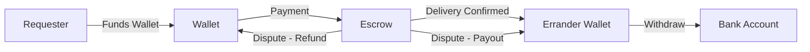

---

## 4. Core Features

### v1.0 Features (Baseline)

- User registration & authentication (JWT / Laravel Sanctum)
- Role-based access (Requester / Errander / Admin)
- Request posting with categories, photos, budget hints
- Bid submission with goods amount, service fee, delivery estimate
- Bid acceptance & automatic rejection of competing bids
- Payment integration (Flutterwave primary, Paystack backup)
- Delivery OTP generation & confirmation
- Category-based dispute windows
- Dispute management with evidence upload
- In-app & push notifications (FCM)
- Admin portal (users, categories, disputes, settings, payments)
- Public user profiles with completed order counts

### v2.0 New Features

- **Wallet System:** Multi-currency user wallets with full transaction history
- **Escrow Engine:** Smart escrow with automatic release/refund triggers
- **KYC Verification:** 4-tier identity verification (Email/Phone → BVN → NIN+Selfie → Address)
- **Trust Score:** Composite score from completion rate, ratings, SLA adherence, dispute history
- **Geo-location Matching:** Radius-based errander discovery with category filtering
- **Realtime Chat:** WebSocket-based chat between requester and assigned errander via Laravel Reverb
- **Urgent Requests:** Priority flag with additional fee and shortened SLA timer
- **SLA Tracking:** Timestamp tracking for accepted → started → arrived → completed
- **Subscription Plans:** Free, Pro, and Business tiers with feature gating
- **Business Accounts:** Company profiles with multi-user teams and role hierarchies
- **Ratings & Reviews:** Dual-sided reviews with structured feedback
- **Analytics Dashboard:** Real-time metrics for admins and business account owners
- **Audit Logging:** Immutable log of all sensitive actions
- **Fraud Detection:** Rule-based and ML-ready fraud scoring system

---

## 5. User Roles & Permissions

### Role Hierarchy

| Role | Description | Permissions |
|---|---|---|
| `requester` | Posts requests, reviews bids, pays, confirms delivery, raises disputes | request.*, bid.read, payment.initiate, delivery.confirm, dispute.create, wallet.fund, chat.* |
| `errander` | Browses requests, submits bids, fulfils orders, generates OTP, withdraws earnings | request.read, bid.*, delivery.generate_otp, wallet.withdraw, chat.* |
| `company_admin` | Manages a business account, invites team members, views analytics | business.*, request.create (on behalf of company), analytics.view |
| `company_member` | Acts as requester under a business account | request.create, request.read, bid.read (scoped to company) |
| `admin` | Full platform management, dispute resolution, KYC approval, settings | * (all permissions) |
| `super_admin` | System configuration, admin management, hard deletes | * (all permissions including destructive) |

### Spatie Permissions Configuration

```php
// Roles
- requester
- errander
- company_admin
- company_member
- admin
- super_admin

// Permission Groups
- request.create, request.read, request.update, request.delete
- bid.create, bid.read, bid.delete
- payment.initiate, payment.read
- delivery.generate_otp, delivery.confirm, delivery.read
- dispute.create, dispute.read, dispute.respond
- wallet.fund, wallet.withdraw, wallet.read
- chat.send, chat.read
- kyc.submit, kyc.read
- rating.create, rating.read
- business.manage, business.invite
- subscription.manage
- admin.users, admin.disputes, admin.payments, admin.settings, admin.categories
- analytics.view
```

### Role-Based Middleware

All API routes are protected by `auth:sanctum` middleware with Spatie's `role` and `permission` middleware:

```php
Route::middleware(['auth:sanctum', 'role:requester'])->group(function () {
    Route::post('/requests', [RequestController::class, 'store']);
});

Route::middleware(['auth:sanctum', 'permission:admin.disputes'])->group(function () {
    Route::post('/admin/disputes/{id}/resolve', [AdminDisputeController::class, 'resolve']);
});
```

---

## 6. User Stories

### 6.1 Requester Stories

| ID | Story | Acceptance Criteria | Priority |
|---|---|---|---|
| R-01 | As a requester, I can register with email, phone, and password | JWT token returned; role set to `requester`; welcome email sent | P0 |
| R-02 | As a requester, I can complete KYC verification up to my desired level | BVN, NIN, selfie, and address verified; verification level updated | P0 |
| R-03 | As a requester, I can fund my wallet via Flutterwave/Paystack | Wallet balance increases; transaction record created | P0 |
| R-04 | As a requester, I can post a request with title, description, category, location, budget hint, photos, and urgency flag | Request saved with status `open`; nearby erranders notified within 5 seconds | P0 |
| R-05 | As a requester, I can view all bids on my request with full price breakdown | All bids with `pending` status listed; errander profile, trust score, and completed orders visible | P0 |
| R-06 | As a requester, I can accept one bid and pay via wallet or direct payment | Bid status → `accepted`; other bids → `rejected`; payment processed; request → `assigned` | P0 |
| R-07 | As a requester, I can view my request's SLA timer in real-time | Timer shows accepted_at, estimated delivery, and current status | P1 |
| R-08 | As a requester, I can chat with the assigned errander in real-time | Messages sent and received via Reverb WebSockets; attachments supported | P0 |
| R-09 | As a requester, I can enter the delivery OTP provided by the errander | Code verified against Redis OTP; delivery confirmed on match; dispute window begins | P0 |
| R-10 | As a requester, I can rate and review the errander after delivery | 1-5 star rating + structured feedback submitted; trust score recalculated | P0 |
| R-11 | As a requester, I can raise a dispute within the category-specific window | Dispute created with evidence; payout paused; admin notified | P0 |
| R-12 | As a requester, I can view my complete request history with statuses and financials | Paginated list with filters by status, date range, and category | P1 |
| R-13 | As a requester, I can view my wallet balance and transaction history | Balance displayed; paginated transaction list with type, amount, reference, date | P0 |
| R-14 | As a requester, I can subscribe to a Pro or Business plan | Subscription activated; features unlocked immediately; recurring billing set up | P1 |
| R-15 | As a requester, I can mark a request as urgent for faster fulfilment | Urgent fee added to total; request highlighted in feed; SLA timer shortened | P2 |

### 6.2 Errander Stories

| ID | Story | Acceptance Criteria | Priority |
|---|---|---|---|
| E-01 | As an errander, I can register and complete KYC verification | Account created; verification level set; can browse requests at Level 1+ | P0 |
| E-02 | As an errander, I receive real-time notifications for new requests matching my location and categories | FCM push + in-app notification + Reverb event within 5 seconds | P0 |
| E-03 | As an errander, I can browse a geo-sorted feed of open requests | Requests sorted by proximity; filterable by category, budget range, urgency | P0 |
| E-04 | As an errander, I can submit a bid with goods amount, service fee, and delivery estimate | Bid saved with status `pending`; requester notified; one bid per request enforced | P0 |
| E-05 | As an errander, I can view the status of all my bids and active deliveries | Paginated list with request details, bid status, and SLA timers | P1 |
| E-06 | As an errander, I receive notification when my bid is accepted | Push + in-app notification with request details, chat link, and SLA expectations | P0 |
| E-07 | As an errander, I can chat with the requester after bid acceptance | Realtime chat via Reverb; file attachments supported | P0 |
| E-08 | As an errander, I can update SLA milestones (started, arrived) | Timestamps recorded; requester notified of each update | P1 |
| E-09 | As an errander, I can generate a 6-digit delivery OTP at drop-off | OTP generated, stored in Redis with 30-min TTL, displayed on-screen | P0 |
| E-10 | As an errander, I receive payout to my wallet after delivery confirmation or dispute window closure | Wallet balance updated; transaction record created; notification sent | P0 |
| E-11 | As an errander, I can withdraw wallet earnings to my bank account | Withdrawal processed via Flutterwave; 1.5% fee applied; funds arrive within 24 hours | P0 |
| E-12 | As an errander, I can view my trust score and its component breakdown | Score displayed with completion rate, avg rating, on-time %, and dispute history | P1 |
| E-13 | As an errander, I can rate and review the requester after delivery | 1-5 star rating + structured feedback submitted | P1 |
| E-14 | As an errander, my public profile shows completed orders, trust score, and reviews | Public endpoint returns aggregated stats; no PII exposed | P0 |
| E-15 | As an errander, I can set my availability status (online/offline/away) | Status reflected in matching engine; offline erranders excluded from notifications | P2 |

### 6.3 Business Account Stories

| ID | Story | Acceptance Criteria | Priority |
|---|---|---|---|
| B-01 | As a business owner, I can create a company profile | Company saved with name, industry, RC number, address; owner set as company_admin | P1 |
| B-02 | As a company admin, I can invite team members by email | Invitation sent; member joins with company_member role; seat count tracked | P1 |
| B-03 | As a company member, I can post requests on behalf of the company | Request linked to company; company billing used if applicable | P1 |
| B-04 | As a company admin, I can view analytics for all company requests | Dashboard with spend, request volume, active erranders, average delivery time | P2 |
| B-05 | As a company admin, I can set spending limits per member | Budget caps enforced at request creation | P2 |

### 6.4 Admin Stories

| ID | Story | Acceptance Criteria | Priority |
|---|---|---|---|
| A-01 | As an admin, I can manage categories and their dispute windows | CRUD on categories; dispute_window_hours configurable per category | P0 |
| A-02 | As an admin, I can configure platform fee percentage and other settings | Settings stored in DB; applied immediately to new transactions | P0 |
| A-03 | As an admin, I can view and resolve open disputes with full evidence | Dispute list; resolve in favour of requester or errander; funds released accordingly | P0 |
| A-04 | As an admin, I can view all transactions, payouts, and platform revenue | Paginated records with advanced filters and date ranges | P0 |
| A-05 | As an admin, I can suspend, deactivate, or permanently ban a user | User status updated; active sessions invalidated; reason logged | P0 |
| A-06 | As an admin, I can review and approve/reject KYC submissions | KYC documents viewable; approve/reject with reason; verification level updated | P0 |
| A-07 | As an admin, I can view platform analytics dashboard | Real-time metrics: GMV, active users, request volume, dispute rate, avg delivery time | P1 |
| A-08 | As an admin, I can manage subscription plans and view subscribers | Plan CRUD; subscriber list with status, revenue, churn rate | P1 |
| A-09 | As an admin, I can review flagged fraud cases | Fraud scores visible; manual review workflow; ban/whitelist actions | P2 |
| A-10 | As an admin, I can view the audit log with filters | All sensitive actions logged with user, action, IP, timestamp, old/new values | P1 |

---

## 7. Functional Requirements

### 7.1 Authentication & Authorization

| ID | Requirement | Details |
|---|---|---|
| FR-AUTH-01 | Email & password registration | Name, email, phone, password, role selection |
| FR-AUTH-02 | Email verification | 6-digit code sent to email; must verify within 1 hour |
| FR-AUTH-03 | Phone verification | SMS OTP via Termii/Africa's Talking; verified flag set |
| FR-AUTH-04 | JWT authentication | Laravel Sanctum token-based auth; tokens expire after 30 days |
| FR-AUTH-05 | Password reset | Email link with signed URL; expires in 60 minutes |
| FR-AUTH-06 | Role-based access control | Spatie Permissions; roles and permissions checked on every request |
| FR-AUTH-07 | Session management | View active sessions; revoke individual or all sessions |
| FR-AUTH-08 | Account deletion | Soft delete with 30-day grace period; data retained for legal compliance |
| FR-AUTH-09 | Biometric login (Mobile) | Fingerprint/Face ID as secondary auth factor on mobile apps |
| FR-AUTH-10 | 2FA | Optional TOTP-based two-factor authentication via Google Authenticator |

### 7.2 Request Management

| ID | Requirement | Details |
|---|---|---|
| FR-REQ-01 | Create request | Title, description, category_id, location (lat/lng), budget_hint, photos (max 5), is_urgent flag |
| FR-REQ-02 | Request feed | Paginated, filterable by category, location radius, urgency, budget range |
| FR-REQ-03 | Request detail | Full request with bids (detailed for owner, summary for others) |
| FR-REQ-04 | Request edit | Only when status is `open`; title, description, location, budget_hint editable |
| FR-REQ-05 | Request cancel | Only when status is `open`; sets status to `cancelled` |
| FR-REQ-06 | Urgent request | Adds ₦1,500 urgent_fee; highlighted in feed; shortened SLA; priority notification |
| FR-REQ-07 | Photo upload | Multipart upload to AWS S3; max 5MB per photo; JPEG/PNG/WebP |
| FR-REQ-08 | Draft requests | Save as draft before publishing; status = `draft` |
| FR-REQ-09 | Request expiry | Open requests auto-expire after 7 days if no bid accepted |
| FR-REQ-10 | Re-post | Clone a previous request with pre-filled fields |

### 7.3 Bid Management

| ID | Requirement | Details |
|---|---|---|
| FR-BID-01 | Submit bid | Goods amount, service fee, delivery estimate, optional note |
| FR-BID-02 | Platform fee | Calculated server-side: (goods_amount + service_fee) * platform_fee_percentage |
| FR-BID-03 | One bid per errander | Duplicate bid returns 422; enforced at DB level with unique constraint |
| FR-BID-04 | Bid acceptance | Sets bid to `accepted`; rejects all other bids; triggers payment flow |
| FR-BID-05 | Bid withdrawal | Errander can withdraw before acceptance; status → `withdrawn` |
| FR-BID-06 | Bid expiry | Pending bids older than 7 days auto-withdrawn |
| FR-BID-07 | Bid visibility | Request owner sees all bid details; other users see bid count only |
| FR-BID-08 | Minimum bid | Service fee cannot be less than ₦500 |

### 7.4 Payment & Wallet

| ID | Requirement | Details |
|---|---|---|
| FR-PAY-01 | Wallet funding | Via Flutterwave/Paystack; min ₦1,000; max ₦500,000 per transaction |
| FR-PAY-02 | Wallet payment | Deduct from wallet + move to escrow; must have sufficient balance |
| FR-PAY-03 | Direct payment | Pay without wallet; funds go directly to escrow |
| FR-PAY-04 | Payment breakdown | Goods amount + service fee + platform fee + urgent fee (if applicable) shown before payment |
| FR-PAY-05 | Escrow hold | Funds held in platform escrow until delivery confirmed or dispute resolved |
| FR-PAY-06 | Escrow release | Auto-release to errander wallet after dispute window closes |
| FR-PAY-07 | Escrow refund | Refund to requester wallet if dispute resolved in their favour |
| FR-PAY-08 | Withdrawal | Errander withdraws to bank; 1.5% fee capped at ₦200; processed within 24 hours |
| FR-PAY-09 | Payment gateway failover | Flutterwave primary; Paystack auto-failover if Flutterwave unavailable |
| FR-PAY-10 | Webhook handling | Signature verification; idempotency via provider_ref |

### 7.5 KYC & Verification

| ID | Requirement | Details |
|---|---|---|
| FR-KYC-01 | Tier 0 verification | Email + Phone OTP verification |
| FR-KYC-02 | Tier 1 verification | BVN lookup via Flutterwave/PremiumTrust API |
| FR-KYC-03 | Tier 2 verification | NIN verification + liveness selfie check |
| FR-KYC-04 | Tier 3 verification | Address verification via utility bill or bank statement upload |
| FR-KYC-05 | Document upload | Government ID, selfie, utility bill; stored on S3 with encryption |
| FR-KYC-06 | Admin review | Manual review queue for Tier 2/3; approve/reject with reason |
| FR-KYC-07 | Verification expiry | Documents expire after 2 years; re-verification required |
| FR-KYC-08 | Verification limits | Unverified users: max ₦50,000 wallet balance; Tier 1: ₦200,000; Tier 2: ₦1,000,000; Tier 3: unlimited |

### 7.6 Delivery & OTP

| ID | Requirement | Details |
|---|---|---|
| FR-DEL-01 | OTP generation | 6-digit code; stored in Redis; 30-minute TTL; shown to errander only |
| FR-DEL-02 | OTP confirmation | Requester enters OTP; verified against Redis; 3 max attempts |
| FR-DEL-03 | Dispute window | Starts on delivery confirmation; duration from category.dispute_window_hours |
| FR-DEL-04 | OTP expiry | Expired OTP can be regenerated up to 3 times |
| FR-DEL-05 | Delivery proof | Optional photo upload on delivery confirmation |

### 7.7 Dispute Resolution

| ID | Requirement | Details |
|---|---|---|
| FR-DISP-01 | Dispute creation | Requester only; within dispute window; reason, description, evidence (max 5 files) |
| FR-DISP-02 | Errander response | Errander submits response + evidence within 48 hours |
| FR-DISP-03 | Admin resolution | Favour requester → refund; favour errander → payout |
| FR-DISP-04 | Auto-resolution | If errander doesn't respond within 48 hours, auto-favour requester |
| FR-DISP-05 | Appeal | Either party can appeal within 72 hours with new evidence |
| FR-DISP-06 | Dispute evidence | Photos, videos, chat screenshots; stored on S3 |

### 7.8 Chat

| ID | Requirement | Details |
|---|---|---|
| FR-CHAT-01 | Realtime messaging | WebSocket via Laravel Reverb; message delivered within 500ms |
| FR-CHAT-02 | Conversation creation | Auto-created when bid is accepted |
| FR-CHAT-03 | Message types | Text, image, location share |
| FR-CHAT-04 | Read receipts | Message read_at timestamp; typing indicators |
| FR-CHAT-05 | Attachment upload | Images up to 10MB; stored on S3 |
| FR-CHAT-06 | Chat history | Persistent; searchable; paginated |
| FR-CHAT-07 | Chat restrictions | Only requester and assigned errander can chat per request |

### 7.9 Trust Score & Ratings

| ID | Requirement | Details |
|---|---|---|
| FR-TRUST-01 | Trust score calculation | Composite: completion_rate (30%) + avg_rating (25%) + on_time_pct (25%) + dispute_rate (20%) |
| FR-TRUST-02 | Score range | 0.0 - 5.0; updated after each completed delivery |
| FR-TRUST-03 | Dual ratings | Both parties rate each other after delivery; 1-5 stars + structured feedback |
| FR-TRUST-04 | Rating blind window | Neither party sees the other's rating until both submit (or 72 hours pass) |
| FR-TRUST-05 | Review response | Users can respond to reviews once |
| FR-TRUST-06 | Review moderation | AI + manual review for profanity, spam, fake reviews |

### 7.10 Subscription & Business Accounts

| ID | Requirement | Details |
|---|---|---|
| FR-SUB-01 | Plan tiers | Free (basic features), Pro (₦5,000/mo), Business (₦25,000/mo) |
| FR-SUB-02 | Feature gating | Pro: priority support, analytics, 0% withdrawal fee; Business: multi-user, API access, dedicated support |
| FR-SUB-03 | Billing | Monthly or annual (20% discount); auto-renewal; proration on upgrade |
| FR-SUB-04 | Company profile | Business name, RC number, industry, address, tax ID |
| FR-SUB-05 | Team management | Invite members by email; role assignment; seat limit per plan |
| FR-SUB-06 | Spending controls | Per-member budget limits; approval workflow for large requests |

---

## 8. Non-Functional Requirements

### 8.1 Performance

| ID | Requirement | Target |
|---|---|---|
| NFR-P01 | API response time (p95) | < 200ms for reads; < 500ms for writes |
| NFR-P02 | Realtime event delivery | < 500ms from publish to client receive |
| NFR-P03 | Page load time (LCP) | < 2.5 seconds |
| NFR-P04 | Database query time (p95) | < 50ms |
| NFR-P05 | Push notification delivery | < 5 seconds from event trigger |
| NFR-P06 | Concurrent WebSocket connections | Support 50,000 simultaneous connections |
| NFR-P07 | Image optimization | WebP conversion on upload; CDN delivery via CloudFront |

### 8.2 Availability & Reliability

| ID | Requirement | Target |
|---|---|---|
| NFR-A01 | System uptime | 99.9% (8.76 hours downtime/year) |
| NFR-A02 | Database availability | Multi-AZ RDS PostgreSQL with automatic failover |
| NFR-A03 | Redis availability | Multi-AZ ElastiCache with automatic failover |
| NFR-A04 | Disaster recovery | RPO: 1 hour; RTO: 4 hours |
| NFR-A05 | Backup schedule | Daily automated DB snapshots; 30-day retention |
| NFR-A06 | Graceful degradation | Core payment/critical flows degrade last |

### 8.3 Security

| ID | Requirement | Target |
|---|---|---|
| NFR-S01 | Data encryption at rest | AES-256 for DB, S3, Redis |
| NFR-S02 | Data encryption in transit | TLS 1.3 minimum |
| NFR-S03 | Authentication | JWT + refresh tokens; 2FA optional |
| NFR-S04 | Rate limiting | 60 req/min per user; 120 req/min per IP |
| NFR-S05 | Input validation | Server-side validation on all inputs; SQL injection prevention via Eloquent ORM |
| NFR-S06 | XSS prevention | Output encoding; CSP headers |
| NFR-S07 | CSRF protection | Laravel CSRF tokens on web; token-based for API |
| NFR-S08 | File upload security | Virus scanning via ClamAV; file type validation; size limits |
| NFR-S09 | Penetration testing | Quarterly external pentests |
| NFR-S10 | GDPR/NDPR compliance | Data export, account deletion, consent management |

### 8.4 Scalability

| ID | Requirement | Target |
|---|---|---|
| NFR-SC01 | Horizontal scaling | Stateless API servers behind ALB; auto-scale based on CPU > 70% |
| NFR-SC02 | Database scaling | Read replicas for reporting queries; connection pooling via PgBouncer |
| NFR-SC03 | Cache strategy | Redis cache with 80%+ hit rate on hot data |
| NFR-SC04 | Queue throughput | Process 10,000+ jobs/minute |
| NFR-SC05 | File storage | S3 with CloudFront CDN; auto-lifecycle to Glacier after 1 year |

### 8.5 Observability

| ID | Requirement | Target |
|---|---|---|
| NFR-O01 | Centralized logging | All services log to CloudWatch; structured JSON format |
| NFR-O02 | APM | Datadog/New Relic for transaction tracing |
| NFR-O03 | Metrics | Prometheus + Grafana dashboards for key business metrics |
| NFR-O04 | Alerting | PagerDuty integration for critical incidents |
| NFR-O05 | Audit trail | Immutable audit log for all state-changing operations |

---

## 9. Trust & Safety

### 9.1 Fraud Detection System

#### Rule-Based Detection

| Rule | Trigger | Action |
|---|---|---|
| Rapid account creation | > 3 accounts from same IP in 1 hour | Flag for review; rate limit IP |
| Suspicious payment patterns | > 5 failed payments in 10 minutes | Temporary payment block |
| Chargeback frequency | > 2 chargebacks in 30 days | Account suspension; admin review |
| KYC mismatch | BVN name ≠ profile name | KYC rejection; flag account |
| Unusual withdrawal | Withdrawal > 3x average earnings | Manual approval required |
| Location anomalies | GPS shows errander far from request location | Flag delivery for review |
| Chat pattern analysis | Keywords associated with off-platform deals | Warning message; flag conversation |

#### Fraud Scoring Model

```
fraud_score = (kyc_score * 0.30) + (behavior_score * 0.25) + (payment_score * 0.25) + (device_score * 0.20)

Where:
- kyc_score: Based on verification level and document authenticity
- behavior_score: Based on platform activity patterns
- payment_score: Based on transaction history and chargeback rate
- device_score: Based on device fingerprinting and multi-accounting detection
```

**Thresholds:**
- `fraud_score < 30`: Low risk — normal access
- `fraud_score 30-60`: Medium risk — enhanced monitoring, some features limited
- `fraud_score > 60`: High risk — account frozen, admin review required

### 9.2 Content Moderation

- **Profile photos:** AI-based NSFW detection; manual review queue for flagged content
- **Request descriptions:** Prohibited item detection (weapons, drugs, adult content)
- **Reviews:** Automated profanity filter; hate speech detection
- **Chat messages:** Real-time keyword filtering for off-platform contact sharing

### 9.3 Insurance & Protection

- **Request Value Protection:** Up to ₦100,000 covered per request for verified delivery disputes
- **Errander Accident Cover:** Optional insurance subscription for erranders (v3)
- **Identity Theft Protection:** KYC data encrypted at rest; access strictly audited

### 9.4 Safety Features

- **Emergency button:** In-app SOS button that shares location with emergency contacts
- **Share delivery tracking:** Requester can share live delivery status with trusted contacts
- **Errander check-in:** Periodic location check-in during active deliveries
- **Safe word system:** Pre-agreed safe word that either party can use to trigger admin intervention

---

## 10. KYC & Verification

### 10.1 Verification Architecture

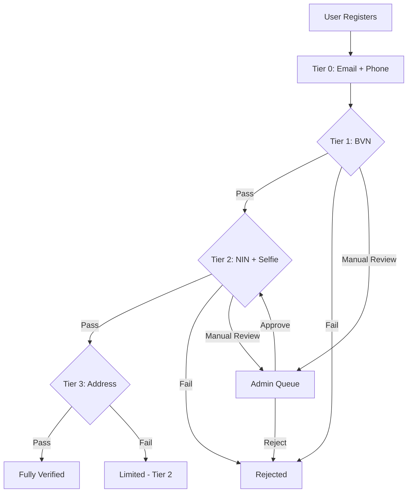

### 10.2 Verification Tiers

#### Tier 0 — Basic Verification

- **Requirements:** Email OTP + Phone OTP
- **Limits:** Max wallet balance ₦50,000; max single transaction ₦25,000
- **Benefits:** Can browse requests; cannot bid or post requests
- **Auto-verified:** Yes (via OTP)

#### Tier 1 — BVN Verified

- **Requirements:** Tier 0 + BVN (Bank Verification Number)
- **Limits:** Max wallet balance ₦200,000; max single transaction ₦100,000
- **Benefits:** Can post requests; can bid on requests; can fund wallet
- **Auto-verified:** BVN lookup via Flutterwave API; name match check

#### Tier 2 — Identity Verified

- **Requirements:** Tier 1 + NIN (National Identity Number) + Liveness Selfie
- **Limits:** Max wallet balance ₦1,000,000; max single transaction ₦500,000
- **Benefits:** Higher transaction limits; eligible for urgent requests; trust score visible
- **Auto-verified:** NIN lookup + face match API; admin review for edge cases

#### Tier 3 — Address Verified

- **Requirements:** Tier 2 + Proof of Address (utility bill, bank statement ≤ 3 months old)
- **Limits:** Unlimited wallet balance; unlimited transaction value
- **Benefits:** Full platform access; eligible for business accounts; withdrawal up to ₦5,000,000/day
- **Auto-verified:** No — always requires admin review

### 10.3 Database Tables

#### kyc_verifications

```sql
CREATE TABLE kyc_verifications (
    id UUID PRIMARY KEY DEFAULT gen_random_uuid(),
    user_id UUID NOT NULL REFERENCES users(id) ON DELETE CASCADE,
    tier INTEGER NOT NULL DEFAULT 0 CHECK (tier BETWEEN 0 AND 3),
    status VARCHAR(20) NOT NULL DEFAULT 'pending' CHECK (status IN ('pending', 'in_review', 'approved', 'rejected')),
    
    -- Tier 0
    email_verified_at TIMESTAMPTZ,
    phone_verified_at TIMESTAMPTZ,
    
    -- Tier 1
    bvn VARCHAR(11),
    bvn_name_match BOOLEAN,
    bvn_verified_at TIMESTAMPTZ,
    
    -- Tier 2
    nin VARCHAR(11),
    nin_name_match BOOLEAN,
    selfie_path VARCHAR(500),
    selfie_verified_at TIMESTAMPTZ,
    face_match_score DECIMAL(5,2),
    
    -- Tier 3
    address_line_1 VARCHAR(255),
    address_line_2 VARCHAR(255),
    city VARCHAR(100),
    state VARCHAR(100),
    postal_code VARCHAR(20),
    address_proof_path VARCHAR(500),
    address_verified_at TIMESTAMPTZ,
    
    reviewed_by UUID REFERENCES users(id),
    reviewed_at TIMESTAMPTZ,
    rejection_reason TEXT,
    
    created_at TIMESTAMPTZ NOT NULL DEFAULT NOW(),
    updated_at TIMESTAMPTZ NOT NULL DEFAULT NOW(),
    
    UNIQUE (user_id, tier)
);

CREATE INDEX idx_kyc_user_id ON kyc_verifications(user_id);
CREATE INDEX idx_kyc_status ON kyc_verifications(status);
CREATE INDEX idx_kyc_tier_status ON kyc_verifications(tier, status);
```

### 10.4 API Endpoints

#### `POST /kyc/verify/tier-0`

🔒 Submit email and phone verification OTPs.

**Body:**
```json
{
  "email_otp": "123456",
  "phone_otp": "789012"
}
```

**Response `200`:**
```json
{
  "success": true,
  "data": {
    "tier": 0,
    "status": "approved",
    "email_verified_at": "2026-06-03T10:00:00Z",
    "phone_verified_at": "2026-06-03T10:01:00Z"
  }
}
```

#### `POST /kyc/verify/tier-1`

🔒 Submit BVN for verification.

**Body:**
```json
{
  "bvn": "12345678901",
  "date_of_birth": "1990-01-15",
  "consent": true
}
```

**Business Rules:**
- BVN is encrypted at rest
- Name match is performed against user profile
- Flutterwave BVN lookup API is called
- On mismatch, manual review is triggered

#### `POST /kyc/verify/tier-2`

🔒 Submit NIN and selfie for identity verification.

**Body (multipart/form-data):**
```json
{
  "nin": "12345678901",
  "selfie": "file (JPEG/PNG, max 5MB)"
}
```

#### `POST /kyc/verify/tier-3`

🔒 Submit address verification documents.

**Body (multipart/form-data):**
```json
{
  "address_line_1": "15 Adeola Odeku Street",
  "city": "Lagos",
  "state": "Lagos",
  "postal_code": "101211",
  "address_proof": "file (PDF/JPEG/PNG, max 10MB)"
}
```

#### `GET /kyc/status`

🔒 Get current verification status and limits.

**Response `200`:**
```json
{
  "success": true,
  "data": {
    "current_tier": 2,
    "tiers": [
      { "tier": 0, "status": "approved", "completed_at": "2026-05-01T08:00:00Z" },
      { "tier": 1, "status": "approved", "completed_at": "2026-05-02T09:00:00Z" },
      { "tier": 2, "status": "approved", "completed_at": "2026-05-05T14:00:00Z" },
      { "tier": 3, "status": "in_review", "submitted_at": "2026-06-01T10:00:00Z" }
    ],
    "limits": {
      "max_wallet_balance": 1000000,
      "max_single_transaction": 500000,
      "max_daily_withdrawal": 2000000
    }
  }
}
```

#### `GET /admin/kyc/pending`

🔒 **Admin:** List pending KYC reviews.

#### `POST /admin/kyc/{id}/review`

🔒 **Admin:** Approve or reject a KYC submission.

**Body:**
```json
{
  "action": "approve | reject",
  "rejection_reason": "Document unclear (if rejected)"
}
```

### 10.5 KYC Security Considerations

- BVN and NIN values encrypted at rest using AES-256-GCM
- Encryption keys stored in AWS KMS; rotated every 90 days
- KYC documents stored in private S3 bucket with SSE-KMS encryption
- Access logs for all KYC data accesses
- Data retention: KYC data retained for 5 years after account deletion per CBN regulations
- All KYC API calls logged in audit trail

---

## 11. Wallet & Escrow System

### 11.1 Wallet Architecture

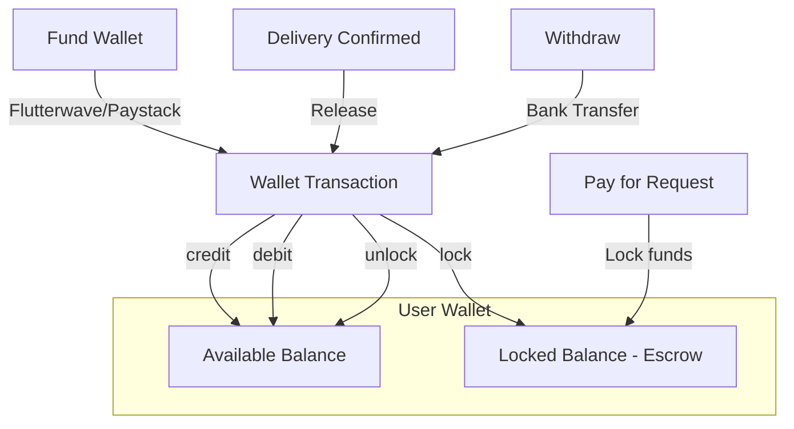

### 11.2 Escrow Flow

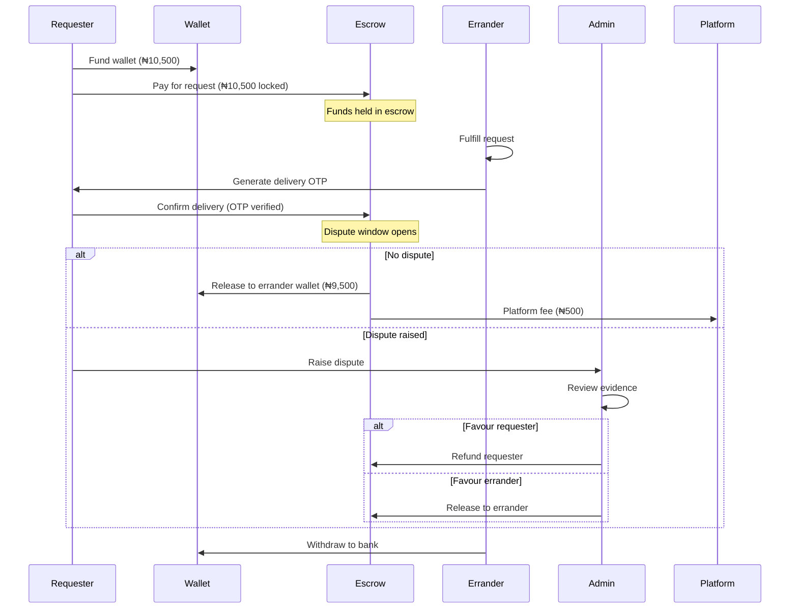

### 11.3 Database Tables

#### wallets

```sql
CREATE TABLE wallets (
    id UUID PRIMARY KEY DEFAULT gen_random_uuid(),
    user_id UUID NOT NULL UNIQUE REFERENCES users(id) ON DELETE CASCADE,
    balance DECIMAL(15,2) NOT NULL DEFAULT 0.00 CHECK (balance >= 0),
    locked_balance DECIMAL(15,2) NOT NULL DEFAULT 0.00 CHECK (locked_balance >= 0),
    currency VARCHAR(3) NOT NULL DEFAULT 'NGN',
    status VARCHAR(20) NOT NULL DEFAULT 'active' CHECK (status IN ('active', 'frozen', 'closed')),
    created_at TIMESTAMPTZ NOT NULL DEFAULT NOW(),
    updated_at TIMESTAMPTZ NOT NULL DEFAULT NOW()
);

CREATE INDEX idx_wallets_user_id ON wallets(user_id);
CREATE INDEX idx_wallets_status ON wallets(status);

-- Computed column via accessor in Laravel:
-- available_balance = balance - locked_balance
```

#### wallet_transactions

```sql
CREATE TABLE wallet_transactions (
    id UUID PRIMARY KEY DEFAULT gen_random_uuid(),
    wallet_id UUID NOT NULL REFERENCES wallets(id) ON DELETE CASCADE,
    user_id UUID NOT NULL REFERENCES users(id),
    type VARCHAR(20) NOT NULL CHECK (type IN (
        'deposit', 'withdrawal', 'payment', 'refund', 
        'payout', 'fee', 'lock', 'unlock', 'adjustment'
    )),
    amount DECIMAL(15,2) NOT NULL,
    balance_before DECIMAL(15,2) NOT NULL,
    balance_after DECIMAL(15,2) NOT NULL,
    reference VARCHAR(100) NOT NULL UNIQUE,
    description TEXT,
    metadata JSONB DEFAULT '{}',
    status VARCHAR(20) NOT NULL DEFAULT 'completed' CHECK (status IN ('pending', 'completed', 'failed', 'reversed')),
    related_transaction_id UUID REFERENCES wallet_transactions(id),
    created_at TIMESTAMPTZ NOT NULL DEFAULT NOW(),
    
    CONSTRAINT unique_reference UNIQUE(reference)
);

CREATE INDEX idx_wt_wallet_id ON wallet_transactions(wallet_id);
CREATE INDEX idx_wt_user_id ON wallet_transactions(user_id);
CREATE INDEX idx_wt_type ON wallet_transactions(type);
CREATE INDEX idx_wt_reference ON wallet_transactions(reference);
CREATE INDEX idx_wt_created ON wallet_transactions(created_at DESC);
```

#### escrow_transactions

```sql
CREATE TABLE escrow_transactions (
    id UUID PRIMARY KEY DEFAULT gen_random_uuid(),
    bid_id UUID NOT NULL REFERENCES bids(id),
    request_id UUID NOT NULL REFERENCES requests(id),
    requester_id UUID NOT NULL REFERENCES users(id),
    errander_id UUID NOT NULL REFERENCES users(id),
    amount DECIMAL(15,2) NOT NULL,
    breakdown JSONB NOT NULL,
    status VARCHAR(20) NOT NULL DEFAULT 'held' CHECK (status IN (
        'held', 'released_to_errander', 'refunded_to_requester', 'partially_refunded'
    )),
    held_at TIMESTAMPTZ NOT NULL DEFAULT NOW(),
    released_at TIMESTAMPTZ,
    release_trigger VARCHAR(20) CHECK (release_trigger IN ('delivery_confirmed', 'dispute_window_closed', 'admin_resolution')),
    created_at TIMESTAMPTZ NOT NULL DEFAULT NOW(),
    updated_at TIMESTAMPTZ NOT NULL DEFAULT NOW()
);

CREATE INDEX idx_escrow_bid_id ON escrow_transactions(bid_id);
CREATE INDEX idx_escrow_request_id ON escrow_transactions(request_id);
CREATE INDEX idx_escrow_status ON escrow_transactions(status);
```

### 11.4 Wallet Business Rules

| Rule | Description |
|---|---|
| **Double-entry accounting** | Every credit has a corresponding debit; wallet balance = sum of all transactions |
| **Locked funds** | Payment moves funds from available→locked; cannot be withdrawn while locked |
| **Negative balance prevention** | Balance check before debit; transaction rolled back if insufficient |
| **Idempotency** | Unique reference prevents duplicate transactions |
| **Withdrawal limits** | Based on KYC tier; daily and per-transaction limits |
| **Withdrawal fees** | 1.5% of amount capped at ₦200; deducted from withdrawal amount |
| **Frozen wallets** | Admin can freeze wallet (fraud investigation); all transactions blocked |
| **Transaction history** | Immutable; no deletion; corrections via adjustment transactions with audit trail |

### 11.5 Wallet API Endpoints

#### `GET /wallet`

🔒 Get authenticated user's wallet.

**Response `200`:**
```json
{
  "success": true,
  "data": {
    "id": "uuid",
    "balance": 25000.00,
    "locked_balance": 10500.00,
    "available_balance": 14500.00,
    "currency": "NGN",
    "status": "active"
  }
}
```

#### `POST /wallet/fund`

🔒 Initiate wallet funding. **Role: requester**

**Body:**
```json
{
  "amount": 10000.00,
  "payment_gateway": "flutterwave | paystack"
}
```

**Response `200`:**
```json
{
  "success": true,
  "data": {
    "reference": "WLT-20260603-ABC123",
    "payment_url": "https://checkout.flutterwave.com/v3/hosted/pay/xxx",
    "amount": 10000.00
  }
}
```

#### `GET /wallet/transactions`

🔒 Paginated transaction history.

**Query params:** `type`, `status`, `from_date`, `to_date`, `page`, `per_page`

**Response `200`:**
```json
{
  "success": true,
  "data": [
    {
      "id": "uuid",
      "type": "deposit",
      "amount": 10000.00,
      "balance_before": 5000.00,
      "balance_after": 15000.00,
      "reference": "WLT-20260603-ABC123",
      "description": "Wallet funding via Flutterwave",
      "status": "completed",
      "created_at": "2026-06-03T10:00:00Z"
    }
  ],
  "meta": { "current_page": 1, "per_page": 20, "total": 45 }
}
```

#### `POST /wallet/withdraw`

🔒 Withdraw to bank account. **Role: errander**

**Body:**
```json
{
  "amount": 50000.00,
  "bank_code": "044",
  "account_number": "0123456789",
  "account_name": "John Doe",
  "narration": "Errand Boy earnings withdrawal"
}
```

**Business Rules:**
- Available balance must be ≥ amount
- Amount must be ≥ ₦1,000
- KYC Tier 1+ required
- Daily withdrawal limit based on KYC tier
- 1.5% fee capped at ₦200

---

## 12. Payments & Payouts

### 12.1 Payment Architecture

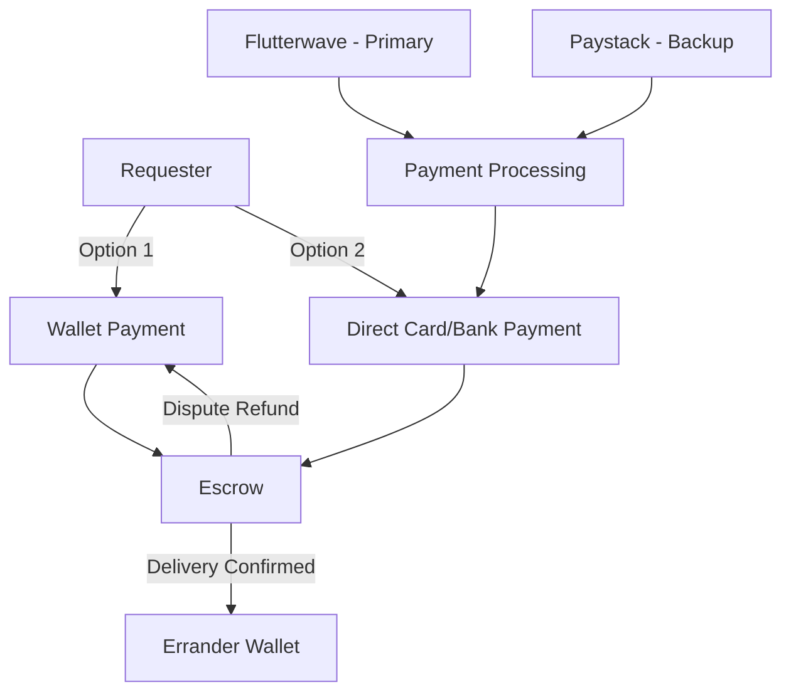

### 12.2 Payment Gateway Configuration

#### Flutterwave (Primary)

```php
// config/flutterwave.php
return [
    'public_key' => env('FLW_PUBLIC_KEY'),
    'secret_key' => env('FLW_SECRET_KEY'),
    'encryption_key' => env('FLW_ENCRYPTION_KEY'),
    'webhook_hash' => env('FLW_WEBHOOK_HASH'),
    'base_url' => env('FLW_BASE_URL', 'https://api.flutterwave.com/v3'),
];
```

#### Paystack (Backup/Failover)

```php
// config/paystack.php
return [
    'public_key' => env('PAYSTACK_PUBLIC_KEY'),
    'secret_key' => env('PAYSTACK_SECRET_KEY'),
    'base_url' => env('PAYSTACK_BASE_URL', 'https://api.paystack.co'),
];
```

### 12.3 Payment Gateway Failover Strategy

```php
// App\Services\PaymentGatewayService.php
class PaymentGatewayService
{
    public function initiatePayment(PaymentRequest $request): PaymentResponse
    {
        try {
            return $this->flutterwave->initiate($request);
        } catch (GatewayException $e) {
            Log::warning('Flutterwave unavailable, failing over to Paystack', [
                'error' => $e->getMessage(),
                'request_id' => $request->bid_id,
            ]);
            
            try {
                return $this->paystack->initiate($request);
            } catch (GatewayException $e2) {
                Log::error('Both payment gateways unavailable', [
                    'flutterwave_error' => $e->getMessage(),
                    'paystack_error' => $e2->getMessage(),
                ]);
                throw new BothGatewaysFailedException();
            }
        }
    }
}
```

### 12.4 Database Tables

#### payments

```sql
CREATE TABLE payments (
    id UUID PRIMARY KEY DEFAULT gen_random_uuid(),
    bid_id UUID NOT NULL REFERENCES bids(id),
    request_id UUID NOT NULL REFERENCES requests(id),
    user_id UUID NOT NULL REFERENCES users(id),
    provider VARCHAR(20) NOT NULL CHECK (provider IN ('flutterwave', 'paystack', 'wallet')),
    provider_ref VARCHAR(100) UNIQUE,
    amount DECIMAL(15,2) NOT NULL,
    breakdown JSONB NOT NULL,
    currency VARCHAR(3) NOT NULL DEFAULT 'NGN',
    status VARCHAR(20) NOT NULL DEFAULT 'pending' CHECK (status IN ('pending', 'successful', 'failed', 'refunded')),
    payment_method VARCHAR(50),
    paid_at TIMESTAMPTZ,
    failed_at TIMESTAMPTZ,
    failure_reason TEXT,
    metadata JSONB DEFAULT '{}',
    retry_count INTEGER NOT NULL DEFAULT 0,
    created_at TIMESTAMPTZ NOT NULL DEFAULT NOW(),
    updated_at TIMESTAMPTZ NOT NULL DEFAULT NOW()
);

CREATE INDEX idx_payments_bid_id ON payments(bid_id);
CREATE INDEX idx_payments_user_id ON payments(user_id);
CREATE INDEX idx_payments_provider_ref ON payments(provider_ref);
CREATE INDEX idx_payments_status ON payments(status);
```

#### payouts

```sql
CREATE TABLE payouts (
    id UUID PRIMARY KEY DEFAULT gen_random_uuid(),
    errander_id UUID NOT NULL REFERENCES users(id),
    bid_id UUID NOT NULL REFERENCES bids(id),
    escrow_transaction_id UUID REFERENCES escrow_transactions(id),
    amount DECIMAL(15,2) NOT NULL,
    fee DECIMAL(15,2) NOT NULL DEFAULT 0.00,
    net_amount DECIMAL(15,2) NOT NULL,
    status VARCHAR(20) NOT NULL DEFAULT 'pending' CHECK (status IN (
        'pending', 'processing', 'completed', 'failed'
    )),
    provider VARCHAR(20) NOT NULL DEFAULT 'flutterwave',
    provider_ref VARCHAR(100),
    completed_at TIMESTAMPTZ,
    created_at TIMESTAMPTZ NOT NULL DEFAULT NOW(),
    updated_at TIMESTAMPTZ NOT NULL DEFAULT NOW()
);

CREATE INDEX idx_payouts_errander_id ON payouts(errander_id);
CREATE INDEX idx_payouts_status ON payouts(status);
```

#### withdrawals

```sql
CREATE TABLE withdrawals (
    id UUID PRIMARY KEY DEFAULT gen_random_uuid(),
    user_id UUID NOT NULL REFERENCES users(id),
    wallet_transaction_id UUID REFERENCES wallet_transactions(id),
    amount DECIMAL(15,2) NOT NULL,
    fee DECIMAL(15,2) NOT NULL DEFAULT 0.00,
    net_amount DECIMAL(15,2) NOT NULL,
    bank_code VARCHAR(10) NOT NULL,
    account_number VARCHAR(10) NOT NULL,
    account_name VARCHAR(200) NOT NULL,
    narration VARCHAR(255),
    status VARCHAR(20) NOT NULL DEFAULT 'pending' CHECK (status IN (
        'pending', 'processing', 'completed', 'failed', 'reversed'
    )),
    provider VARCHAR(20) NOT NULL DEFAULT 'flutterwave',
    provider_ref VARCHAR(100),
    completed_at TIMESTAMPTZ,
    created_at TIMESTAMPTZ NOT NULL DEFAULT NOW(),
    updated_at TIMESTAMPTZ NOT NULL DEFAULT NOW()
);

CREATE INDEX idx_withdrawals_user_id ON withdrawals(user_id);
CREATE INDEX idx_withdrawals_status ON withdrawals(status);
```

### 12.5 API Endpoints

#### `POST /payments/initiate`

🔒 Initiate payment for an accepted bid. **Role: requester**

**Body:**
```json
{
  "bid_id": "uuid",
  "payment_method": "wallet | card | bank_transfer",
  "save_card": false
}
```

**Response `200`:**
```json
{
  "success": true,
  "data": {
    "payment_id": "uuid",
    "payment_url": "https://checkout.flutterwave.com/v3/hosted/pay/xxx",
    "amount": 10500.00,
    "breakdown": {
      "goods_amount": 8500.00,
      "service_fee": 1500.00,
      "platform_fee": 500.00,
      "urgent_fee": 0.00
    },
    "method": "card",
    "expires_at": "2026-06-03T10:30:00Z"
  }
}
```

**Business Rules:**
- Bid must be in `accepted` status
- Payment must not already exist in `successful` status
- Wallet payment: balance checked; funds locked immediately
- Card/bank: Flutterwave checkout URL returned; webhook confirms

#### `POST /payments/webhook/flutterwave`

Flutterwave webhook callback. **No auth — verified via Flutterwave signature hash.**

#### `POST /payments/webhook/paystack`

Paystack webhook callback. **No auth — verified via Paystack signature.**

#### `GET /payments/{id}`

🔒 Get payment details. Accessible by requester or errander (parties).

#### `GET /my/payments`

🔒 Payment history for authenticated user.

**Query params:** `status`, `from_date`, `to_date`, `page`, `per_page`

#### `GET /my/payouts`

🔒 Payout history for authenticated errander.

#### `POST /admin/payouts/{id}/retry`

🔒 **Admin:** Retry a failed payout.

### 12.6 Webhook Security

```php
// App\Http\Middleware\VerifyFlutterwaveWebhook.php
class VerifyFlutterwaveWebhook
{
    public function handle(Request $request, Closure $next)
    {
        $signature = $request->header('verif-hash');
        $secretHash = config('flutterwave.webhook_hash');
        
        if (!$signature || $signature !== $secretHash) {
            Log::warning('Flutterwave webhook: invalid signature', [
                'ip' => $request->ip(),
                'provided' => $signature,
            ]);
            return response()->json(['message' => 'Invalid signature'], 401);
        }
        
        return $next($request);
    }
}
```

---

## 13. Subscription Plans

### 13.1 Plan Tiers

| Feature | Free | Pro | Business |
|---|---|---|---|
| **Monthly Price** | Free | ₦5,000 | ₦25,000 |
| **Annual Price** | Free | ₦48,000 (20% off) | ₦240,000 (20% off) |
| **Active Requests** | 5 | 20 | Unlimited |
| **Urgent Requests** | 0/mo | 5/mo | 20/mo |
| **Wallet Withdrawal Fee** | 1.5% | 0% | 0% |
| **Priority Support** | ❌ | ✅ | ✅ |
| **Analytics Dashboard** | ❌ | Basic | Advanced |
| **API Access** | ❌ | ❌ | ✅ |
| **Team Members** | ❌ | ❌ | Up to 10 |
| **Dedicated Account Manager** | ❌ | ❌ | ✅ |
| **Custom Branding** | ❌ | ❌ | ✅ |
| **Spending Controls** | ❌ | ❌ | ✅ |
| **Bulk Requests** | ❌ | ❌ | ✅ |

### 13.2 Database Tables

#### plans

```sql
CREATE TABLE plans (
    id UUID PRIMARY KEY DEFAULT gen_random_uuid(),
    name VARCHAR(100) NOT NULL,
    slug VARCHAR(50) NOT NULL UNIQUE,
    description TEXT,
    monthly_price DECIMAL(10,2) NOT NULL,
    annual_price DECIMAL(10,2) NOT NULL,
    features JSONB NOT NULL DEFAULT '[]',
    limits JSONB NOT NULL DEFAULT '{}',
    status VARCHAR(20) NOT NULL DEFAULT 'active' CHECK (status IN ('active', 'inactive', 'deprecated')),
    sort_order INTEGER NOT NULL DEFAULT 0,
    created_at TIMESTAMPTZ NOT NULL DEFAULT NOW(),
    updated_at TIMESTAMPTZ NOT NULL DEFAULT NOW()
);
```

#### subscriptions

```sql
CREATE TABLE subscriptions (
    id UUID PRIMARY KEY DEFAULT gen_random_uuid(),
    user_id UUID NOT NULL REFERENCES users(id),
    plan_id UUID NOT NULL REFERENCES plans(id),
    status VARCHAR(20) NOT NULL DEFAULT 'active' CHECK (status IN (
        'active', 'cancelled', 'expired', 'past_due', 'trialing'
    )),
    billing_cycle VARCHAR(10) NOT NULL DEFAULT 'monthly' CHECK (billing_cycle IN ('monthly', 'annual')),
    started_at TIMESTAMPTZ NOT NULL,
    expires_at TIMESTAMPTZ NOT NULL,
    cancelled_at TIMESTAMPTZ,
    auto_renew BOOLEAN NOT NULL DEFAULT true,
    payment_provider VARCHAR(20) DEFAULT 'flutterwave',
    provider_subscription_id VARCHAR(100),
    provider_customer_id VARCHAR(100),
    created_at TIMESTAMPTZ NOT NULL DEFAULT NOW(),
    updated_at TIMESTAMPTZ NOT NULL DEFAULT NOW()
);

CREATE INDEX idx_subscriptions_user_id ON subscriptions(user_id);
CREATE INDEX idx_subscriptions_status ON subscriptions(status);
CREATE INDEX idx_subscriptions_expires ON subscriptions(expires_at);
```

### 13.3 API Endpoints

#### `GET /plans`

Public list of available plans.

**Response `200`:**
```json
{
  "success": true,
  "data": [
    {
      "id": "uuid",
      "name": "Pro",
      "slug": "pro",
      "monthly_price": 5000.00,
      "annual_price": 48000.00,
      "features": ["20 active requests", "5 urgent requests/mo", "0% withdrawal fee", "Priority support", "Basic analytics"],
      "limits": { "active_requests": 20, "urgent_requests_per_month": 5 }
    }
  ]
}
```

#### `POST /subscriptions`

🔒 Subscribe to a plan. **Role: requester, company_admin**

**Body:**
```json
{
  "plan_id": "uuid",
  "billing_cycle": "monthly | annual",
  "auto_renew": true
}
```

**Response `200`:**
```json
{
  "success": true,
  "data": {
    "subscription_id": "uuid",
    "plan": "Pro",
    "billing_cycle": "monthly",
    "amount": 5000.00,
    "payment_url": "https://checkout.flutterwave.com/v3/hosted/pay/xxx",
    "starts_at": "2026-06-03T10:00:00Z",
    "expires_at": "2026-07-03T10:00:00Z"
  }
}
```

#### `GET /my/subscription`

🔒 Get current subscription status.

#### `POST /subscriptions/cancel`

🔒 Cancel auto-renewal. Subscription remains active until expiry.

#### `GET /admin/subscriptions`

🔒 **Admin:** List all subscriptions with filters.

#### `POST /admin/plans`

🔒 **Admin:** Create a new plan.

**Body:**
```json
{
  "name": "Enterprise",
  "slug": "enterprise",
  "description": "For large organizations",
  "monthly_price": 100000.00,
  "annual_price": 960000.00,
  "features": ["Unlimited requests", "Unlimited urgent", "API access", "25 team members", "Dedicated support", "Custom branding", "SLA guarantee"],
  "limits": { "active_requests": -1, "team_members": 25 }
}
```

#### `PUT /admin/plans/{id}`

🔒 **Admin:** Update a plan.

#### `DELETE /admin/plans/{id}`

🔒 **Admin:** Deactivate a plan (soft delete).

### 13.4 Feature Gating Implementation

```php
// App\Services\FeatureGateService.php
class FeatureGateService
{
    public function canUseFeature(User $user, string $feature, int $count = 1): bool
    {
        $subscription = $user->activeSubscription();
        
        if (!$subscription) {
            // Free tier limits
            return $this->checkFreeTierLimit($user, $feature, $count);
        }
        
        $plan = $subscription->plan;
        $limits = $plan->limits;
        
        return match($feature) {
            'active_requests' => $limits['active_requests'] === -1 || 
                $user->requests()->where('status', '!=', 'completed')->count() + $count <= $limits['active_requests'],
            'urgent_requests' => $this->checkMonthlyUsage($user, 'urgent_requests', $count, $limits),
            'team_members' => $this->checkTeamMemberLimit($user, $count, $limits),
            'api_access' => in_array('API Access', $plan->features ?? []),
            default => false,
        };
    }
}
```

---

## 14. Business Accounts

### 14.1 Business Account Architecture

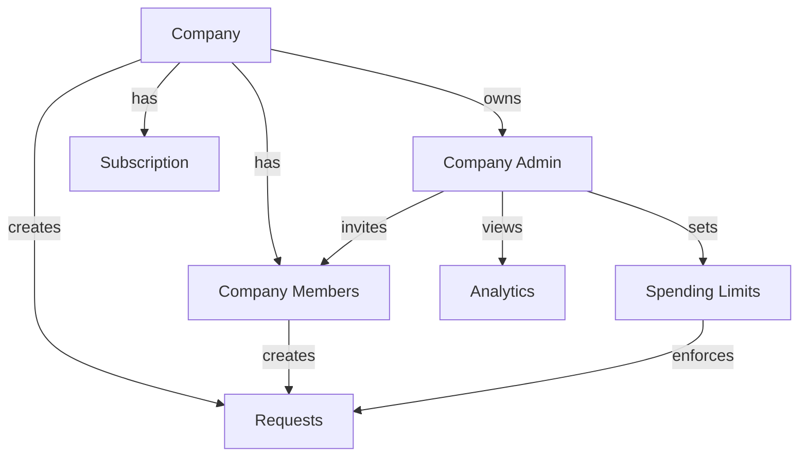

### 14.2 Database Tables

#### companies

```sql
CREATE TABLE companies (
    id UUID PRIMARY KEY DEFAULT gen_random_uuid(),
    name VARCHAR(200) NOT NULL,
    slug VARCHAR(100) NOT NULL UNIQUE,
    industry VARCHAR(100),
    rc_number VARCHAR(50),
    tax_id VARCHAR(50),
    email VARCHAR(255),
    phone VARCHAR(20),
    website VARCHAR(255),
    logo_path VARCHAR(500),
    address_line_1 VARCHAR(255),
    address_line_2 VARCHAR(255),
    city VARCHAR(100),
    state VARCHAR(100),
    postal_code VARCHAR(20),
    country VARCHAR(100) NOT NULL DEFAULT 'Nigeria',
    owner_id UUID NOT NULL REFERENCES users(id),
    status VARCHAR(20) NOT NULL DEFAULT 'active' CHECK (status IN ('active', 'suspended', 'deleted')),
    settings JSONB DEFAULT '{}',
    created_at TIMESTAMPTZ NOT NULL DEFAULT NOW(),
    updated_at TIMESTAMPTZ NOT NULL DEFAULT NOW()
);

CREATE INDEX idx_companies_owner_id ON companies(owner_id);
CREATE INDEX idx_companies_slug ON companies(slug);
```

#### company_users

```sql
CREATE TABLE company_users (
    id UUID PRIMARY KEY DEFAULT gen_random_uuid(),
    company_id UUID NOT NULL REFERENCES companies(id) ON DELETE CASCADE,
    user_id UUID NOT NULL REFERENCES users(id) ON DELETE CASCADE,
    role VARCHAR(20) NOT NULL DEFAULT 'member' CHECK (role IN ('admin', 'member', 'finance', 'viewer')),
    department VARCHAR(100),
    spending_limit DECIMAL(15,2) DEFAULT 100000.00,
    requires_approval_for_above DECIMAL(15,2) DEFAULT 50000.00,
    status VARCHAR(20) NOT NULL DEFAULT 'active' CHECK (status IN ('active', 'invited', 'suspended')),
    invited_at TIMESTAMPTZ,
    joined_at TIMESTAMPTZ,
    created_at TIMESTAMPTZ NOT NULL DEFAULT NOW(),
    updated_at TIMESTAMPTZ NOT NULL DEFAULT NOW(),
    
    UNIQUE (company_id, user_id)
);

CREATE INDEX idx_company_users_company ON company_users(company_id);
CREATE INDEX idx_company_users_user ON company_users(user_id);
```

### 14.3 API Endpoints

#### `POST /companies`

🔒 Create a company. **Role: requester (becomes company_admin)**

**Body:**
```json
{
  "name": "Acme Logistics Ltd",
  "industry": "Logistics",
  "rc_number": "RC1234567",
  "tax_id": "TAX-2024-001",
  "email": "info@acmelogistics.com",
  "phone": "+2348012345678",
  "website": "https://acmelogistics.com",
  "logo": "file (optional, max 2MB)",
  "address": {
    "line_1": "15 Marina Road",
    "city": "Lagos",
    "state": "Lagos",
    "postal_code": "101211"
  }
}
```

**Response `201`:**
```json
{
  "success": true,
  "data": {
    "id": "uuid",
    "name": "Acme Logistics Ltd",
    "slug": "acme-logistics-ltd",
    "owner_id": "uuid",
    "status": "active"
  }
}
```

#### `GET /companies/{id}`

🔒 Get company profile. Accessible by company members.

#### `PUT /companies/{id}`

🔒 Update company profile. **Role: company_admin**

#### `POST /companies/{id}/invite`

🔒 Invite a team member. **Role: company_admin**

**Body:**
```json
{
  "email": "jane@acmelogistics.com",
  "role": "member",
  "department": "Operations",
  "spending_limit": 200000.00
}
```

#### `POST /companies/{id}/invite/{token}/accept`

🔒 Accept a company invitation.

#### `DELETE /companies/{id}/members/{userId}`

🔒 Remove a team member. **Role: company_admin**

#### `GET /companies/{id}/members`

🔒 List team members. **Role: company_admin, company_member**

#### `GET /companies/{id}/analytics`

🔒 Company analytics dashboard. **Role: company_admin**

**Response `200`:**
```json
{
  "success": true,
  "data": {
    "total_requests": 156,
    "total_spend": 1250000.00,
    "active_requests": 12,
    "completed_requests": 140,
    "average_delivery_time_minutes": 45,
    "top_categories": [
      { "name": "Food & Groceries", "count": 45 },
      { "name": "Documents / Printing", "count": 38 }
    ],
    "monthly_spend": [
      { "month": "2026-01", "amount": 280000.00 },
      { "month": "2026-02", "amount": 320000.00 }
    ]
  }
}
```

---

## 15. Request Management

### 15.1 Request Lifecycle

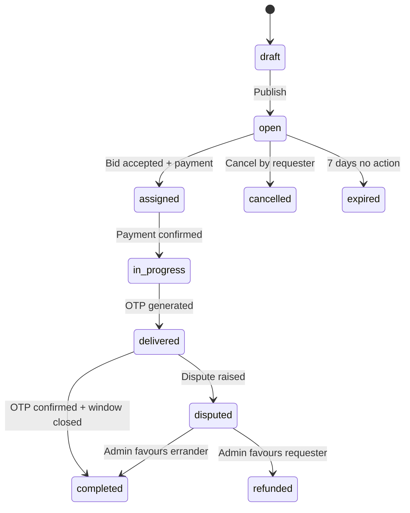

### 15.2 Database Tables

#### requests

```sql
CREATE TABLE requests (
    id UUID PRIMARY KEY DEFAULT gen_random_uuid(),
    user_id UUID NOT NULL REFERENCES users(id),
    company_id UUID REFERENCES companies(id),
    category_id UUID NOT NULL REFERENCES categories(id),
    title VARCHAR(200) NOT NULL,
    description TEXT NOT NULL,
    location VARCHAR(255) NOT NULL,
    latitude DECIMAL(10,7),
    longitude DECIMAL(10,7),
    budget_hint DECIMAL(15,2),
    status VARCHAR(20) NOT NULL DEFAULT 'draft' CHECK (status IN (
        'draft', 'open', 'assigned', 'in_progress', 'delivered', 
        'completed', 'disputed', 'refunded', 'cancelled', 'expired'
    )),
    is_urgent BOOLEAN NOT NULL DEFAULT false,
    urgent_fee DECIMAL(10,2) DEFAULT 0.00,
    accepted_bid_id UUID,
    delivery_confirmed_at TIMESTAMPTZ,
    completed_at TIMESTAMPTZ,
    cancelled_at TIMESTAMPTZ,
    cancellation_reason TEXT,
    metadata JSONB DEFAULT '{}',
    created_at TIMESTAMPTZ NOT NULL DEFAULT NOW(),
    updated_at TIMESTAMPTZ NOT NULL DEFAULT NOW()
);

CREATE INDEX idx_requests_user_id ON requests(user_id);
CREATE INDEX idx_requests_category_id ON requests(category_id);
CREATE INDEX idx_requests_status ON requests(status);
CREATE INDEX idx_requests_location ON requests(latitude, longitude);
CREATE INDEX idx_requests_company ON requests(company_id);
CREATE INDEX idx_requests_created ON requests(created_at DESC);
CREATE INDEX idx_requests_urgent ON requests(is_urgent) WHERE is_urgent = true;
```

#### request_photos

```sql
CREATE TABLE request_photos (
    id UUID PRIMARY KEY DEFAULT gen_random_uuid(),
    request_id UUID NOT NULL REFERENCES requests(id) ON DELETE CASCADE,
    path VARCHAR(500) NOT NULL,
    url VARCHAR(500) NOT NULL,
    sort_order INTEGER NOT NULL DEFAULT 0,
    created_at TIMESTAMPTZ NOT NULL DEFAULT NOW()
);

CREATE INDEX idx_request_photos_req ON request_photos(request_id);
```

### 15.3 API Endpoints

#### `GET /requests`

🔒 Paginated list of open requests (errander feed).

**Query params:**

| Param | Type | Description |
|---|---|---|
| `category_id` | uuid | Filter by category |
| `latitude` | decimal | User's current latitude |
| `longitude` | decimal | User's current longitude |
| `radius_km` | int | Search radius (default: 10) |
| `budget_min` | decimal | Minimum budget |
| `budget_max` | decimal | Maximum budget |
| `is_urgent` | boolean | Filter urgent only |
| `sort` | string | `distance`, `newest`, `budget_high`, `budget_low` (default: `newest`) |
| `page` | int | Page number |
| `per_page` | int | Results per page |

**Response `200`:**
```json
{
  "success": true,
  "data": [
    {
      "id": "uuid",
      "title": "Buy groceries from Shoprite",
      "description": "Need 5 items from Shoprite Ikeja...",
      "category": { "id": "uuid", "name": "Food & Groceries" },
      "location": "Ikeja, Lagos",
      "latitude": 6.6018,
      "longitude": 3.3515,
      "distance_km": 2.3,
      "budget_hint": 5000.00,
      "is_urgent": false,
      "status": "open",
      "requester": {
        "id": "uuid",
        "name": "Adeola",
        "completed_orders": 5
      },
      "bids_count": 3,
      "created_at": "2026-06-03T09:00:00Z"
    }
  ],
  "meta": { "current_page": 1, "per_page": 20, "total": 84 }
}
```

#### `POST /requests`

🔒 Create a new request. **Role: requester, company_admin, company_member**

**Body (multipart/form-data):**
```json
{
  "title": "Buy groceries from Shoprite",
  "description": "Need 5 items from Shoprite Ikeja: Milk, Bread, Eggs, Butter, Sugar",
  "category_id": "uuid",
  "location": "Ikeja, Lagos",
  "latitude": 6.6018,
  "longitude": 3.3515,
  "budget_hint": 5000.00,
  "is_urgent": false,
  "company_id": "uuid (optional, for business accounts)",
  "photos": "file[] (optional, max 5, JPEG/PNG/WebP, max 5MB each)"
}
```

**Validation Rules:**
- `title`: required, string, max 200 chars
- `description`: required, string, max 2000 chars
- `category_id`: required, exists in categories
- `location`: required, string, max 255 chars
- `latitude`: required, numeric, -90 to 90
- `longitude`: required, numeric, -180 to 180
- `budget_hint`: optional, numeric, min 500, max 500000
- `is_urgent`: optional, boolean
- `company_id`: optional, must belong to user's company
- `photos`: optional, array, max 5 items

#### `GET /requests/{id}`

🔒 Get single request with bids. Requesters see full bid details; erranders see summary.

#### `PUT /requests/{id}`

🔒 Update a request. **Role: requester (owner), status must be `open` or `draft`**

#### `DELETE /requests/{id}`

🔒 Cancel a request. **Role: requester (owner), status must be `open`**

#### `GET /my/requests`

🔒 Authenticated requester's own requests. **Query params:** `status`, `category_id`, `from_date`, `to_date`, `page`, `per_page`

---

## 16. Bid Management

### 16.1 Bid Lifecycle

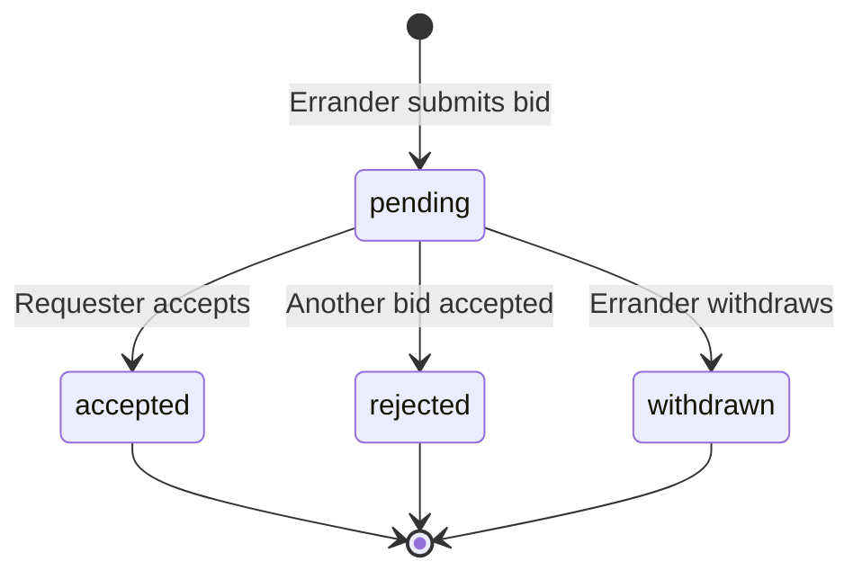

### 16.2 Database Tables

#### bids

```sql
CREATE TABLE bids (
    id UUID PRIMARY KEY DEFAULT gen_random_uuid(),
    request_id UUID NOT NULL REFERENCES requests(id) ON DELETE CASCADE,
    errander_id UUID NOT NULL REFERENCES users(id),
    goods_amount DECIMAL(15,2) NOT NULL CHECK (goods_amount >= 0),
    service_fee DECIMAL(15,2) NOT NULL CHECK (service_fee >= 500),
    platform_fee DECIMAL(15,2) NOT NULL CHECK (platform_fee >= 0),
    total_amount DECIMAL(15,2) NOT NULL,
    note TEXT,
    delivery_at TIMESTAMPTZ,
    status VARCHAR(20) NOT NULL DEFAULT 'pending' CHECK (status IN (
        'pending', 'accepted', 'rejected', 'withdrawn'
    )),
    created_at TIMESTAMPTZ NOT NULL DEFAULT NOW(),
    updated_at TIMESTAMPTZ NOT NULL DEFAULT NOW(),
    
    UNIQUE (request_id, errander_id)
);

CREATE INDEX idx_bids_request_id ON bids(request_id);
CREATE INDEX idx_bids_errander_id ON bids(errander_id);
CREATE INDEX idx_bids_status ON bids(status);
```

### 16.3 API Endpoints

#### `POST /requests/{request_id}/bids`

🔒 Apply to a request. **Role: errander**

**Body:**
```json
{
  "goods_amount": 4500.00,
  "service_fee": 1500.00,
  "delivery_at": "2026-06-03T15:00:00Z",
  "note": "I can deliver within 3 hours. I know Shoprite Ikeja well."
}
```

**Business Rules:**
- One bid per errander per request (enforced by DB unique constraint)
- Request must be in `open` status
- `platform_fee` calculated server-side: `(goods_amount + service_fee) * platform_fee_percentage`
- `total_amount` = goods_amount + service_fee + platform_fee
- Service fee minimum: ₦500
- Errander must have KYC Tier 1+

**Response `201`:**
```json
{
  "success": true,
  "data": {
    "id": "uuid",
    "request_id": "uuid",
    "goods_amount": 4500.00,
    "service_fee": 1500.00,
    "platform_fee": 300.00,
    "total_amount": 6300.00,
    "delivery_at": "2026-06-03T15:00:00Z",
    "status": "pending"
  }
}
```

#### `GET /requests/{request_id}/bids`

🔒 All bids on a request. **Full details for request owner; summary for others.**

#### `POST /bids/{id}/accept`

🔒 Accept a bid. **Role: requester (owns the parent request)**

**Business Rules:**
- Request must be in `open` status
- All other bids on the request auto-set to `rejected`
- Request status → `assigned`
- Payment initiation URL returned
- Chat conversation auto-created
- SLA timer starts

**Response `200`:**
```json
{
  "success": true,
  "data": {
    "bid": {
      "id": "uuid",
      "status": "accepted",
      "total_amount": 6300.00
    },
    "payment_url": "https://checkout.flutterwave.com/v3/hosted/pay/xxx",
    "chat_conversation_id": "uuid"
  }
}
```

#### `GET /my/bids`

🔒 Authenticated errander's bids. **Query params:** `status`, `page`, `per_page`

#### `DELETE /bids/{id}`

🔒 Withdraw a bid. **Role: errander (owner), status must be `pending`**

---

## 17. Delivery & OTP Verification

### 17.1 Delivery Flow

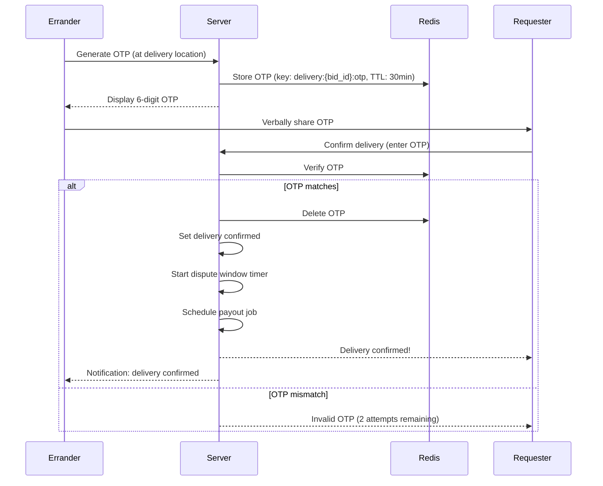

### 17.2 Database Tables

#### deliveries

```sql
CREATE TABLE deliveries (
    id UUID PRIMARY KEY DEFAULT gen_random_uuid(),
    bid_id UUID NOT NULL UNIQUE REFERENCES bids(id),
    request_id UUID NOT NULL REFERENCES requests(id),
    errander_id UUID NOT NULL REFERENCES users(id),
    otp_hash VARCHAR(255),
    otp_generated_at TIMESTAMPTZ,
    otp_expires_at TIMESTAMPTZ,
    otp_attempts INTEGER NOT NULL DEFAULT 0,
    max_otp_attempts INTEGER NOT NULL DEFAULT 3,
    confirmed BOOLEAN NOT NULL DEFAULT false,
    confirmed_at TIMESTAMPTZ,
    confirmed_by UUID REFERENCES users(id),
    dispute_window_hours INTEGER NOT NULL,
    dispute_window_closes_at TIMESTAMPTZ,
    proof_photo_path VARCHAR(500),
    notes TEXT,
    created_at TIMESTAMPTZ NOT NULL DEFAULT NOW(),
    updated_at TIMESTAMPTZ NOT NULL DEFAULT NOW()
);

CREATE INDEX idx_deliveries_bid_id ON deliveries(bid_id);
CREATE INDEX idx_deliveries_confirmed ON deliveries(confirmed);
CREATE INDEX idx_deliveries_window ON deliveries(dispute_window_closes_at);
```

### 17.3 OTP Service

```php
// App\Services\DeliveryOtpService.php
class DeliveryOtpService
{
    public function generate(Bid $bid): array
    {
        // Check bid is accepted and payment confirmed
        if ($bid->status !== BidStatus::ACCEPTED) {
            throw new BidNotAcceptedException();
        }
        
        $payment = $bid->payment;
        if (!$payment || $payment->status !== PaymentStatus::SUCCESSFUL) {
            throw new PaymentNotConfirmedException();
        }
        
        // Generate 6-digit OTP
        $otp = str_pad(random_int(0, 999999), 6, '0', STR_PAD_LEFT);
        
        // Store in Redis with 30-min TTL
        $key = "delivery:{$bid->id}:otp";
        Redis::setex($key, 1800, $otp);
        Redis::setex("delivery:{$bid->id}:attempts", 1800, 0);
        
        // Create/update delivery record
        $delivery = Delivery::updateOrCreate(
            ['bid_id' => $bid->id],
            [
                'request_id' => $bid->request_id,
                'errander_id' => $bid->errander_id,
                'otp_hash' => Hash::make($otp),
                'otp_generated_at' => now(),
                'otp_expires_at' => now()->addMinutes(30),
                'otp_attempts' => 0,
                'dispute_window_hours' => $bid->request->category->dispute_window_hours,
            ]
        );
        
        // Update request status
        $bid->request->update(['status' => RequestStatus::DELIVERED]);
        
        return [
            'otp' => $otp,
            'expires_in_minutes' => 30,
        ];
    }
    
    public function confirm(Bid $bid, string $otp): Delivery
    {
        $delivery = Delivery::where('bid_id', $bid->id)->firstOrFail();
        
        // Check attempts
        if ($delivery->otp_attempts >= $delivery->max_otp_attempts) {
            throw new MaxOtpAttemptsExceededException();
        }
        
        // Check expiry
        if (now()->gt($delivery->otp_expires_at)) {
            throw new OtpExpiredException();
        }
        
        // Verify OTP
        $redisOtp = Redis::get("delivery:{$bid->id}:otp");
        if (!$redisOtp || $redisOtp !== $otp) {
            $delivery->increment('otp_attempts');
            $remaining = $delivery->max_otp_attempts - $delivery->otp_attempts - 1;
            throw new InvalidOtpException("Invalid OTP. {$remaining} attempts remaining.");
        }
        
        // Success
        Redis::del("delivery:{$bid->id}:otp", "delivery:{$bid->id}:attempts");
        
        $delivery->update([
            'confirmed' => true,
            'confirmed_at' => now(),
            'confirmed_by' => auth()->id(),
            'dispute_window_closes_at' => now()->addHours($delivery->dispute_window_hours),
        ]);
        
        $bid->request->update(['status' => RequestStatus::DELIVERED]);
        
        // Dispatch events
        event(new DeliveryConfirmed($delivery));
        
        // Schedule payout
        ProcessPayout::dispatch($delivery)->delay(
            now()->addHours($delivery->dispute_window_hours)
        );
        
        return $delivery;
    }
}
```

### 17.4 API Endpoints

#### `POST /deliveries/{bid_id}/generate-otp`

🔒 Generate delivery OTP. **Role: errander (assigned to this bid)**

**Business Rules:**
- Bid must be `accepted` and payment `successful`
- Errander must be within 500m of delivery location (GPS verified)
- OTP is 6 digits, stored in Redis, 30-min TTL
- Max 3 generation attempts per delivery

**Response `200`:**
```json
{
  "success": true,
  "data": {
    "otp": "847291",
    "expires_in_minutes": 30,
    "expires_at": "2026-06-03T15:30:00Z"
  }
}
```

#### `POST /deliveries/{bid_id}/confirm`

🔒 Confirm delivery by entering OTP. **Role: requester (owns request)**

**Body:**
```json
{
  "otp": "847291"
}
```

**Response `200`:**
```json
{
  "success": true,
  "data": {
    "delivery_id": "uuid",
    "confirmed_at": "2026-06-03T15:05:00Z",
    "dispute_window_hours": 24,
    "dispute_window_closes_at": "2026-06-04T15:05:00Z",
    "message": "Delivery confirmed. You have 24 hours to raise a dispute."
  }
}
```

#### `GET /deliveries/{bid_id}`

🔒 Get delivery details. Accessible by requester and assigned errander.

---

## 18. Realtime Chat

### 18.1 Chat Architecture

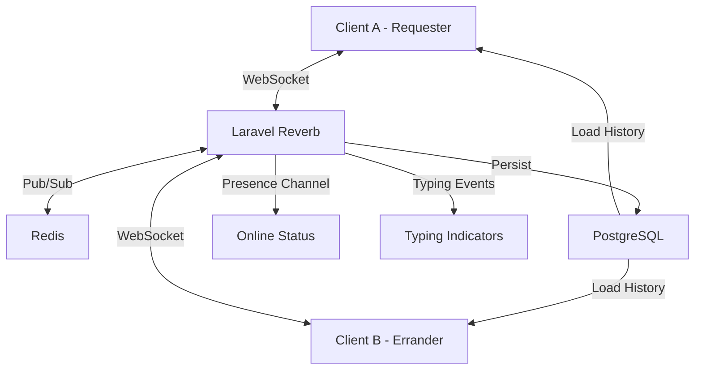

### 18.2 Database Tables

#### conversations

```sql
CREATE TABLE conversations (
    id UUID PRIMARY KEY DEFAULT gen_random_uuid(),
    request_id UUID NOT NULL UNIQUE REFERENCES requests(id),
    requester_id UUID NOT NULL REFERENCES users(id),
    errander_id UUID NOT NULL REFERENCES users(id),
    last_message_at TIMESTAMPTZ,
    last_message_preview VARCHAR(150),
    requester_unread_count INTEGER NOT NULL DEFAULT 0,
    errander_unread_count INTEGER NOT NULL DEFAULT 0,
    status VARCHAR(20) NOT NULL DEFAULT 'active' CHECK (status IN ('active', 'archived', 'blocked')),
    created_at TIMESTAMPTZ NOT NULL DEFAULT NOW(),
    updated_at TIMESTAMPTZ NOT NULL DEFAULT NOW()
);

CREATE INDEX idx_conversations_request ON conversations(request_id);
CREATE INDEX idx_conversations_requester ON conversations(requester_id);
CREATE INDEX idx_conversations_errander ON conversations(errander_id);
```

#### messages

```sql
CREATE TABLE messages (
    id UUID PRIMARY KEY DEFAULT gen_random_uuid(),
    conversation_id UUID NOT NULL REFERENCES conversations(id) ON DELETE CASCADE,
    sender_id UUID NOT NULL REFERENCES users(id),
    type VARCHAR(20) NOT NULL DEFAULT 'text' CHECK (type IN ('text', 'image', 'location', 'system')),
    content TEXT,
    attachment_url VARCHAR(500),
    attachment_thumbnail_url VARCHAR(500),
    read_at TIMESTAMPTZ,
    delivered_at TIMESTAMPTZ,
    created_at TIMESTAMPTZ NOT NULL DEFAULT NOW(),
    updated_at TIMESTAMPTZ NOT NULL DEFAULT NOW()
);

CREATE INDEX idx_messages_conversation ON messages(conversation_id);
CREATE INDEX idx_messages_sender ON messages(sender_id);
CREATE INDEX idx_messages_created ON messages(conversation_id, created_at DESC);
CREATE INDEX idx_messages_unread ON messages(conversation_id, read_at) WHERE read_at IS NULL;
```

### 18.3 Chat Events (Laravel Reverb)

```php
// App\Events\MessageSent.php
class MessageSent implements ShouldBroadcast
{
    use Dispatchable, InteractsWithSockets, SerializesModels;
    
    public function __construct(
        public Message $message,
        public Conversation $conversation
    ) {}
    
    public function broadcastOn(): Channel
    {
        return new PrivateChannel("conversation.{$this->conversation->id}");
    }
    
    public function broadcastAs(): string
    {
        return 'message.sent';
    }
    
    public function broadcastWith(): array
    {
        return [
            'id' => $this->message->id,
            'conversation_id' => $this->conversation->id,
            'sender_id' => $this->message->sender_id,
            'type' => $this->message->type,
            'content' => $this->message->content,
            'attachment_url' => $this->message->attachment_url,
            'created_at' => $this->message->created_at->toISOString(),
        ];
    }
}

// App\Events\TypingIndicator.php
class TypingIndicator implements ShouldBroadcast
{
    use Dispatchable, InteractsWithSockets, SerializesModels;
    
    public function __construct(
        public string $conversationId,
        public string $userId,
        public bool $isTyping
    ) {}
    
    public function broadcastOn(): Channel
    {
        return new PrivateChannel("conversation.{$this->conversationId}");
    }
    
    public function broadcastAs(): string
    {
        return 'typing';
    }
}
```

### 18.4 Reverb Channel Authorization

```php
// routes/channels.php
use App\Models\Conversation;

Broadcast::channel('conversation.{conversationId}', function (User $user, string $conversationId) {
    $conversation = Conversation::findOrFail($conversationId);
    return $user->id === $conversation->requester_id || 
           $user->id === $conversation->errander_id;
});
```

### 18.5 API Endpoints

#### `GET /conversations`

🔒 List user's conversations.

**Response `200`:**
```json
{
  "success": true,
  "data": [
    {
      "id": "uuid",
      "request_id": "uuid",
      "request_title": "Buy groceries from Shoprite",
      "other_user": {
        "id": "uuid",
        "name": "John Doe",
        "avatar_url": "https://cdn.errandboy.ng/avatars/john.jpg"
      },
      "last_message": {
        "preview": "I'm at Shoprite now...",
        "created_at": "2026-06-03T14:30:00Z"
      },
      "unread_count": 2,
      "created_at": "2026-06-03T10:00:00Z"
    }
  ]
}
```

#### `GET /conversations/{id}/messages`

🔒 Get messages for a conversation. **Query params:** `before_id` (cursor), `limit` (default: 50)

**Response `200`:**
```json
{
  "success": true,
  "data": [
    {
      "id": "uuid",
      "sender_id": "uuid",
      "type": "text",
      "content": "I'm at Shoprite now, picking up the items.",
      "attachment_url": null,
      "read_at": "2026-06-03T14:30:05Z",
      "created_at": "2026-06-03T14:30:00Z"
    }
  ],
  "meta": { "has_more": true, "next_cursor": "uuid" }
}
```

#### `POST /conversations/{id}/messages`

🔒 Send a message. **Body (multipart for attachments):**

```json
{
  "type": "text | image",
  "content": "I'm at Shoprite now.",
  "attachment": "file (optional, max 10MB for images)"
}
```

#### `POST /conversations/{id}/read`

🔒 Mark all messages as read in a conversation.

#### `POST /conversations/{id}/typing`

🔒 Send typing indicator (handled via WebSocket; REST fallback).

---

## 19. Geo-location & Matching Engine

### 19.1 Matching Engine Architecture

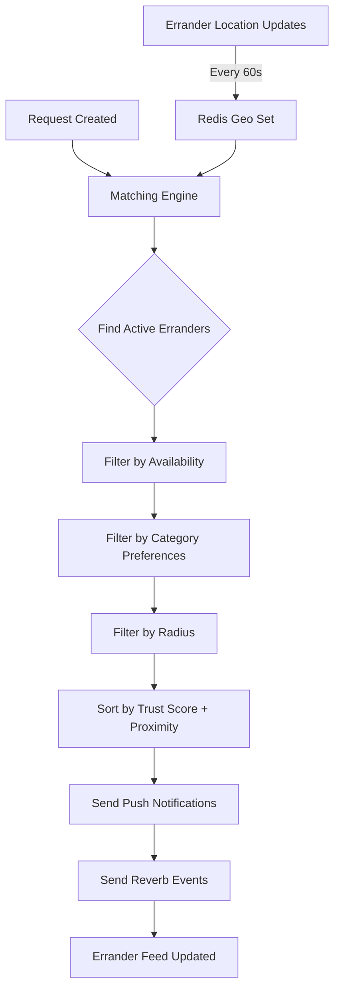

### 19.2 Location Tracking

#### errander_locations (Redis)

Errander locations are stored in Redis using Sorted Sets (GEO commands) for efficient radius queries:

```
GEOADD errander_locations {longitude} {latitude} {user_id}
GEORADIUS errander_locations {longitude} {latitude} {radius_km} km
```

**Update frequency:** Every 60 seconds when errander is online and app is in foreground; every 5 minutes when in background.

#### errander_locations (PostgreSQL — Persistent)

```sql
CREATE TABLE errander_locations (
    id UUID PRIMARY KEY DEFAULT gen_random_uuid(),
    user_id UUID NOT NULL REFERENCES users(id) ON DELETE CASCADE,
    latitude DECIMAL(10,7) NOT NULL,
    longitude DECIMAL(10,7) NOT NULL,
    accuracy DECIMAL(8,2),
    heading DECIMAL(5,2),
    speed DECIMAL(6,2),
    battery_level INTEGER,
    is_online BOOLEAN NOT NULL DEFAULT false,
    recorded_at TIMESTAMPTZ NOT NULL DEFAULT NOW(),
    created_at TIMESTAMPTZ NOT NULL DEFAULT NOW()
);

CREATE INDEX idx_erl_user_id ON errander_locations(user_id);
CREATE INDEX idx_erl_online ON errander_locations(is_online) WHERE is_online = true;
CREATE INDEX idx_erl_recorded ON errander_locations(recorded_at DESC);

-- PostGIS index for spatial queries
CREATE INDEX idx_erl_geo ON errander_locations USING GIST (
    ST_SetSRID(ST_MakePoint(longitude, latitude), 4326)
);
```

### 19.3 Matching Service

```php
// App\Services\MatchingService.php
class MatchingService
{
    public function findNearbyErranders(Request $request, int $radiusKm = 10): Collection
    {
        // 1. Get nearby errander IDs from Redis Geo
        $nearbyIds = Redis::georadius(
            'errander_locations',
            $request->longitude,
            $request->latitude,
            $radiusKm,
            'km',
            'WITHDIST'
        );
        
        if (empty($nearbyIds)) {
            return collect();
        }
        
        // 2. Extract IDs and distances
        $erranderData = collect($nearbyIds)->mapWithKeys(function ($item) {
            return [$item[0] => $item[1]];
        });
        
        // 3. Query erranders with filters
        $erranders = User::whereIn('id', $erranderData->keys())
            ->where('role', 'errander')
            ->where('status', 'active')
            ->where('is_online', true)
            ->whereHas('kycVerification', function ($q) {
                $q->where('tier', '>=', 1)->where('status', 'approved');
            })
            ->with(['erranderStats', 'categories'])
            ->get();
        
        // 4. Attach distance and score
        return $erranders->map(function ($errander) use ($erranderData, $request) {
            $distance = $erranderData[$errander->id];
            $score = $this->calculateMatchScore($errander, $request, $distance);
            $errander->match_distance = $distance;
            $errander->match_score = $score;
            return $errander;
        })->sortByDesc('match_score')->values();
    }
    
    private function calculateMatchScore(User $errander, Request $request, float $distance): float
    {
        $stats = $errander->erranderStats;
        
        // Distance score: closer = better (max 40 points)
        $distanceScore = max(0, 40 - ($distance * 4));
        
        // Trust score (max 30 points)
        $trustScore = ($stats->trust_score ?? 0) * 6; // trust_score is 0-5
        
        // Category match (max 20 points)
        $categoryMatch = $errander->categories->contains($request->category_id) ? 20 : 0;
        
        // Availability score: recently active = better (max 10 points)
        $availabilityScore = min(10, $errander->last_location_update 
            ? max(0, 10 - now()->diffInMinutes($errander->last_location_update))
            : 0);
        
        return $distanceScore + $trustScore + $categoryMatch + $availabilityScore;
    }
}
```

### 19.4 API Endpoints

#### `PUT /me/location`

🔒 Update current location. **Role: errander**

**Body:**
```json
{
  "latitude": 6.6018,
  "longitude": 3.3515,
  "accuracy": 10.5,
  "heading": 45.0,
  "speed": 2.5,
  "battery_level": 85,
  "is_online": true
}
```

**Frequency:** Called every 60 seconds by the mobile app when errander is online.

#### `GET /erranders/nearby`

🔒 Get nearby available erranders. **Role: admin (for monitoring)**

**Query params:** `latitude`, `longitude`, `radius_km`, `category_id`

---

## 20. Trust Score & Reputation System

### 20.1 Trust Score Formula

```
Trust Score (0.0 - 5.0) = 
    (completion_rate × 0.30) +
    (rating_score × 0.25) +
    (on_time_score × 0.25) +
    (dispute_score × 0.20)

Where each component is normalized to 0-5:

completion_rate = (completed_orders / total_accepted_orders) × 5
    
rating_score = average_rating  (already 1-5)

on_time_score = (on_time_deliveries / total_completed_orders) × 5

dispute_score = (1 - (disputes_lost / total_completed_orders)) × 5
    (minimum 0 for erranders with > 3 disputes lost)
```

### 20.2 Score Tiers

| Score Range | Tier | Badge | Implications |
|---|---|---|---|
| 4.5 - 5.0 | Platinum | 🏆 | Priority matching; featured in search; 0% withdrawal fee regardless of plan |
| 4.0 - 4.49 | Gold | 🥇 | Higher position in search results; 25% off withdrawal fees |
| 3.0 - 3.99 | Silver | 🥈 | Standard benefits |
| 2.0 - 2.99 | Bronze | 🥉 | Reduced visibility; cannot accept urgent requests |
| 0.0 - 1.99 | At Risk | ⚠️ | Account under review; may be suspended |

### 20.3 Database Tables

#### errander_stats

```sql
CREATE TABLE errander_stats (
    id UUID PRIMARY KEY DEFAULT gen_random_uuid(),
    user_id UUID NOT NULL UNIQUE REFERENCES users(id) ON DELETE CASCADE,
    total_bids_submitted INTEGER NOT NULL DEFAULT 0,
    total_bids_accepted INTEGER NOT NULL DEFAULT 0,
    completed_orders INTEGER NOT NULL DEFAULT 0,
    cancelled_orders INTEGER NOT NULL DEFAULT 0,
    on_time_deliveries INTEGER NOT NULL DEFAULT 0,
    late_deliveries INTEGER NOT NULL DEFAULT 0,
    disputes_received INTEGER NOT NULL DEFAULT 0,
    disputes_lost INTEGER NOT NULL DEFAULT 0,
    completion_rate DECIMAL(5,2) NOT NULL DEFAULT 0.00,
    average_rating DECIMAL(3,2) NOT NULL DEFAULT 0.00,
    on_time_percentage DECIMAL(5,2) NOT NULL DEFAULT 0.00,
    trust_score DECIMAL(3,2) NOT NULL DEFAULT 0.00,
    total_value_handled DECIMAL(15,2) NOT NULL DEFAULT 0.00,
    average_response_time_seconds INTEGER DEFAULT 0,
    last_completed_at TIMESTAMPTZ,
    created_at TIMESTAMPTZ NOT NULL DEFAULT NOW(),
    updated_at TIMESTAMPTZ NOT NULL DEFAULT NOW()
);

CREATE INDEX idx_stats_user ON errander_stats(user_id);
CREATE INDEX idx_stats_score ON errander_stats(trust_score DESC);
```

### 20.4 Trust Score Recalculation

```php
// App\Services\TrustScoreService.php
class TrustScoreService
{
    public function recalculate(User $errander): void
    {
        $stats = $errander->erranderStats;
        
        $totalAccepted = $stats->total_bids_accepted ?: 1; // Avoid division by zero
        $totalCompleted = $stats->completed_orders ?: 1;
        
        // Component scores (0-5 scale)
        $completionScore = ($stats->completed_orders / $totalAccepted) * 5;
        $ratingScore = $stats->average_rating;
        $onTimeScore = ($stats->on_time_deliveries / $totalCompleted) * 5;
        $disputeScore = max(0, (1 - ($stats->disputes_lost / $totalCompleted)) * 5);
        
        // Weighted composite
        $trustScore = 
            ($completionScore * 0.30) +
            ($ratingScore * 0.25) +
            ($onTimeScore * 0.25) +
            ($disputeScore * 0.20);
        
        $stats->update([
            'completion_rate' => round($completionScore, 2),
            'on_time_percentage' => round(($stats->on_time_deliveries / $totalCompleted) * 100, 2),
            'trust_score' => round(min(5.0, max(0.0, $trustScore)), 2),
        ]);
    }
}
```

### 20.5 API Endpoints

#### `GET /erranders/{id}/trust-score`

Public endpoint returning trust score breakdown.

**Response `200`:**
```json
{
  "success": true,
  "data": {
    "trust_score": 4.3,
    "tier": "Gold",
    "badge": "🥇",
    "breakdown": {
      "completion_rate": { "score": 4.5, "weight": "30%", "detail": "45/50 completed" },
      "average_rating": { "score": 4.2, "weight": "25%", "detail": "Based on 42 reviews" },
      "on_time_performance": { "score": 4.1, "weight": "25%", "detail": "41/50 on time" },
      "dispute_record": { "score": 4.5, "weight": "20%", "detail": "1 dispute lost out of 50" }
    },
    "total_completed": 50,
    "member_since": "2025-01-15"
  }
}
```

---

## 21. Ratings & Reviews

### 21.1 Rating Architecture

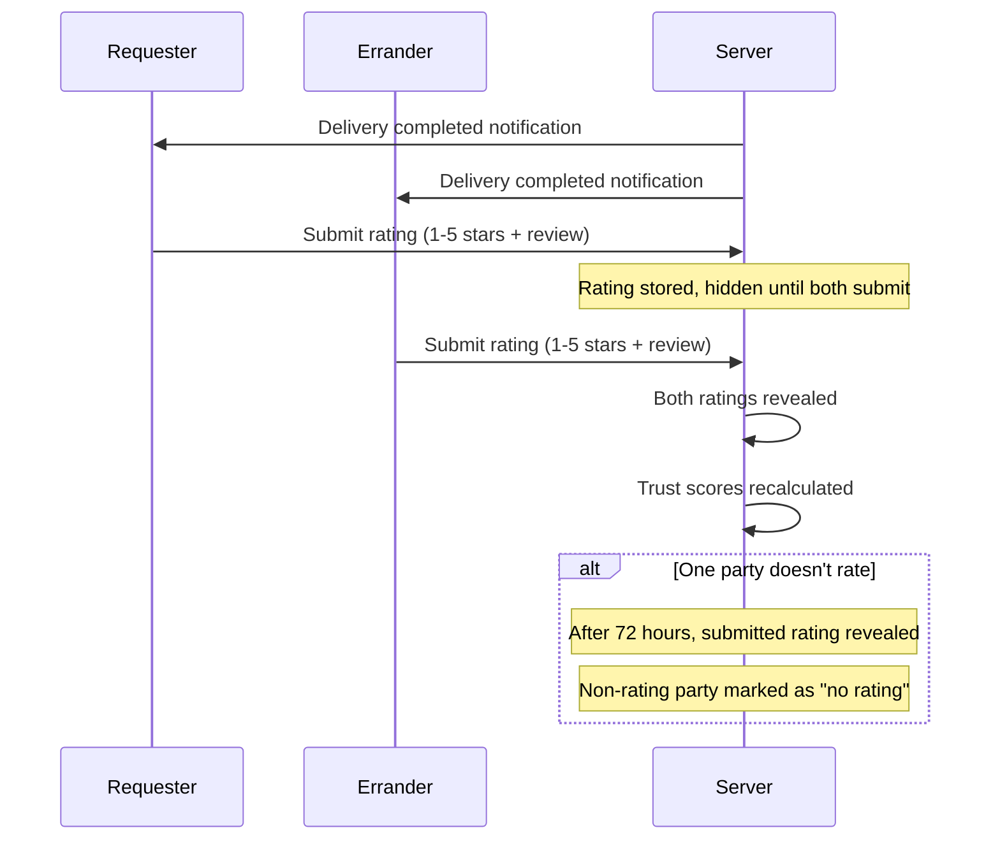

### 21.2 Database Tables

#### ratings

```sql
CREATE TABLE ratings (
    id UUID PRIMARY KEY DEFAULT gen_random_uuid(),
    request_id UUID NOT NULL REFERENCES requests(id),
    bid_id UUID NOT NULL REFERENCES bids(id),
    reviewer_id UUID NOT NULL REFERENCES users(id),
    reviewee_id UUID NOT NULL REFERENCES users(id),
    rating INTEGER NOT NULL CHECK (rating BETWEEN 1 AND 5),
    review TEXT,
    aspects JSONB DEFAULT '{}',
    is_visible BOOLEAN NOT NULL DEFAULT false,
    submitted_at TIMESTAMPTZ NOT NULL DEFAULT NOW(),
    visible_at TIMESTAMPTZ,
    created_at TIMESTAMPTZ NOT NULL DEFAULT NOW(),
    updated_at TIMESTAMPTZ NOT NULL DEFAULT NOW(),
    
    UNIQUE (bid_id, reviewer_id)
);

CREATE INDEX idx_ratings_reviewee ON ratings(reviewee_id);
CREATE INDEX idx_ratings_visible ON ratings(is_visible) WHERE is_visible = true;
CREATE INDEX idx_ratings_request ON ratings(request_id);
```

**Aspects JSONB structure:**
```json
{
  "communication": 5,
  "punctuality": 4,
  "item_accuracy": 5,
  "value": 4,
  "professionalism": 5
}
```

### 21.3 Review Moderation

- **Auto-moderation:** Profanity filter via `chris-kode/laravel-profanity-filter`
- **Flag words:** Admin defined list; flagged reviews go to manual review
- **Spam detection:** Identical reviews from same user; rate limited (10 reviews/hour)
- **Review response:** Reviewee can respond once within 30 days

### 21.4 API Endpoints

#### `POST /ratings`

🔒 Submit a rating after delivery. Accessible by both requester and errander.

**Body:**
```json
{
  "bid_id": "uuid",
  "rating": 4,
  "review": "Great service! Delivered on time and items were correct.",
  "aspects": {
    "communication": 5,
    "punctuality": 4,
    "item_accuracy": 5,
    "value": 4,
    "professionalism": 5
  }
}
```

**Business Rules:**
- Delivery must be confirmed
- One rating per user per bid
- Rating is hidden until both parties submit (or 72 hours pass)
- Trust score recalculated upon visibility

**Response `201`:**
```json
{
  "success": true,
  "data": {
    "id": "uuid",
    "rating": 4,
    "message": "Rating submitted. It will be visible once both parties have rated or after 72 hours."
  }
}
```

#### `GET /users/{id}/ratings`

Public list of visible ratings for a user.

**Query params:** `page`, `per_page`, `rating` (filter by star count)

**Response `200`:**
```json
{
  "success": true,
  "data": [
    {
      "id": "uuid",
      "reviewer": { "id": "uuid", "name": "Adeola" },
      "rating": 4,
      "review": "Great service! Delivered on time.",
      "aspects": { "communication": 5, "punctuality": 4 },
      "created_at": "2026-06-03T16:00:00Z"
    }
  ],
  "meta": {
    "average_rating": 4.3,
    "total_ratings": 42,
    "distribution": { "1": 1, "2": 2, "3": 5, "4": 15, "5": 19 }
  }
}
```

#### `POST /ratings/{id}/respond`

🔒 Respond to a rating (one-time).

**Body:**
```json
{
  "response": "Thank you for your feedback! We appreciate your business."
}
```

---

## 22. SLA & Performance Tracking

### 22.1 SLA Milestones

| Milestone | Trigger | Target | Measured From |
|---|---|---|---|
| **Response Time** | Bid accepted | < 15 min | accepted_at → started_at |
| **Travel Time** | En route to location | < 45 min | started_at → arrived_at |
| **Fulfilment Time** | At the location | Varies by category | arrived_at → completed_at |
| **Total Delivery** | End-to-end | Varies by category | accepted_at → completed_at |

### 22.2 SLA by Category

| Category | Max Response | Max Travel | Max Fulfilment | Total Target |
|---|---|---|---|---|
| Food & Groceries | 10 min | 30 min | 20 min | 60 min |
| Documents / Printing | 15 min | 45 min | 30 min | 90 min |
| Clothing & Apparel | 15 min | 45 min | 30 min | 90 min |
| General Goods | 20 min | 60 min | 30 min | 110 min |
| Electronics | 20 min | 45 min | 45 min | 110 min |
| Services (Repair) | 30 min | 60 min | 120 min | 210 min |
| **Urgent (any)** | **5 min** | **20 min** | **20 min** | **45 min** |

### 22.3 Database Tables

#### sla_tracking

```sql
CREATE TABLE sla_tracking (
    id UUID PRIMARY KEY DEFAULT gen_random_uuid(),
    bid_id UUID NOT NULL UNIQUE REFERENCES bids(id),
    request_id UUID NOT NULL REFERENCES requests(id),
    errander_id UUID NOT NULL REFERENCES users(id),
    status VARCHAR(20) NOT NULL DEFAULT 'pending' CHECK (status IN (
        'pending', 'accepted', 'started', 'arrived', 'completed', 'breached'
    )),
    accepted_at TIMESTAMPTZ,
    started_at TIMESTAMPTZ,
    arrived_at TIMESTAMPTZ,
    completed_at TIMESTAMPTZ,
    sla_target_minutes INTEGER,
    sla_breached BOOLEAN NOT NULL DEFAULT false,
    breach_reason TEXT,
    created_at TIMESTAMPTZ NOT NULL DEFAULT NOW(),
    updated_at TIMESTAMPTZ NOT NULL DEFAULT NOW()
);

CREATE INDEX idx_sla_bid ON sla_tracking(bid_id);
CREATE INDEX idx_sla_breached ON sla_tracking(sla_breached) WHERE sla_breached = true;
CREATE INDEX idx_sla_errander ON sla_tracking(errander_id);
```

### 22.4 API Endpoints

#### `GET /sla/{bid_id}`

🔒 Get SLA tracking for a bid. Accessible by requester and assigned errander.

**Response `200`:**
```json
{
  "success": true,
  "data": {
    "id": "uuid",
    "status": "started",
    "milestones": {
      "accepted": { "completed": true, "at": "2026-06-03T14:00:00Z", "target": "2026-06-03T14:15:00Z" },
      "started": { "completed": true, "at": "2026-06-03T14:05:00Z", "target": "2026-06-03T14:15:00Z" },
      "arrived": { "completed": false, "at": null, "target": "2026-06-03T14:50:00Z" },
      "completed": { "completed": false, "at": null, "target": "2026-06-03T15:20:00Z" }
    },
    "total_target_minutes": 80,
    "elapsed_minutes": 10,
    "remaining_minutes": 70,
    "on_track": true
  }
}
```

#### `POST /sla/{bid_id}/start`

🔒 Mark errand as started. **Role: errander (assigned)**

#### `POST /sla/{bid_id}/arrive`

🔒 Mark arrival at location. **Role: errander (assigned)**

**Body:**
```json
{
  "latitude": 6.6018,
  "longitude": 3.3515
}
```

**Business Rule:** GPS must be within 200m of request location.

---

## 23. Notifications

### 23.1 Notification Types

| Type | Trigger | Channel | Recipient |
|---|---|---|---|
| `new_request` | Request posted in area | Push (FCM) + In-app + Reverb | Nearby erranders |
| `bid_received` | Errander bids on request | Push + In-app + Email | Requester |
| `bid_accepted` | Requester accepts bid | Push + In-app + Email | Errander |
| `bid_rejected` | Bid rejected (another accepted) | In-app | Errander |
| `payment_confirmed` | Payment webhook received | Push + In-app | Errander |
| `delivery_otp_generated` | Errander generates OTP | Push + In-app | Requester |
| `delivery_confirmed` | Requester confirms OTP | Push + In-app | Errander |
| `dispute_opened` | Requester raises dispute | Push + In-app + Email | Errander + Admin |
| `dispute_resolved` | Admin resolves dispute | Push + In-app + Email | Both parties |
| `payout_sent` | Funds released to wallet | Push + In-app | Errander |
| `funds_received` | Wallet funded | Push + In-app | Requester |
| `withdrawal_complete` | Bank withdrawal processed | Push + In-app | Errander |
| `kyc_approved` | KYC tier approved | Push + In-app | User |
| `kyc_rejected` | KYC rejected | Push + In-app + Email | User |
| `subscription_expiring` | Plan expiring in 3 days | Email + In-app | Subscriber |
| `chat_message` | New message (user offline) | Push | Recipient |
| `sla_warning` | SLA at 80% of target | In-app | Errander |
| `sla_breached` | SLA target exceeded | Push + In-app | Errander |

### 23.2 Database Tables

#### notifications

```sql
CREATE TABLE notifications (
    id UUID PRIMARY KEY DEFAULT gen_random_uuid(),
    user_id UUID NOT NULL REFERENCES users(id) ON DELETE CASCADE,
    type VARCHAR(50) NOT NULL,
    title VARCHAR(200) NOT NULL,
    body TEXT NOT NULL,
    data JSONB DEFAULT '{}',
    read_at TIMESTAMPTZ,
    created_at TIMESTAMPTZ NOT NULL DEFAULT NOW()
);

CREATE INDEX idx_notifications_user ON notifications(user_id, read_at, created_at DESC);
CREATE INDEX idx_notifications_unread ON notifications(user_id, created_at DESC) WHERE read_at IS NULL;
```

### 23.3 Notification Channels Configuration

```php
// config/errandboy.php
'notifications' => [
    'channels' => [
        'new_request' => ['database', 'fcm', 'reverb'],
        'bid_received' => ['database', 'fcm', 'mail'],
        'bid_accepted' => ['database', 'fcm', 'mail'],
        'payment_confirmed' => ['database', 'fcm'],
        'delivery_otp_generated' => ['database', 'fcm'],
        'delivery_confirmed' => ['database', 'fcm'],
        'dispute_opened' => ['database', 'fcm', 'mail'],
        'payout_sent' => ['database', 'fcm'],
        'chat_message' => ['fcm'],
    ],
],
```

### 23.4 FCM Integration

```php
// App\Services\NotificationService.php
class NotificationService
{
    public function send(User $user, string $type, array $data): void
    {
        // 1. Save in-app notification
        $notification = $user->notifications()->create([
            'type' => $type,
            'title' => $data['title'],
            'body' => $data['body'],
            'data' => $data['payload'] ?? [],
        ]);
        
        // 2. Push via FCM
        if ($user->fcm_token && $this->shouldSendPush($type)) {
            $this->sendPushNotification($user->fcm_token, $data);
        }
        
        // 3. Reverb realtime event (if user is online)
        if ($this->shouldSendRealtime($type)) {
            event(new NotificationReceived($notification, $user->id));
        }
        
        // 4. Email (for critical notifications)
        if ($this->shouldSendEmail($type)) {
            Mail::to($user)->queue(new CriticalNotificationMail($notification));
        }
    }
    
    private function sendPushNotification(string $token, array $data): void
    {
        $message = (new FcmMessage())
            ->withTitle($data['title'])
            ->withBody($data['body'])
            ->withData($data['payload'] ?? [])
            ->withPriority('high')
            ->withSound('default');
        
        FCM::sendTo($token, $message);
    }
}
```

### 23.5 Reverb Notification Event

```php
// App\Events\NotificationReceived.php
class NotificationReceived implements ShouldBroadcast
{
    use Dispatchable, InteractsWithSockets, SerializesModels;
    
    public function __construct(
        public Notification $notification,
        public string $userId
    ) {}
    
    public function broadcastOn(): Channel
    {
        return new PrivateChannel("user.{$this->userId}");
    }
    
    public function broadcastAs(): string
    {
        return 'notification.received';
    }
}
```

### 23.6 API Endpoints

#### `GET /notifications`

🔒 Paginated in-app notifications.

**Query params:** `read` (boolean filter), `type`, `page`, `per_page`

#### `POST /notifications/{id}/read`

🔒 Mark single notification as read.

#### `POST /notifications/read-all`

🔒 Mark all notifications as read.

#### `PUT /me/fcm-token`

🔒 Register FCM push token.

**Body:**
```json
{
  "fcm_token": "fMz9xK2QRNq...",
  "device_type": "android | ios",
  "device_name": "Samsung Galaxy S25"
}
```

---

## 24. Dispute Management

### 24.1 Dispute Lifecycle

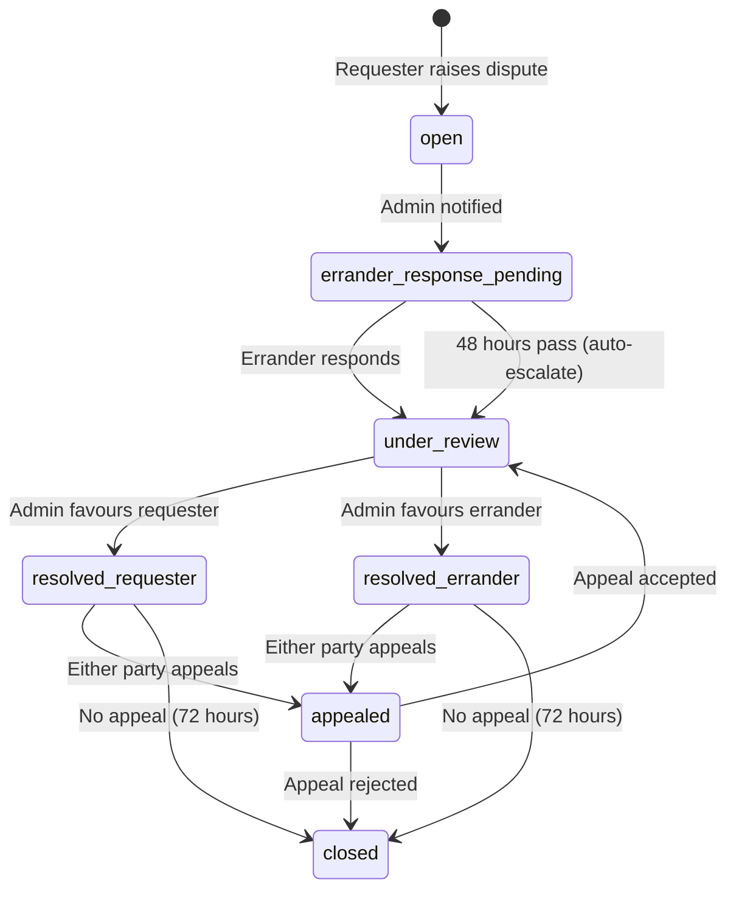

### 24.2 Database Tables

#### disputes

```sql
CREATE TABLE disputes (
    id UUID PRIMARY KEY DEFAULT gen_random_uuid(),
    delivery_id UUID NOT NULL REFERENCES deliveries(id),
    bid_id UUID NOT NULL REFERENCES bids(id),
    request_id UUID NOT NULL REFERENCES requests(id),
    raised_by UUID NOT NULL REFERENCES users(id),
    errander_id UUID NOT NULL REFERENCES users(id),
    reason VARCHAR(200) NOT NULL,
    description TEXT NOT NULL,
    status VARCHAR(30) NOT NULL DEFAULT 'open' CHECK (status IN (
        'open', 'errander_response_pending', 'under_review',
        'resolved_requester', 'resolved_errander', 'appealed', 'closed'
    )),
    resolution_note TEXT,
    resolved_by UUID REFERENCES users(id),
    resolved_at TIMESTAMPTZ,
    dispute_window_closed_at TIMESTAMPTZ,
    is_appeal BOOLEAN NOT NULL DEFAULT false,
    parent_dispute_id UUID REFERENCES disputes(id),
    created_at TIMESTAMPTZ NOT NULL DEFAULT NOW(),
    updated_at TIMESTAMPTZ NOT NULL DEFAULT NOW()
);

CREATE INDEX idx_disputes_delivery ON disputes(delivery_id);
CREATE INDEX idx_disputes_status ON disputes(status);
CREATE INDEX idx_disputes_raised_by ON disputes(raised_by);
```

#### dispute_evidence

```sql
CREATE TABLE dispute_evidence (
    id UUID PRIMARY KEY DEFAULT gen_random_uuid(),
    dispute_id UUID NOT NULL REFERENCES disputes(id) ON DELETE CASCADE,
    uploaded_by UUID NOT NULL REFERENCES users(id),
    type VARCHAR(20) NOT NULL CHECK (type IN ('photo', 'video', 'document', 'screenshot')),
    path VARCHAR(500) NOT NULL,
    url VARCHAR(500) NOT NULL,
    created_at TIMESTAMPTZ NOT NULL DEFAULT NOW()
);

CREATE INDEX idx_de_dispute ON dispute_evidence(dispute_id);
```

#### dispute_messages

```sql
CREATE TABLE dispute_messages (
    id UUID PRIMARY KEY DEFAULT gen_random_uuid(),
    dispute_id UUID NOT NULL REFERENCES disputes(id) ON DELETE CASCADE,
    sender_id UUID NOT NULL REFERENCES users(id),
    message TEXT NOT NULL,
    is_admin_note BOOLEAN NOT NULL DEFAULT false,
    created_at TIMESTAMPTZ NOT NULL DEFAULT NOW()
);

CREATE INDEX idx_dm_dispute ON dispute_messages(dispute_id);
```

### 24.3 Dispute Window Reference

| Category | Dispute Window |
|---|---|
| Food & Groceries | 6 hours |
| Documents / Printing | 12 hours |
| Clothing & Apparel | 24 hours |
| General Goods | 24 hours |
| Electronics | 48 hours |
| Services (Repair) | 72 hours |

> Windows are stored as `dispute_window_hours` on the `categories` table and are configurable by admins.

### 24.4 API Endpoints

#### `POST /disputes`

🔒 Open a dispute. **Role: requester**

**Body (multipart/form-data):**
```json
{
  "delivery_id": "uuid",
  "reason": "Items not as described",
  "description": "The items delivered do not match what I requested. I ordered Brand X milk but received Brand Y.",
  "evidence": "file[] (optional, max 5 files, each max 10MB)"
}
```

**Business Rules:**
- Delivery must be confirmed
- Current time must be within `dispute_window_closes_at`
- Payout job is paused immediately
- Dispute window is extended until resolution

**Response `201`:**
```json
{
  "success": true,
  "data": {
    "id": "uuid",
    "status": "open",
    "opened_at": "2026-06-03T16:00:00Z",
    "message": "Dispute opened. Admin will review within 24 hours. Your funds remain in escrow."
  }
}
```

#### `GET /disputes/{id}`

🔒 Get dispute details. Accessible by requester, errander (parties), or admin.

#### `GET /my/disputes`

🔒 Authenticated user's dispute history.

**Query params:** `status`, `page`, `per_page`

#### `POST /disputes/{id}/respond`

🔒 Errander responds to a dispute.

**Body (multipart/form-data):**
```json
{
  "response": "I purchased exactly Brand X as requested. I have the receipt as proof.",
  "evidence": "file[] (optional, max 5 files)"
}
```

**Business Rule:** Must respond within 48 hours of dispute opening.

#### `POST /admin/disputes/{id}/resolve`

🔒 **Admin:** Resolve a dispute.

**Body:**
```json
{
  "resolution": "favour_requester | favour_errander",
  "note": "After reviewing evidence from both parties, the errander provided a valid receipt showing the correct brand was purchased. Ruling in favour of errander.",
  "send_notification": true
}
```

**Business Rules:**
- `favour_requester` → escrow refunded to requester wallet; request status → `refunded`
- `favour_errander` → escrow released to errander wallet; request status → `completed`
- Both parties notified with resolution note
- Either party can appeal within 72 hours

---

## 25. Analytics & Reporting

### 25.1 Analytics Architecture

Data flows from PostgreSQL → Materialized Views → Cache (Redis) → API → Dashboard.

### 25.2 Key Metrics

#### Platform Metrics

| Metric | Calculation | Refresh |
|---|---|---|
| GMV (Gross Merchandise Volume) | SUM(total_amount) from successful payments | Hourly |
| Active Users (DAU/WAU/MAU) | Distinct users with activity in period | Hourly |
| Request Volume | COUNT(requests) by status per period | Hourly |
| Fulfilment Rate | completed / (completed + cancelled + expired) | Hourly |
| Avg Delivery Time | AVG(completed_at - accepted_at) per category | Hourly |
| Dispute Rate | disputed / total_delivered | Daily |
| Platform Revenue | SUM(platform_fee) from payments | Hourly |
| Avg Order Value | AVG(total_amount) | Daily |

#### Errander Metrics

| Metric | Calculation |
|---|---|
| Top Erranders | By completed orders, earnings, rating |
| Utilization Rate | Active hours / total available hours |
| Churn Rate | Erranders inactive > 30 days / total erranders |
| Onboarding Funnel | Registered → KYC Tier 1 → First Bid → First Completion |

#### Financial Metrics

| Metric | Calculation |
|---|---|
| Total Escrow Held | SUM(escrow_transactions WHERE status='held') |
| Pending Payouts | SUM(payouts WHERE status='pending') |
| Withdrawal Volume | SUM(withdrawals WHERE status='completed') / period |
| Revenue by Stream | Platform fees, urgent fees, subscription, withdrawal fees |

### 25.3 Materialized Views

```sql
-- Daily platform metrics
CREATE MATERIALIZED VIEW mv_daily_metrics AS
SELECT
    DATE(created_at) AS date,
    COUNT(*) AS total_requests,
    COUNT(CASE WHEN status = 'completed' THEN 1 END) AS completed_requests,
    COUNT(CASE WHEN status = 'disputed' THEN 1 END) AS disputed_requests,
    COUNT(CASE WHEN is_urgent THEN 1 END) AS urgent_requests,
    COALESCE(SUM(CASE WHEN status IN ('completed', 'delivered') THEN budget_hint ELSE 0 END), 0) AS estimated_gmv
FROM requests
GROUP BY DATE(created_at);

CREATE UNIQUE INDEX idx_mvdm_date ON mv_daily_metrics(date);
```

### 25.4 API Endpoints

#### `GET /admin/analytics/dashboard`

🔒 **Admin:** Platform dashboard metrics.

**Query params:** `period` (`today`, `7d`, `30d`, `90d`, `1y`, `custom`), `from_date`, `to_date`

**Response `200`:**
```json
{
  "success": true,
  "data": {
    "period": "30d",
    "gmv": 28500000.00,
    "gmv_change_pct": 12.5,
    "total_requests": 3420,
    "completion_rate": 92.3,
    "active_erranders": 850,
    "active_requesters": 2100,
    "dispute_rate": 2.1,
    "platform_revenue": 1425000.00,
    "average_delivery_time_minutes": 68,
    "gmv_trend": [
      { "date": "2026-05-04", "gmv": 850000.00 },
      { "date": "2026-05-05", "gmv": 920000.00 }
    ],
    "top_categories": [
      { "name": "Food & Groceries", "count": 1200, "gmv": 8500000.00 },
      { "name": "Documents / Printing", "count": 800, "gmv": 4200000.00 }
    ]
  }
}
```

#### `GET /admin/analytics/erranders`

🔒 **Admin:** Errander performance metrics.

#### `GET /admin/analytics/revenue`

🔒 **Admin:** Revenue breakdown by stream.

#### `GET /companies/{id}/analytics`

🔒 Company analytics dashboard. **Role: company_admin**

---

## 26. Admin Portal

### 26.1 Admin Dashboard

The admin portal is a web-based dashboard (Next.js) with the following modules:

- **Dashboard:** Real-time metrics, charts, alerts
- **User Management:** List, search, suspend, activate, ban users
- **KYC Review:** Queue of pending KYC submissions for manual review
- **Request Monitor:** All requests with full details and status filters
- **Dispute Resolution:** Open disputes queue with evidence viewer
- **Payment Monitor:** All payments, payouts, withdrawals with filters
- **Category Management:** CRUD for categories and dispute windows
- **Subscription Management:** Plans CRUD, subscriber list, revenue
- **Settings:** Platform fee, OTP expiry, notification templates
- **Audit Log:** Searchable, filterable immutable audit trail
- **Fraud Queue:** Flagged accounts and transactions for review

### 26.2 Admin API Endpoints

#### User Management

| Method | Endpoint | Description |
|---|---|---|
| `GET` | `/admin/users` | List all users (filters: `role`, `status`, `kyc_tier`, `search`, `page`) |
| `GET` | `/admin/users/{id}` | Get user details with full KYC, wallet, stats |
| `PUT` | `/admin/users/{id}/suspend` | Suspend user (`{ "reason": "string" }`) |
| `PUT` | `/admin/users/{id}/activate` | Reactivate user |
| `PUT` | `/admin/users/{id}/ban` | Permanently ban user |
| `PUT` | `/admin/users/{id}/freeze-wallet` | Freeze user's wallet |
| `PUT` | `/admin/users/{id}/unfreeze-wallet` | Unfreeze user's wallet |

#### KYC Review

| Method | Endpoint | Description |
|---|---|---|
| `GET` | `/admin/kyc/pending` | List pending KYC reviews |
| `GET` | `/admin/kyc/{id}` | Get KYC submission with documents |
| `POST` | `/admin/kyc/{id}/review` | Approve/reject KYC (`{ "action": "approve|reject", "reason": "string" }`) |

#### Dispute Resolution

| Method | Endpoint | Description |
|---|---|---|
| `GET` | `/admin/disputes` | List disputes (filters: `status`, `category`, `date`) |
| `GET` | `/admin/disputes/{id}` | Get dispute with all evidence and messages |
| `POST` | `/admin/disputes/{id}/message` | Add admin note to dispute |
| `POST` | `/admin/disputes/{id}/resolve` | Resolve dispute |
| `POST` | `/admin/disputes/{id}/appeal/{action}` | Accept/reject appeal |

#### Payment & Transaction Monitoring

| Method | Endpoint | Description |
|---|---|---|
| `GET` | `/admin/payments` | All payments (filters: `status`, `provider`, `date`) |
| `GET` | `/admin/payouts` | All payouts (filters: `status`, `date`) |
| `GET` | `/admin/withdrawals` | All withdrawals (filters: `status`, `date`) |
| `GET` | `/admin/escrow` | Current escrow holdings and history |
| `POST` | `/admin/payouts/{id}/retry` | Retry failed payout |
| `POST` | `/admin/withdrawals/{id}/retry` | Retry failed withdrawal |

#### Category Management

| Method | Endpoint | Description |
|---|---|---|
| `GET` | `/admin/categories` | List categories |
| `POST` | `/admin/categories` | Create category |
| `PUT` | `/admin/categories/{id}` | Update category |
| `DELETE` | `/admin/categories/{id}` | Soft-delete category |

#### Settings

| Method | Endpoint | Description |
|---|---|---|
| `GET` | `/admin/settings` | Get all platform settings |
| `PUT` | `/admin/settings` | Update settings |

**Settings Body:**
```json
{
  "platform_fee_percentage": 5.0,
  "otp_expiry_minutes": 30,
  "max_bid_photos": 5,
  "max_request_photos": 5,
  "min_service_fee": 500,
  "urgent_request_fee": 1500,
  "request_expiry_days": 7,
  "withdrawal_fee_percentage": 1.5,
  "withdrawal_fee_cap": 200,
  "default_dispute_window_hours": 24,
  "max_failed_login_attempts": 5,
  "account_lockout_minutes": 30
}
```

#### Audit Log

| Method | Endpoint | Description |
|---|---|---|
| `GET` | `/admin/audit-logs` | List audit logs (filters: `user_id`, `action`, `model`, `date`) |

---

## 27. Complete API Reference

**Base URL:** `https://api.errandboy.ng/v1`

**Authentication:** Bearer token via `Authorization: Bearer {token}` header.

**Standard Response Envelope:**
```json
{
  "success": true,
  "data": {},
  "message": "string",
  "meta": {
    "current_page": 1,
    "per_page": 20,
    "total": 100
  }
}
```

**Error Response:**
```json
{
  "success": false,
  "message": "Validation failed",
  "errors": {
    "field": ["Error message"]
  }
}
```

### 27.1 Authentication

| Method | Endpoint | Auth | Description |
|---|---|---|---|
| `POST` | `/auth/register` | — | Register new user |
| `POST` | `/auth/login` | — | Login and receive token |
| `POST` | `/auth/logout` | 🔒 | Invalidate current token |
| `POST` | `/auth/refresh` | 🔒 | Refresh expired token |
| `POST` | `/auth/forgot-password` | — | Send password reset email |
| `POST` | `/auth/reset-password` | — | Reset password with token |
| `POST` | `/auth/verify-email` | — | Verify email with OTP |
| `POST` | `/auth/verify-phone` | 🔒 | Verify phone with OTP |
| `POST` | `/auth/enable-2fa` | 🔒 | Enable two-factor authentication |
| `POST` | `/auth/disable-2fa` | 🔒 | Disable two-factor authentication |
| `GET` | `/auth/sessions` | 🔒 | List active sessions |
| `DELETE` | `/auth/sessions/{id}` | 🔒 | Revoke a session |

### 27.2 Users & Profiles

| Method | Endpoint | Auth | Description |
|---|---|---|---|
| `GET` | `/me` | 🔒 | Get authenticated user profile |
| `PUT` | `/me` | 🔒 | Update profile |
| `DELETE` | `/me` | 🔒 | Delete account (soft) |
| `PUT` | `/me/avatar` | 🔒 | Upload avatar |
| `PUT` | `/me/fcm-token` | 🔒 | Register FCM push token |
| `PUT` | `/me/location` | 🔒 | Update current location (errander) |
| `PUT` | `/me/availability` | 🔒 | Set availability status (errander) |
| `GET` | `/users/{id}/profile` | — | Public user profile |
| `GET` | `/users/{id}/ratings` | — | Public user ratings |
| `GET` | `/erranders/{id}/trust-score` | — | Public trust score |

### 27.3 KYC & Verification

| Method | Endpoint | Auth | Roles | Description |
|---|---|---|---|---|
| `GET` | `/kyc/status` | 🔒 | All | Get verification status |
| `POST` | `/kyc/verify/tier-0` | 🔒 | All | Email + Phone verification |
| `POST` | `/kyc/verify/tier-1` | 🔒 | All | BVN verification |
| `POST` | `/kyc/verify/tier-2` | 🔒 | All | NIN + Selfie verification |
| `POST` | `/kyc/verify/tier-3` | 🔒 | All | Address verification |
| `GET` | `/admin/kyc/pending` | 🔒 | Admin | Pending KYC reviews |
| `GET` | `/admin/kyc/{id}` | 🔒 | Admin | KYC submission detail |
| `POST` | `/admin/kyc/{id}/review` | 🔒 | Admin | Approve/reject KYC |

### 27.4 Categories

| Method | Endpoint | Auth | Description |
|---|---|---|---|
| `GET` | `/categories` | — | List all categories |
| `GET` | `/categories/{id}` | — | Get category details |

### 27.5 Requests

| Method | Endpoint | Auth | Roles | Description |
|---|---|---|---|---|
| `GET` | `/requests` | 🔒 | Errander | Browse open requests feed |
| `POST` | `/requests` | 🔒 | Requester | Create request |
| `GET` | `/requests/{id}` | 🔒 | All | Get request details |
| `PUT` | `/requests/{id}` | 🔒 | Owner | Update request |
| `DELETE` | `/requests/{id}` | 🔒 | Owner | Cancel request |
| `GET` | `/my/requests` | 🔒 | Requester | My requests history |

### 27.6 Bids

| Method | Endpoint | Auth | Roles | Description |
|---|---|---|---|---|
| `POST` | `/requests/{id}/bids` | 🔒 | Errander | Submit bid |
| `GET` | `/requests/{id}/bids` | 🔒 | All | View bids on request |
| `POST` | `/bids/{id}/accept` | 🔒 | Requester | Accept bid |
| `DELETE` | `/bids/{id}` | 🔒 | Owner | Withdraw bid |
| `GET` | `/my/bids` | 🔒 | Errander | My bids history |

### 27.7 Payments

| Method | Endpoint | Auth | Roles | Description |
|---|---|---|---|---|
| `POST` | `/payments/initiate` | 🔒 | Requester | Initiate payment |
| `GET` | `/payments/{id}` | 🔒 | Parties | Get payment details |
| `GET` | `/my/payments` | 🔒 | All | Payment history |
| `POST` | `/payments/webhook/flutterwave` | Sig | — | Flutterwave webhook |
| `POST` | `/payments/webhook/paystack` | Sig | — | Paystack webhook |

### 27.8 Wallet

| Method | Endpoint | Auth | Roles | Description |
|---|---|---|---|---|
| `GET` | `/wallet` | 🔒 | All | Get wallet balance |
| `POST` | `/wallet/fund` | 🔒 | Requester | Fund wallet |
| `GET` | `/wallet/transactions` | 🔒 | All | Transaction history |
| `POST` | `/wallet/withdraw` | 🔒 | Errander | Withdraw to bank |

### 27.9 Deliveries

| Method | Endpoint | Auth | Roles | Description |
|---|---|---|---|---|
| `POST` | `/deliveries/{bid_id}/generate-otp` | 🔒 | Errander | Generate delivery OTP |
| `POST` | `/deliveries/{bid_id}/confirm` | 🔒 | Requester | Confirm delivery (OTP) |
| `GET` | `/deliveries/{bid_id}` | 🔒 | Parties | Get delivery details |

### 27.10 Disputes

| Method | Endpoint | Auth | Roles | Description |
|---|---|---|---|---|
| `POST` | `/disputes` | 🔒 | Requester | Open dispute |
| `GET` | `/disputes/{id}` | 🔒 | Parties | Get dispute details |
| `GET` | `/my/disputes` | 🔒 | All | My disputes |
| `POST` | `/disputes/{id}/respond` | 🔒 | Errander | Respond to dispute |
| `POST` | `/disputes/{id}/appeal` | 🔒 | Parties | Appeal resolution |

### 27.11 Chat

| Method | Endpoint | Auth | Roles | Description |
|---|---|---|---|---|
| `GET` | `/conversations` | 🔒 | All | List conversations |
| `GET` | `/conversations/{id}/messages` | 🔒 | Parties | Get messages (cursor) |
| `POST` | `/conversations/{id}/messages` | 🔒 | Parties | Send message |
| `POST` | `/conversations/{id}/read` | 🔒 | Parties | Mark as read |
| `POST` | `/conversations/{id}/typing` | 🔒 | Parties | Typing indicator |

### 27.12 Ratings

| Method | Endpoint | Auth | Roles | Description |
|---|---|---|---|---|
| `POST` | `/ratings` | 🔒 | All | Submit rating |
| `POST` | `/ratings/{id}/respond` | 🔒 | Reviewee | Respond to rating |

### 27.13 SLA

| Method | Endpoint | Auth | Roles | Description |
|---|---|---|---|---|
| `GET` | `/sla/{bid_id}` | 🔒 | Parties | Get SLA status |
| `POST` | `/sla/{bid_id}/start` | 🔒 | Errander | Mark started |
| `POST` | `/sla/{bid_id}/arrive` | 🔒 | Errander | Mark arrived |

### 27.14 Subscriptions

| Method | Endpoint | Auth | Roles | Description |
|---|---|---|---|---|
| `GET` | `/plans` | — | — | List plans |
| `POST` | `/subscriptions` | 🔒 | Requester | Subscribe |
| `GET` | `/my/subscription` | 🔒 | All | Current subscription |
| `POST` | `/subscriptions/cancel` | 🔒 | All | Cancel auto-renewal |

### 27.15 Business Accounts

| Method | Endpoint | Auth | Roles | Description |
|---|---|---|---|---|
| `POST` | `/companies` | 🔒 | Requester | Create company |
| `GET` | `/companies/{id}` | 🔒 | Members | Get company |
| `PUT` | `/companies/{id}` | 🔒 | Admin | Update company |
| `POST` | `/companies/{id}/invite` | 🔒 | Admin | Invite member |
| `POST` | `/invitations/{token}/accept` | 🔒 | All | Accept invitation |
| `DELETE` | `/companies/{id}/members/{uid}` | 🔒 | Admin | Remove member |
| `GET` | `/companies/{id}/members` | 🔒 | Members | List members |
| `GET` | `/companies/{id}/analytics` | 🔒 | Admin | Company analytics |

### 27.16 Notifications

| Method | Endpoint | Auth | Description |
|---|---|---|---|
| `GET` | `/notifications` | 🔒 | List notifications |
| `POST` | `/notifications/{id}/read` | 🔒 | Mark as read |
| `POST` | `/notifications/read-all` | 🔒 | Mark all as read |

### 27.17 Admin

| Method | Endpoint | Auth | Description |
|---|---|---|---|
| `GET` | `/admin/users` | 🔒 Admin | List users |
| `GET` | `/admin/users/{id}` | 🔒 Admin | User detail |
| `PUT` | `/admin/users/{id}/suspend` | 🔒 Admin | Suspend user |
| `PUT` | `/admin/users/{id}/activate` | 🔒 Admin | Activate user |
| `PUT` | `/admin/users/{id}/ban` | 🔒 Admin | Ban user |
| `GET` | `/admin/requests` | 🔒 Admin | All requests |
| `GET` | `/admin/payments` | 🔒 Admin | All payments |
| `GET` | `/admin/payouts` | 🔒 Admin | All payouts |
| `GET` | `/admin/withdrawals` | 🔒 Admin | All withdrawals |
| `GET` | `/admin/escrow` | 🔒 Admin | Escrow holdings |
| `GET` | `/admin/disputes` | 🔒 Admin | All disputes |
| `POST` | `/admin/disputes/{id}/resolve` | 🔒 Admin | Resolve dispute |
| `POST` | `/admin/disputes/{id}/message` | 🔒 Admin | Add admin note |
| `GET` | `/admin/categories` | 🔒 Admin | Categories |
| `POST` | `/admin/categories` | 🔒 Admin | Create category |
| `PUT` | `/admin/categories/{id}` | 🔒 Admin | Update category |
| `DELETE` | `/admin/categories/{id}` | 🔒 Admin | Delete category |
| `GET` | `/admin/settings` | 🔒 Admin | Get settings |
| `PUT` | `/admin/settings` | 🔒 Admin | Update settings |
| `GET` | `/admin/plans` | 🔒 Admin | List plans |
| `POST` | `/admin/plans` | 🔒 Admin | Create plan |
| `PUT` | `/admin/plans/{id}` | 🔒 Admin | Update plan |
| `GET` | `/admin/subscriptions` | 🔒 Admin | All subscriptions |
| `GET` | `/admin/analytics/dashboard` | 🔒 Admin | Analytics dashboard |
| `GET` | `/admin/analytics/erranders` | 🔒 Admin | Errander metrics |
| `GET` | `/admin/analytics/revenue` | 🔒 Admin | Revenue breakdown |
| `GET` | `/admin/audit-logs` | 🔒 Admin | Audit logs |
| `GET` | `/admin/fraud-queue` | 🔒 Admin | Flagged accounts |

---

## 28. Request & Response Objects

### 28.1 User Object

```json
{
  "id": "uuid",
  "name": "string",
  "email": "string",
  "phone": "string",
  "role": "requester | errander | admin",
  "status": "active | suspended | banned",
  "kyc_tier": 2,
  "avatar_url": "string | null",
  "is_online": true,
  "completed_orders": 42,
  "member_since": "2025-01-15",
  "created_at": "ISO8601"
}
```

### 28.2 Request Object

```json
{
  "id": "uuid",
  "title": "string",
  "description": "string",
  "category": {
    "id": "uuid",
    "name": "string",
    "dispute_window_hours": 24
  },
  "location": "string",
  "latitude": 6.6018,
  "longitude": 3.3515,
  "budget_hint": 5000.00,
  "is_urgent": false,
  "urgent_fee": 0.00,
  "photos": ["https://cdn.errandboy.ng/requests/photo1.jpg"],
  "status": "open | assigned | in_progress | delivered | completed | disputed | refunded | cancelled | expired",
  "requester": {
    "id": "uuid",
    "name": "string",
    "completed_orders": 5
  },
  "company": {
    "id": "uuid",
    "name": "string"
  },
  "bids_count": 3,
  "accepted_bid_id": null,
  "created_at": "ISO8601",
  "updated_at": "ISO8601"
}
```

### 28.3 Bid Object

```json
{
  "id": "uuid",
  "request_id": "uuid",
  "errander": {
    "id": "uuid",
    "name": "string",
    "completed_orders": 12,
    "trust_score": 4.3,
    "average_rating": 4.2
  },
  "goods_amount": 4500.00,
  "service_fee": 1500.00,
  "platform_fee": 300.00,
  "total_amount": 6300.00,
  "note": "string | null",
  "delivery_at": "ISO8601",
  "status": "pending | accepted | rejected | withdrawn",
  "created_at": "ISO8601"
}
```

### 28.4 Payment Object

```json
{
  "id": "uuid",
  "bid_id": "uuid",
  "request_id": "uuid",
  "provider": "flutterwave | paystack | wallet",
  "provider_ref": "FLW-MOCK-xxx",
  "amount": 6300.00,
  "breakdown": {
    "goods_amount": 4500.00,
    "service_fee": 1500.00,
    "platform_fee": 300.00,
    "urgent_fee": 0.00
  },
  "currency": "NGN",
  "status": "pending | successful | failed | refunded",
  "payment_method": "card | bank_transfer | wallet",
  "paid_at": "ISO8601 | null"
}
```

### 28.5 Wallet Object

```json
{
  "id": "uuid",
  "user_id": "uuid",
  "balance": 25000.00,
  "locked_balance": 10500.00,
  "available_balance": 14500.00,
  "currency": "NGN",
  "status": "active | frozen | closed"
}
```

### 28.6 Wallet Transaction Object

```json
{
  "id": "uuid",
  "type": "deposit | withdrawal | payment | refund | payout | fee | lock | unlock | adjustment",
  "amount": 10000.00,
  "balance_before": 5000.00,
  "balance_after": 15000.00,
  "reference": "WLT-20260603-ABC123",
  "description": "Wallet funding via Flutterwave",
  "status": "pending | completed | failed | reversed",
  "created_at": "ISO8601"
}
```

### 28.7 Delivery Object

```json
{
  "id": "uuid",
  "bid_id": "uuid",
  "request_id": "uuid",
  "confirmed": false,
  "confirmed_at": "ISO8601 | null",
  "dispute_window_hours": 24,
  "dispute_window_closes_at": "ISO8601 | null",
  "otp_generated_at": "ISO8601",
  "otp_expires_at": "ISO8601"
}
```

### 28.8 Dispute Object

```json
{
  "id": "uuid",
  "delivery_id": "uuid",
  "bid_id": "uuid",
  "request_id": "uuid",
  "raised_by": {
    "id": "uuid",
    "name": "string"
  },
  "errander": {
    "id": "uuid",
    "name": "string"
  },
  "reason": "string",
  "description": "string",
  "evidence": [
    { "id": "uuid", "type": "photo", "url": "string" }
  ],
  "errander_response": "string | null",
  "status": "open | errander_response_pending | under_review | resolved_requester | resolved_errander | appealed | closed",
  "resolution_note": "string | null",
  "resolved_by": "string | null",
  "opened_at": "ISO8601",
  "resolved_at": "ISO8601 | null"
}
```

### 28.9 Rating Object

```json
{
  "id": "uuid",
  "reviewer": {
    "id": "uuid",
    "name": "string",
    "avatar_url": "string"
  },
  "rating": 4,
  "review": "Great service! Delivered on time and items were correct.",
  "aspects": {
    "communication": 5,
    "punctuality": 4,
    "item_accuracy": 5
  },
  "response": "Thank you! Happy to help.",
  "created_at": "ISO8601"
}
```

### 28.10 Conversation Object

```json
{
  "id": "uuid",
  "request_id": "uuid",
  "request_title": "string",
  "other_user": {
    "id": "uuid",
    "name": "string",
    "avatar_url": "string",
    "is_online": true
  },
  "last_message": {
    "preview": "string",
    "created_at": "ISO8601"
  },
  "unread_count": 2,
  "created_at": "ISO8601"
}
```

### 28.11 Message Object

```json
{
  "id": "uuid",
  "conversation_id": "uuid",
  "sender_id": "uuid",
  "type": "text | image | location | system",
  "content": "string",
  "attachment_url": "string | null",
  "attachment_thumbnail_url": "string | null",
  "read_at": "ISO8601 | null",
  "delivered_at": "ISO8601 | null",
  "created_at": "ISO8601"
}
```

### 28.12 Notification Object

```json
{
  "id": "uuid",
  "type": "bid_received | bid_accepted | delivery_confirmed | dispute_opened | payout_sent",
  "title": "string",
  "body": "string",
  "read": false,
  "data": {},
  "created_at": "ISO8601"
}
```

### 28.13 SLA Object

```json
{
  "id": "uuid",
  "bid_id": "uuid",
  "status": "started",
  "milestones": {
    "accepted": { "completed": true, "at": "ISO8601", "target": "ISO8601" },
    "started": { "completed": true, "at": "ISO8601", "target": "ISO8601" },
    "arrived": { "completed": false, "at": null, "target": "ISO8601" },
    "completed": { "completed": false, "at": null, "target": "ISO8601" }
  },
  "total_target_minutes": 80,
  "elapsed_minutes": 10,
  "remaining_minutes": 70,
  "on_track": true
}
```

### 28.14 Subscription Object

```json
{
  "id": "uuid",
  "plan": {
    "id": "uuid",
    "name": "Pro",
    "slug": "pro"
  },
  "status": "active",
  "billing_cycle": "monthly",
  "started_at": "2026-06-01T00:00:00Z",
  "expires_at": "2026-07-01T00:00:00Z",
  "auto_renew": true,
  "features": ["20 active requests", "5 urgent requests/mo", "0% withdrawal fee"]
}
```

### 28.15 Company Object

```json
{
  "id": "uuid",
  "name": "Acme Logistics Ltd",
  "slug": "acme-logistics-ltd",
  "industry": "Logistics",
  "logo_url": "https://cdn.errandboy.ng/logos/acme.jpg",
  "owner": { "id": "uuid", "name": "string" },
  "member_count": 5,
  "status": "active",
  "created_at": "ISO8601"
}
```

---

## 29. Status State Machines

### 29.1 Request Statuses

```
draft
  └─► open              (published by requester; erranders notified)
        ├─► assigned     (bid accepted + payment initiated)
        │    └─► in_progress  (payment confirmed by webhook)
        │          └─► delivered   (errander generates OTP at drop-off)
        │                ├─► completed    (OTP confirmed; window closes; no dispute)
        │                └─► disputed     (requester raises dispute within window)
        │                      ├─► completed   (admin favours errander)
        │                      └─► refunded    (admin favours requester)
        ├─► cancelled    (requester cancels before acceptance)
        └─► expired      (7 days without accepted bid)

Transitions:
  draft → open               Requester publishes
  open → assigned            Bid accepted + payment URL generated
  open → cancelled           Requester cancels
  open → expired             Cron: 7 days elapsed
  assigned → in_progress     Payment webhook confirmed
  in_progress → delivered    Errander generates OTP
  delivered → completed      OTP confirmed + dispute window closes
  delivered → disputed       Requester raises dispute
  disputed → completed       Admin resolves: favour_errander
  disputed → refunded        Admin resolves: favour_requester
```

### 29.2 Bid Statuses

```
pending
  ├─► accepted   (requester accepts this bid)
  ├─► rejected   (another bid accepted on same request)
  └─► withdrawn  (errander cancels before acceptance)

Transitions:
  pending → accepted   Requester accepts
  pending → rejected   Auto: other bid accepted
  pending → withdrawn  Errander withdraws
```

### 29.3 Payment Statuses

```
pending → successful | failed | refunded

Transitions:
  pending → successful   Webhook confirms payment
  pending → failed       Webhook reports failure or timeout (30 min)
  successful → refunded  Admin dispute resolution: favour_requester
```

### 29.4 Delivery Statuses

```
pending
  └─► otp_generated   (errander generates OTP)
        ├─► confirmed  (requester enters correct OTP)
        └─► expired    (OTP expires after 30 min — can regenerate)
```

### 29.5 Dispute Statuses

```
open
  └─► errander_response_pending   (admin notified; errander has 48h)
        └─► under_review          (both responses in or 48h elapsed)
              ├─► resolved_requester  (admin favours requester → refund)
              ├─► resolved_errander   (admin favours errander → payout)
              └─► (appealed)          (either party appeals within 72h)
                    └─► under_review  (appeal accepted)
                    └─► closed        (appeal rejected or no appeal)
```

### 29.6 Escrow Statuses

```
held
  ├─► released_to_errander    (delivery confirmed + window closed)
  ├─► refunded_to_requester   (dispute: favour requester)
  └─► partially_refunded      (split resolution)
```

### 29.7 KYC Verification Statuses

```
pending
  └─► in_review   (admin picks up for manual review)
        ├─► approved   (admin approves; tier upgraded)
        └─► rejected   (admin rejects with reason)
```

### 29.8 Subscription Statuses

```
active
  ├─► cancelled   (user cancels; remains active until expiry)
  ├─► expired     (term ends without renewal)
  ├─► past_due    (payment failed; grace period)
  └─► trialing    (free trial period)
```

---

## 30. Database Schema

### 30.1 Complete Entity-Relationship

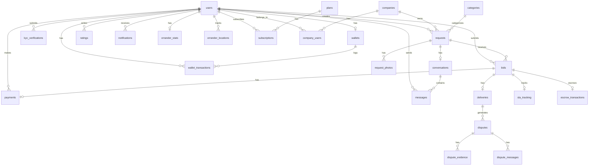

### 30.2 Complete Schema (All Tables)

```sql
-- ============================================
-- 1. users
-- ============================================
CREATE TABLE users (
    id UUID PRIMARY KEY DEFAULT gen_random_uuid(),
    name VARCHAR(200) NOT NULL,
    email VARCHAR(255) NOT NULL UNIQUE,
    phone VARCHAR(20) UNIQUE,
    email_verified_at TIMESTAMPTZ,
    phone_verified_at TIMESTAMPTZ,
    password VARCHAR(255) NOT NULL,
    role VARCHAR(20) NOT NULL DEFAULT 'requester' CHECK (role IN ('requester', 'errander', 'company_admin', 'company_member', 'admin', 'super_admin')),
    status VARCHAR(20) NOT NULL DEFAULT 'active' CHECK (status IN ('active', 'suspended', 'banned', 'deleted')),
    avatar_path VARCHAR(500),
    avatar_url VARCHAR(500),
    fcm_token VARCHAR(500),
    device_type VARCHAR(20),
    device_name VARCHAR(100),
    is_online BOOLEAN NOT NULL DEFAULT false,
    last_location_update TIMESTAMPTZ,
    two_factor_enabled BOOLEAN NOT NULL DEFAULT false,
    two_factor_secret VARCHAR(255),
    kyc_tier INTEGER NOT NULL DEFAULT 0 CHECK (kyc_tier BETWEEN 0 AND 3),
    completed_orders INTEGER NOT NULL DEFAULT 0,
    banned_at TIMESTAMPTZ,
    ban_reason TEXT,
    deleted_at TIMESTAMPTZ,
    created_at TIMESTAMPTZ NOT NULL DEFAULT NOW(),
    updated_at TIMESTAMPTZ NOT NULL DEFAULT NOW()
);

CREATE INDEX idx_users_email ON users(email);
CREATE INDEX idx_users_role ON users(role);
CREATE INDEX idx_users_status ON users(status);
CREATE INDEX idx_users_kyc_tier ON users(kyc_tier);

-- ============================================
-- 2. categories
-- ============================================
CREATE TABLE categories (
    id UUID PRIMARY KEY DEFAULT gen_random_uuid(),
    name VARCHAR(100) NOT NULL,
    slug VARCHAR(100) NOT NULL UNIQUE,
    description TEXT,
    icon VARCHAR(50),
    dispute_window_hours INTEGER NOT NULL DEFAULT 24,
    sla_target_minutes INTEGER NOT NULL DEFAULT 120,
    sort_order INTEGER NOT NULL DEFAULT 0,
    is_active BOOLEAN NOT NULL DEFAULT true,
    deleted_at TIMESTAMPTZ,
    created_at TIMESTAMPTZ NOT NULL DEFAULT NOW(),
    updated_at TIMESTAMPTZ NOT NULL DEFAULT NOW()
);

CREATE INDEX idx_categories_active ON categories(is_active) WHERE is_active = true;

-- ============================================
-- 3. companies
-- ============================================
CREATE TABLE companies (
    id UUID PRIMARY KEY DEFAULT gen_random_uuid(),
    name VARCHAR(200) NOT NULL,
    slug VARCHAR(100) NOT NULL UNIQUE,
    industry VARCHAR(100),
    rc_number VARCHAR(50),
    tax_id VARCHAR(50),
    email VARCHAR(255),
    phone VARCHAR(20),
    website VARCHAR(255),
    logo_path VARCHAR(500),
    logo_url VARCHAR(500),
    address_line_1 VARCHAR(255),
    address_line_2 VARCHAR(255),
    city VARCHAR(100),
    state VARCHAR(100),
    postal_code VARCHAR(20),
    country VARCHAR(100) NOT NULL DEFAULT 'Nigeria',
    owner_id UUID NOT NULL REFERENCES users(id),
    status VARCHAR(20) NOT NULL DEFAULT 'active' CHECK (status IN ('active', 'suspended', 'deleted')),
    settings JSONB DEFAULT '{}',
    created_at TIMESTAMPTZ NOT NULL DEFAULT NOW(),
    updated_at TIMESTAMPTZ NOT NULL DEFAULT NOW()
);

CREATE INDEX idx_companies_owner ON companies(owner_id);
CREATE INDEX idx_companies_slug ON companies(slug);
CREATE INDEX idx_companies_status ON companies(status);

-- ============================================
-- 4. company_users
-- ============================================
CREATE TABLE company_users (
    id UUID PRIMARY KEY DEFAULT gen_random_uuid(),
    company_id UUID NOT NULL REFERENCES companies(id) ON DELETE CASCADE,
    user_id UUID NOT NULL REFERENCES users(id) ON DELETE CASCADE,
    role VARCHAR(20) NOT NULL DEFAULT 'member' CHECK (role IN ('admin', 'member', 'finance', 'viewer')),
    department VARCHAR(100),
    spending_limit DECIMAL(15,2) DEFAULT 100000.00,
    requires_approval_for_above DECIMAL(15,2) DEFAULT 50000.00,
    status VARCHAR(20) NOT NULL DEFAULT 'active' CHECK (status IN ('active', 'invited', 'suspended')),
    invited_at TIMESTAMPTZ,
    joined_at TIMESTAMPTZ,
    created_at TIMESTAMPTZ NOT NULL DEFAULT NOW(),
    updated_at TIMESTAMPTZ NOT NULL DEFAULT NOW(),
    UNIQUE (company_id, user_id)
);

CREATE INDEX idx_cu_company ON company_users(company_id);
CREATE INDEX idx_cu_user ON company_users(user_id);

-- ============================================
-- 5. requests
-- ============================================
CREATE TABLE requests (
    id UUID PRIMARY KEY DEFAULT gen_random_uuid(),
    user_id UUID NOT NULL REFERENCES users(id),
    company_id UUID REFERENCES companies(id),
    category_id UUID NOT NULL REFERENCES categories(id),
    title VARCHAR(200) NOT NULL,
    description TEXT NOT NULL,
    location VARCHAR(255) NOT NULL,
    latitude DECIMAL(10,7),
    longitude DECIMAL(10,7),
    budget_hint DECIMAL(15,2),
    status VARCHAR(20) NOT NULL DEFAULT 'draft' CHECK (status IN ('draft', 'open', 'assigned', 'in_progress', 'delivered', 'completed', 'disputed', 'refunded', 'cancelled', 'expired')),
    is_urgent BOOLEAN NOT NULL DEFAULT false,
    urgent_fee DECIMAL(10,2) DEFAULT 0.00,
    accepted_bid_id UUID,
    delivery_confirmed_at TIMESTAMPTZ,
    completed_at TIMESTAMPTZ,
    cancelled_at TIMESTAMPTZ,
    cancellation_reason TEXT,
    metadata JSONB DEFAULT '{}',
    created_at TIMESTAMPTZ NOT NULL DEFAULT NOW(),
    updated_at TIMESTAMPTZ NOT NULL DEFAULT NOW()
);

CREATE INDEX idx_req_user ON requests(user_id);
CREATE INDEX idx_req_category ON requests(category_id);
CREATE INDEX idx_req_status ON requests(status);
CREATE INDEX idx_req_location ON requests(latitude, longitude);
CREATE INDEX idx_req_company ON requests(company_id);
CREATE INDEX idx_req_created ON requests(created_at DESC);
CREATE INDEX idx_req_urgent ON requests(is_urgent) WHERE is_urgent = true;

-- ============================================
-- 6. request_photos
-- ============================================
CREATE TABLE request_photos (
    id UUID PRIMARY KEY DEFAULT gen_random_uuid(),
    request_id UUID NOT NULL REFERENCES requests(id) ON DELETE CASCADE,
    path VARCHAR(500) NOT NULL,
    url VARCHAR(500) NOT NULL,
    sort_order INTEGER NOT NULL DEFAULT 0,
    created_at TIMESTAMPTZ NOT NULL DEFAULT NOW()
);

CREATE INDEX idx_rp_request ON request_photos(request_id);

-- ============================================
-- 7. bids
-- ============================================
CREATE TABLE bids (
    id UUID PRIMARY KEY DEFAULT gen_random_uuid(),
    request_id UUID NOT NULL REFERENCES requests(id) ON DELETE CASCADE,
    errander_id UUID NOT NULL REFERENCES users(id),
    goods_amount DECIMAL(15,2) NOT NULL CHECK (goods_amount >= 0),
    service_fee DECIMAL(15,2) NOT NULL CHECK (service_fee >= 500),
    platform_fee DECIMAL(15,2) NOT NULL CHECK (platform_fee >= 0),
    total_amount DECIMAL(15,2) NOT NULL,
    note TEXT,
    delivery_at TIMESTAMPTZ,
    status VARCHAR(20) NOT NULL DEFAULT 'pending' CHECK (status IN ('pending', 'accepted', 'rejected', 'withdrawn')),
    created_at TIMESTAMPTZ NOT NULL DEFAULT NOW(),
    updated_at TIMESTAMPTZ NOT NULL DEFAULT NOW(),
    UNIQUE (request_id, errander_id)
);

CREATE INDEX idx_bids_request ON bids(request_id);
CREATE INDEX idx_bids_errander ON bids(errander_id);
CREATE INDEX idx_bids_status ON bids(status);

-- ============================================
-- 8. payments
-- ============================================
CREATE TABLE payments (
    id UUID PRIMARY KEY DEFAULT gen_random_uuid(),
    bid_id UUID NOT NULL REFERENCES bids(id),
    request_id UUID NOT NULL REFERENCES requests(id),
    user_id UUID NOT NULL REFERENCES users(id),
    provider VARCHAR(20) NOT NULL CHECK (provider IN ('flutterwave', 'paystack', 'wallet')),
    provider_ref VARCHAR(100) UNIQUE,
    amount DECIMAL(15,2) NOT NULL,
    breakdown JSONB NOT NULL,
    currency VARCHAR(3) NOT NULL DEFAULT 'NGN',
    status VARCHAR(20) NOT NULL DEFAULT 'pending' CHECK (status IN ('pending', 'successful', 'failed', 'refunded')),
    payment_method VARCHAR(50),
    paid_at TIMESTAMPTZ,
    failed_at TIMESTAMPTZ,
    failure_reason TEXT,
    metadata JSONB DEFAULT '{}',
    retry_count INTEGER NOT NULL DEFAULT 0,
    created_at TIMESTAMPTZ NOT NULL DEFAULT NOW(),
    updated_at TIMESTAMPTZ NOT NULL DEFAULT NOW()
);

CREATE INDEX idx_pay_bid ON payments(bid_id);
CREATE INDEX idx_pay_user ON payments(user_id);
CREATE INDEX idx_pay_provider_ref ON payments(provider_ref);
CREATE INDEX idx_pay_status ON payments(status);

-- ============================================
-- 9. wallets
-- ============================================
CREATE TABLE wallets (
    id UUID PRIMARY KEY DEFAULT gen_random_uuid(),
    user_id UUID NOT NULL UNIQUE REFERENCES users(id) ON DELETE CASCADE,
    balance DECIMAL(15,2) NOT NULL DEFAULT 0.00 CHECK (balance >= 0),
    locked_balance DECIMAL(15,2) NOT NULL DEFAULT 0.00 CHECK (locked_balance >= 0),
    currency VARCHAR(3) NOT NULL DEFAULT 'NGN',
    status VARCHAR(20) NOT NULL DEFAULT 'active' CHECK (status IN ('active', 'frozen', 'closed')),
    created_at TIMESTAMPTZ NOT NULL DEFAULT NOW(),
    updated_at TIMESTAMPTZ NOT NULL DEFAULT NOW()
);

CREATE INDEX idx_wallets_user ON wallets(user_id);
CREATE INDEX idx_wallets_status ON wallets(status);

-- ============================================
-- 10. wallet_transactions
-- ============================================
CREATE TABLE wallet_transactions (
    id UUID PRIMARY KEY DEFAULT gen_random_uuid(),
    wallet_id UUID NOT NULL REFERENCES wallets(id) ON DELETE CASCADE,
    user_id UUID NOT NULL REFERENCES users(id),
    type VARCHAR(20) NOT NULL CHECK (type IN ('deposit', 'withdrawal', 'payment', 'refund', 'payout', 'fee', 'lock', 'unlock', 'adjustment')),
    amount DECIMAL(15,2) NOT NULL,
    balance_before DECIMAL(15,2) NOT NULL,
    balance_after DECIMAL(15,2) NOT NULL,
    reference VARCHAR(100) NOT NULL UNIQUE,
    description TEXT,
    metadata JSONB DEFAULT '{}',
    status VARCHAR(20) NOT NULL DEFAULT 'completed' CHECK (status IN ('pending', 'completed', 'failed', 'reversed')),
    related_transaction_id UUID REFERENCES wallet_transactions(id),
    created_at TIMESTAMPTZ NOT NULL DEFAULT NOW()
);

CREATE INDEX idx_wt_wallet ON wallet_transactions(wallet_id);
CREATE INDEX idx_wt_user ON wallet_transactions(user_id);
CREATE INDEX idx_wt_type ON wallet_transactions(type);
CREATE INDEX idx_wt_ref ON wallet_transactions(reference);
CREATE INDEX idx_wt_created ON wallet_transactions(created_at DESC);

-- ============================================
-- 11. escrow_transactions
-- ============================================
CREATE TABLE escrow_transactions (
    id UUID PRIMARY KEY DEFAULT gen_random_uuid(),
    bid_id UUID NOT NULL REFERENCES bids(id),
    request_id UUID NOT NULL REFERENCES requests(id),
    requester_id UUID NOT NULL REFERENCES users(id),
    errander_id UUID NOT NULL REFERENCES users(id),
    amount DECIMAL(15,2) NOT NULL,
    breakdown JSONB NOT NULL,
    status VARCHAR(20) NOT NULL DEFAULT 'held' CHECK (status IN ('held', 'released_to_errander', 'refunded_to_requester', 'partially_refunded')),
    held_at TIMESTAMPTZ NOT NULL DEFAULT NOW(),
    released_at TIMESTAMPTZ,
    release_trigger VARCHAR(20) CHECK (release_trigger IN ('delivery_confirmed', 'dispute_window_closed', 'admin_resolution')),
    created_at TIMESTAMPTZ NOT NULL DEFAULT NOW(),
    updated_at TIMESTAMPTZ NOT NULL DEFAULT NOW()
);

CREATE INDEX idx_escrow_bid ON escrow_transactions(bid_id);
CREATE INDEX idx_escrow_status ON escrow_transactions(status);

-- ============================================
-- 12. payouts
-- ============================================
CREATE TABLE payouts (
    id UUID PRIMARY KEY DEFAULT gen_random_uuid(),
    errander_id UUID NOT NULL REFERENCES users(id),
    bid_id UUID NOT NULL REFERENCES bids(id),
    escrow_transaction_id UUID REFERENCES escrow_transactions(id),
    amount DECIMAL(15,2) NOT NULL,
    fee DECIMAL(15,2) NOT NULL DEFAULT 0.00,
    net_amount DECIMAL(15,2) NOT NULL,
    status VARCHAR(20) NOT NULL DEFAULT 'pending' CHECK (status IN ('pending', 'processing', 'completed', 'failed')),
    provider VARCHAR(20) NOT NULL DEFAULT 'flutterwave',
    provider_ref VARCHAR(100),
    completed_at TIMESTAMPTZ,
    created_at TIMESTAMPTZ NOT NULL DEFAULT NOW(),
    updated_at TIMESTAMPTZ NOT NULL DEFAULT NOW()
);

CREATE INDEX idx_payouts_errander ON payouts(errander_id);
CREATE INDEX idx_payouts_status ON payouts(status);

-- ============================================
-- 13. withdrawals
-- ============================================
CREATE TABLE withdrawals (
    id UUID PRIMARY KEY DEFAULT gen_random_uuid(),
    user_id UUID NOT NULL REFERENCES users(id),
    wallet_transaction_id UUID REFERENCES wallet_transactions(id),
    amount DECIMAL(15,2) NOT NULL,
    fee DECIMAL(15,2) NOT NULL DEFAULT 0.00,
    net_amount DECIMAL(15,2) NOT NULL,
    bank_code VARCHAR(10) NOT NULL,
    account_number VARCHAR(10) NOT NULL,
    account_name VARCHAR(200) NOT NULL,
    narration VARCHAR(255),
    status VARCHAR(20) NOT NULL DEFAULT 'pending' CHECK (status IN ('pending', 'processing', 'completed', 'failed', 'reversed')),
    provider VARCHAR(20) NOT NULL DEFAULT 'flutterwave',
    provider_ref VARCHAR(100),
    completed_at TIMESTAMPTZ,
    created_at TIMESTAMPTZ NOT NULL DEFAULT NOW(),
    updated_at TIMESTAMPTZ NOT NULL DEFAULT NOW()
);

CREATE INDEX idx_withdrawals_user ON withdrawals(user_id);
CREATE INDEX idx_withdrawals_status ON withdrawals(status);

-- ============================================
-- 14. deliveries
-- ============================================
CREATE TABLE deliveries (
    id UUID PRIMARY KEY DEFAULT gen_random_uuid(),
    bid_id UUID NOT NULL UNIQUE REFERENCES bids(id),
    request_id UUID NOT NULL REFERENCES requests(id),
    errander_id UUID NOT NULL REFERENCES users(id),
    otp_hash VARCHAR(255),
    otp_generated_at TIMESTAMPTZ,
    otp_expires_at TIMESTAMPTZ,
    otp_attempts INTEGER NOT NULL DEFAULT 0,
    max_otp_attempts INTEGER NOT NULL DEFAULT 3,
    confirmed BOOLEAN NOT NULL DEFAULT false,
    confirmed_at TIMESTAMPTZ,
    confirmed_by UUID REFERENCES users(id),
    dispute_window_hours INTEGER NOT NULL,
    dispute_window_closes_at TIMESTAMPTZ,
    proof_photo_path VARCHAR(500),
    proof_photo_url VARCHAR(500),
    notes TEXT,
    created_at TIMESTAMPTZ NOT NULL DEFAULT NOW(),
    updated_at TIMESTAMPTZ NOT NULL DEFAULT NOW()
);

CREATE INDEX idx_del_bid ON deliveries(bid_id);
CREATE INDEX idx_del_confirmed ON deliveries(confirmed);
CREATE INDEX idx_del_window ON deliveries(dispute_window_closes_at);

-- ============================================
-- 15. disputes
-- ============================================
CREATE TABLE disputes (
    id UUID PRIMARY KEY DEFAULT gen_random_uuid(),
    delivery_id UUID NOT NULL REFERENCES deliveries(id),
    bid_id UUID NOT NULL REFERENCES bids(id),
    request_id UUID NOT NULL REFERENCES requests(id),
    raised_by UUID NOT NULL REFERENCES users(id),
    errander_id UUID NOT NULL REFERENCES users(id),
    reason VARCHAR(200) NOT NULL,
    description TEXT NOT NULL,
    status VARCHAR(30) NOT NULL DEFAULT 'open' CHECK (status IN ('open', 'errander_response_pending', 'under_review', 'resolved_requester', 'resolved_errander', 'appealed', 'closed')),
    resolution_note TEXT,
    resolved_by UUID REFERENCES users(id),
    resolved_at TIMESTAMPTZ,
    dispute_window_closed_at TIMESTAMPTZ,
    is_appeal BOOLEAN NOT NULL DEFAULT false,
    parent_dispute_id UUID REFERENCES disputes(id),
    created_at TIMESTAMPTZ NOT NULL DEFAULT NOW(),
    updated_at TIMESTAMPTZ NOT NULL DEFAULT NOW()
);

CREATE INDEX idx_disp_delivery ON disputes(delivery_id);
CREATE INDEX idx_disp_status ON disputes(status);
CREATE INDEX idx_disp_raised_by ON disputes(raised_by);

-- ============================================
-- 16. dispute_evidence
-- ============================================
CREATE TABLE dispute_evidence (
    id UUID PRIMARY KEY DEFAULT gen_random_uuid(),
    dispute_id UUID NOT NULL REFERENCES disputes(id) ON DELETE CASCADE,
    uploaded_by UUID NOT NULL REFERENCES users(id),
    type VARCHAR(20) NOT NULL CHECK (type IN ('photo', 'video', 'document', 'screenshot')),
    path VARCHAR(500) NOT NULL,
    url VARCHAR(500) NOT NULL,
    created_at TIMESTAMPTZ NOT NULL DEFAULT NOW()
);

CREATE INDEX idx_de_dispute ON dispute_evidence(dispute_id);

-- ============================================
-- 17. dispute_messages
-- ============================================
CREATE TABLE dispute_messages (
    id UUID PRIMARY KEY DEFAULT gen_random_uuid(),
    dispute_id UUID NOT NULL REFERENCES disputes(id) ON DELETE CASCADE,
    sender_id UUID NOT NULL REFERENCES users(id),
    message TEXT NOT NULL,
    is_admin_note BOOLEAN NOT NULL DEFAULT false,
    created_at TIMESTAMPTZ NOT NULL DEFAULT NOW()
);

CREATE INDEX idx_dm_dispute ON dispute_messages(dispute_id);

-- ============================================
-- 18. kyc_verifications
-- ============================================
CREATE TABLE kyc_verifications (
    id UUID PRIMARY KEY DEFAULT gen_random_uuid(),
    user_id UUID NOT NULL REFERENCES users(id) ON DELETE CASCADE,
    tier INTEGER NOT NULL DEFAULT 0 CHECK (tier BETWEEN 0 AND 3),
    status VARCHAR(20) NOT NULL DEFAULT 'pending' CHECK (status IN ('pending', 'in_review', 'approved', 'rejected')),
    email_verified_at TIMESTAMPTZ,
    phone_verified_at TIMESTAMPTZ,
    bvn VARCHAR(11),
    bvn_name_match BOOLEAN,
    bvn_verified_at TIMESTAMPTZ,
    nin VARCHAR(11),
    nin_name_match BOOLEAN,
    selfie_path VARCHAR(500),
    selfie_url VARCHAR(500),
    selfie_verified_at TIMESTAMPTZ,
    face_match_score DECIMAL(5,2),
    address_line_1 VARCHAR(255),
    address_line_2 VARCHAR(255),
    city VARCHAR(100),
    state VARCHAR(100),
    postal_code VARCHAR(20),
    address_proof_path VARCHAR(500),
    address_proof_url VARCHAR(500),
    address_verified_at TIMESTAMPTZ,
    reviewed_by UUID REFERENCES users(id),
    reviewed_at TIMESTAMPTZ,
    rejection_reason TEXT,
    created_at TIMESTAMPTZ NOT NULL DEFAULT NOW(),
    updated_at TIMESTAMPTZ NOT NULL DEFAULT NOW(),
    UNIQUE (user_id, tier)
);

CREATE INDEX idx_kyc_user ON kyc_verifications(user_id);
CREATE INDEX idx_kyc_status ON kyc_verifications(status);
CREATE INDEX idx_kyc_tier_status ON kyc_verifications(tier, status);

-- ============================================
-- 19. errander_stats
-- ============================================
CREATE TABLE errander_stats (
    id UUID PRIMARY KEY DEFAULT gen_random_uuid(),
    user_id UUID NOT NULL UNIQUE REFERENCES users(id) ON DELETE CASCADE,
    total_bids_submitted INTEGER NOT NULL DEFAULT 0,
    total_bids_accepted INTEGER NOT NULL DEFAULT 0,
    completed_orders INTEGER NOT NULL DEFAULT 0,
    cancelled_orders INTEGER NOT NULL DEFAULT 0,
    on_time_deliveries INTEGER NOT NULL DEFAULT 0,
    late_deliveries INTEGER NOT NULL DEFAULT 0,
    disputes_received INTEGER NOT NULL DEFAULT 0,
    disputes_lost INTEGER NOT NULL DEFAULT 0,
    completion_rate DECIMAL(5,2) NOT NULL DEFAULT 0.00,
    average_rating DECIMAL(3,2) NOT NULL DEFAULT 0.00,
    on_time_percentage DECIMAL(5,2) NOT NULL DEFAULT 0.00,
    trust_score DECIMAL(3,2) NOT NULL DEFAULT 0.00,
    total_value_handled DECIMAL(15,2) NOT NULL DEFAULT 0.00,
    average_response_time_seconds INTEGER DEFAULT 0,
    last_completed_at TIMESTAMPTZ,
    created_at TIMESTAMPTZ NOT NULL DEFAULT NOW(),
    updated_at TIMESTAMPTZ NOT NULL DEFAULT NOW()
);

CREATE INDEX idx_stats_user ON errander_stats(user_id);
CREATE INDEX idx_stats_score ON errander_stats(trust_score DESC);

-- ============================================
-- 20. errander_locations
-- ============================================
CREATE TABLE errander_locations (
    id UUID PRIMARY KEY DEFAULT gen_random_uuid(),
    user_id UUID NOT NULL REFERENCES users(id) ON DELETE CASCADE,
    latitude DECIMAL(10,7) NOT NULL,
    longitude DECIMAL(10,7) NOT NULL,
    accuracy DECIMAL(8,2),
    heading DECIMAL(5,2),
    speed DECIMAL(6,2),
    battery_level INTEGER,
    is_online BOOLEAN NOT NULL DEFAULT false,
    recorded_at TIMESTAMPTZ NOT NULL DEFAULT NOW(),
    created_at TIMESTAMPTZ NOT NULL DEFAULT NOW()
);

CREATE INDEX idx_erl_user ON errander_locations(user_id);
CREATE INDEX idx_erl_online ON errander_locations(is_online) WHERE is_online = true;
CREATE INDEX idx_erl_recorded ON errander_locations(recorded_at DESC);

-- ============================================
-- 21. conversations
-- ============================================
CREATE TABLE conversations (
    id UUID PRIMARY KEY DEFAULT gen_random_uuid(),
    request_id UUID NOT NULL UNIQUE REFERENCES requests(id),
    requester_id UUID NOT NULL REFERENCES users(id),
    errander_id UUID NOT NULL REFERENCES users(id),
    last_message_at TIMESTAMPTZ,
    last_message_preview VARCHAR(150),
    requester_unread_count INTEGER NOT NULL DEFAULT 0,
    errander_unread_count INTEGER NOT NULL DEFAULT 0,
    status VARCHAR(20) NOT NULL DEFAULT 'active' CHECK (status IN ('active', 'archived', 'blocked')),
    created_at TIMESTAMPTZ NOT NULL DEFAULT NOW(),
    updated_at TIMESTAMPTZ NOT NULL DEFAULT NOW()
);

CREATE INDEX idx_conv_request ON conversations(request_id);
CREATE INDEX idx_conv_requester ON conversations(requester_id);
CREATE INDEX idx_conv_errander ON conversations(errander_id);

-- ============================================
-- 22. messages
-- ============================================
CREATE TABLE messages (
    id UUID PRIMARY KEY DEFAULT gen_random_uuid(),
    conversation_id UUID NOT NULL REFERENCES conversations(id) ON DELETE CASCADE,
    sender_id UUID NOT NULL REFERENCES users(id),
    type VARCHAR(20) NOT NULL DEFAULT 'text' CHECK (type IN ('text', 'image', 'location', 'system')),
    content TEXT,
    attachment_url VARCHAR(500),
    attachment_thumbnail_url VARCHAR(500),
    read_at TIMESTAMPTZ,
    delivered_at TIMESTAMPTZ,
    created_at TIMESTAMPTZ NOT NULL DEFAULT NOW(),
    updated_at TIMESTAMPTZ NOT NULL DEFAULT NOW()
);

CREATE INDEX idx_msg_conv ON messages(conversation_id);
CREATE INDEX idx_msg_sender ON messages(sender_id);
CREATE INDEX idx_msg_created ON messages(conversation_id, created_at DESC);
CREATE INDEX idx_msg_unread ON messages(conversation_id, read_at) WHERE read_at IS NULL;

-- ============================================
-- 23. ratings
-- ============================================
CREATE TABLE ratings (
    id UUID PRIMARY KEY DEFAULT gen_random_uuid(),
    request_id UUID NOT NULL REFERENCES requests(id),
    bid_id UUID NOT NULL REFERENCES bids(id),
    reviewer_id UUID NOT NULL REFERENCES users(id),
    reviewee_id UUID NOT NULL REFERENCES users(id),
    rating INTEGER NOT NULL CHECK (rating BETWEEN 1 AND 5),
    review TEXT,
    aspects JSONB DEFAULT '{}',
    is_visible BOOLEAN NOT NULL DEFAULT false,
    response TEXT,
    responded_at TIMESTAMPTZ,
    submitted_at TIMESTAMPTZ NOT NULL DEFAULT NOW(),
    visible_at TIMESTAMPTZ,
    created_at TIMESTAMPTZ NOT NULL DEFAULT NOW(),
    updated_at TIMESTAMPTZ NOT NULL DEFAULT NOW(),
    UNIQUE (bid_id, reviewer_id)
);

CREATE INDEX idx_ratings_reviewee ON ratings(reviewee_id);
CREATE INDEX idx_ratings_visible ON ratings(is_visible) WHERE is_visible = true;
CREATE INDEX idx_ratings_request ON ratings(request_id);

-- ============================================
-- 24. sla_tracking
-- ============================================
CREATE TABLE sla_tracking (
    id UUID PRIMARY KEY DEFAULT gen_random_uuid(),
    bid_id UUID NOT NULL UNIQUE REFERENCES bids(id),
    request_id UUID NOT NULL REFERENCES requests(id),
    errander_id UUID NOT NULL REFERENCES users(id),
    status VARCHAR(20) NOT NULL DEFAULT 'pending' CHECK (status IN ('pending', 'accepted', 'started', 'arrived', 'completed', 'breached')),
    accepted_at TIMESTAMPTZ,
    started_at TIMESTAMPTZ,
    arrived_at TIMESTAMPTZ,
    completed_at TIMESTAMPTZ,
    sla_target_minutes INTEGER,
    sla_breached BOOLEAN NOT NULL DEFAULT false,
    breach_reason TEXT,
    created_at TIMESTAMPTZ NOT NULL DEFAULT NOW(),
    updated_at TIMESTAMPTZ NOT NULL DEFAULT NOW()
);

CREATE INDEX idx_sla_bid ON sla_tracking(bid_id);
CREATE INDEX idx_sla_breached ON sla_tracking(sla_breached) WHERE sla_breached = true;
CREATE INDEX idx_sla_errander ON sla_tracking(errander_id);

-- ============================================
-- 25. plans
-- ============================================
CREATE TABLE plans (
    id UUID PRIMARY KEY DEFAULT gen_random_uuid(),
    name VARCHAR(100) NOT NULL,
    slug VARCHAR(50) NOT NULL UNIQUE,
    description TEXT,
    monthly_price DECIMAL(10,2) NOT NULL,
    annual_price DECIMAL(10,2) NOT NULL,
    features JSONB NOT NULL DEFAULT '[]',
    limits JSONB NOT NULL DEFAULT '{}',
    status VARCHAR(20) NOT NULL DEFAULT 'active' CHECK (status IN ('active', 'inactive', 'deprecated')),
    sort_order INTEGER NOT NULL DEFAULT 0,
    created_at TIMESTAMPTZ NOT NULL DEFAULT NOW(),
    updated_at TIMESTAMPTZ NOT NULL DEFAULT NOW()
);

-- ============================================
-- 26. subscriptions
-- ============================================
CREATE TABLE subscriptions (
    id UUID PRIMARY KEY DEFAULT gen_random_uuid(),
    user_id UUID NOT NULL REFERENCES users(id),
    plan_id UUID NOT NULL REFERENCES plans(id),
    status VARCHAR(20) NOT NULL DEFAULT 'active' CHECK (status IN ('active', 'cancelled', 'expired', 'past_due', 'trialing')),
    billing_cycle VARCHAR(10) NOT NULL DEFAULT 'monthly' CHECK (billing_cycle IN ('monthly', 'annual')),
    started_at TIMESTAMPTZ NOT NULL,
    expires_at TIMESTAMPTZ NOT NULL,
    cancelled_at TIMESTAMPTZ,
    auto_renew BOOLEAN NOT NULL DEFAULT true,
    payment_provider VARCHAR(20) DEFAULT 'flutterwave',
    provider_subscription_id VARCHAR(100),
    provider_customer_id VARCHAR(100),
    created_at TIMESTAMPTZ NOT NULL DEFAULT NOW(),
    updated_at TIMESTAMPTZ NOT NULL DEFAULT NOW()
);

CREATE INDEX idx_sub_user ON subscriptions(user_id);
CREATE INDEX idx_sub_status ON subscriptions(status);
CREATE INDEX idx_sub_expires ON subscriptions(expires_at);

-- ============================================
-- 27. notifications
-- ============================================
CREATE TABLE notifications (
    id UUID PRIMARY KEY DEFAULT gen_random_uuid(),
    user_id UUID NOT NULL REFERENCES users(id) ON DELETE CASCADE,
    type VARCHAR(50) NOT NULL,
    title VARCHAR(200) NOT NULL,
    body TEXT NOT NULL,
    data JSONB DEFAULT '{}',
    read_at TIMESTAMPTZ,
    created_at TIMESTAMPTZ NOT NULL DEFAULT NOW()
);

CREATE INDEX idx_notif_user ON notifications(user_id, read_at, created_at DESC);
CREATE INDEX idx_notif_unread ON notifications(user_id, created_at DESC) WHERE read_at IS NULL;

-- ============================================
-- 28. audit_logs
-- ============================================
CREATE TABLE audit_logs (
    id UUID PRIMARY KEY DEFAULT gen_random_uuid(),
    user_id UUID REFERENCES users(id),
    action VARCHAR(100) NOT NULL,
    model_type VARCHAR(100) NOT NULL,
    model_id UUID,
    old_values JSONB,
    new_values JSONB,
    ip_address VARCHAR(45),
    user_agent TEXT,
    metadata JSONB DEFAULT '{}',
    created_at TIMESTAMPTZ NOT NULL DEFAULT NOW()
);

CREATE INDEX idx_audit_user ON audit_logs(user_id);
CREATE INDEX idx_audit_action ON audit_logs(action);
CREATE INDEX idx_audit_model ON audit_logs(model_type, model_id);
CREATE INDEX idx_audit_created ON audit_logs(created_at DESC);

-- ============================================
-- 29. settings
-- ============================================
CREATE TABLE settings (
    id UUID PRIMARY KEY DEFAULT gen_random_uuid(),
    key VARCHAR(100) NOT NULL UNIQUE,
    value TEXT NOT NULL,
    type VARCHAR(20) NOT NULL DEFAULT 'string' CHECK (type IN ('string', 'integer', 'float', 'boolean', 'json', 'array')),
    description TEXT,
    is_public BOOLEAN NOT NULL DEFAULT false,
    created_at TIMESTAMPTZ NOT NULL DEFAULT NOW(),
    updated_at TIMESTAMPTZ NOT NULL DEFAULT NOW()
);

CREATE INDEX idx_settings_key ON settings(key);

-- ============================================
-- 30. personal_access_tokens (Sanctum)
-- ============================================
CREATE TABLE personal_access_tokens (
    id UUID PRIMARY KEY DEFAULT gen_random_uuid(),
    tokenable_type VARCHAR(255) NOT NULL,
    tokenable_id UUID NOT NULL,
    name VARCHAR(255) NOT NULL,
    token VARCHAR(64) NOT NULL UNIQUE,
    abilities TEXT,
    last_used_at TIMESTAMPTZ,
    expires_at TIMESTAMPTZ,
    created_at TIMESTAMPTZ NOT NULL DEFAULT NOW(),
    updated_at TIMESTAMPTZ NOT NULL DEFAULT NOW()
);

CREATE INDEX idx_tokens_tokenable ON personal_access_tokens(tokenable_type, tokenable_id);

-- ============================================
-- 31. failed_jobs
-- ============================================
CREATE TABLE failed_jobs (
    id UUID PRIMARY KEY DEFAULT gen_random_uuid(),
    uuid VARCHAR(255) NOT NULL UNIQUE,
    connection TEXT NOT NULL,
    queue TEXT NOT NULL,
    payload TEXT NOT NULL,
    exception TEXT NOT NULL,
    failed_at TIMESTAMPTZ NOT NULL DEFAULT NOW()
);

-- ============================================
-- 32. jobs (queue jobs table)
-- ============================================
CREATE TABLE jobs (
    id BIGSERIAL PRIMARY KEY,
    queue VARCHAR(255) NOT NULL,
    payload TEXT NOT NULL,
    attempts SMALLINT NOT NULL DEFAULT 0,
    reserved_at INTEGER,
    available_at INTEGER NOT NULL,
    created_at INTEGER NOT NULL
);

CREATE INDEX idx_jobs_queue ON jobs(queue);

-- ============================================
-- 33. job_batches
-- ============================================
CREATE TABLE job_batches (
    id VARCHAR(255) PRIMARY KEY,
    name VARCHAR(255) NOT NULL,
    total_jobs INTEGER NOT NULL,
    pending_jobs INTEGER NOT NULL,
    failed_jobs INTEGER NOT NULL,
    failed_job_ids TEXT,
    options TEXT,
    cancelled_at INTEGER,
    created_at INTEGER NOT NULL,
    finished_at INTEGER
);
```

### 30.3 PostgreSQL Indexing Recommendations

```sql
-- Composite indexes for common query patterns

-- Requests: errander feed query (most frequent)
CREATE INDEX idx_requests_feed ON requests(status, category_id, created_at DESC) 
    WHERE status = 'open';

-- Requests: requester history
CREATE INDEX idx_requests_user_status ON requests(user_id, status);

-- Bids: errander's active bids
CREATE INDEX idx_bids_errander_status ON bids(errander_id, status);

-- Payments: reconciliation queries
CREATE INDEX idx_payments_date ON payments(created_at DESC);
CREATE INDEX idx_payments_provider_date ON payments(provider, created_at DESC);

-- Wallet transactions: statement generation
CREATE INDEX idx_wt_user_date ON wallet_transactions(user_id, created_at DESC);

-- Messages: chat message pagination (cursor-based)
CREATE INDEX idx_messages_conv_cursor ON messages(conversation_id, created_at DESC, id DESC);

-- Disputes: admin queue
CREATE INDEX idx_disputes_admin ON disputes(status, created_at ASC) 
    WHERE status IN ('open', 'errander_response_pending', 'under_review');

-- KYC: admin review queue
CREATE INDEX idx_kyc_review ON kyc_verifications(status, created_at ASC) 
    WHERE status IN ('pending', 'in_review');

-- Audit logs: search
CREATE INDEX idx_audit_model_date ON audit_logs(model_type, created_at DESC);

-- Full-text search indexes
CREATE INDEX idx_requests_search ON requests USING GIN (to_tsvector('english', title || ' ' || description));
CREATE INDEX idx_users_search ON users USING GIN (to_tsvector('english', name || ' ' || COALESCE(email, '')));
```

---

## 31. Laravel Backend Architecture

### 31.1 Technology Stack

| Component | Technology |
|---|---|
| **Framework** | Laravel 12 |
| **PHP Version** | PHP 8.3+ |
| **Database** | PostgreSQL 16 |
| **Cache** | Redis 7 (ElastiCache) |
| **Queue** | Redis (Laravel Horizon) |
| **Broadcasting** | Laravel Reverb (WebSockets) |
| **Authentication** | Laravel Sanctum (API tokens) |
| **Authorization** | Spatie Laravel Permissions |
| **Search** | PostgreSQL Full-Text Search + Laravel Scout |
| **Storage** | AWS S3 + CloudFront CDN |
| **Payments** | Flutterwave SDK + Paystack SDK |
| **Push Notifications** | Firebase Cloud Messaging (FCM) |
| **Email** | Laravel Mail + AWS SES |
| **SMS** | Termii / Africa's Talking |
| **Audit Log** | Spatie Laravel Activity Log |
| **API Docs** | Scribe / Scramble |
| **Testing** | PHPUnit + Laravel Pest |
| **Static Analysis** | Larastan (PHPStan) |
| **Code Style** | Laravel Pint |

### 31.2 Laravel Directory Structure

```
errand-boy-api/
├── app/
│   ├── Console/
│   │   └── Commands/
│   │       ├── ProcessPayouts.php
│   │       ├── CloseDisputeWindows.php
│   │       ├── ExpireOpenRequests.php
│   │       ├── RecalculateTrustScores.php
│   │       ├── ReleaseUnratedRatings.php
│   │       └── DetectFraudPatterns.php
│   ├── Enums/
│   │   ├── RequestStatus.php
│   │   ├── BidStatus.php
│   │   ├── PaymentStatus.php
│   │   ├── DisputeStatus.php
│   │   ├── WalletTransactionType.php
│   │   ├── EscrowStatus.php
│   │   ├── KycTier.php
│   │   ├── KycStatus.php
│   │   ├── SubscriptionStatus.php
│   │   ├── SlaStatus.php
│   │   └── NotificationType.php
│   ├── Events/
│   │   ├── RequestPosted.php
│   │   ├── BidPlaced.php
│   │   ├── BidAccepted.php
│   │   ├── PaymentConfirmed.php
│   │   ├── DeliveryOtpGenerated.php
│   │   ├── DeliveryConfirmed.php
│   │   ├── DisputeOpened.php
│   │   ├── DisputeResolved.php
│   │   ├── PayoutSent.php
│   │   ├── WalletFunded.php
│   │   ├── KycStatusChanged.php
│   │   ├── MessageSent.php
│   │   ├── TypingIndicator.php
│   │   ├── NotificationReceived.php
│   │   ├── SlaBreached.php
│   │   └── FraudDetected.php
│   ├── Exceptions/
│   │   ├── Handler.php
│   │   ├── BidAlreadyExistsException.php
│   │   ├── InsufficientBalanceException.php
│   │   ├── InvalidOtpException.php
│   │   ├── OtpExpiredException.php
│   │   ├── MaxOtpAttemptsException.php
│   │   ├── DisputeWindowClosedException.php
│   │   ├── GatewayUnavailableException.php
│   │   └── FeatureLimitExceededException.php
│   ├── Http/
│   │   ├── Controllers/
│   │   │   ├── Auth/
│   │   │   │   ├── AuthController.php
│   │   │   │   ├── PasswordResetController.php
│   │   │   │   ├── EmailVerificationController.php
│   │   │   │   ├── PhoneVerificationController.php
│   │   │   │   └── TwoFactorController.php
│   │   │   ├── BidController.php
│   │   │   ├── CategoryController.php
│   │   │   ├── ChatController.php
│   │   │   ├── CompanyController.php
│   │   │   ├── DeliveryController.php
│   │   │   ├── DisputeController.php
│   │   │   ├── KycController.php
│   │   │   ├── LocationController.php
│   │   │   ├── NotificationController.php
│   │   │   ├── PaymentController.php
│   │   │   ├── PlanController.php
│   │   │   ├── RatingController.php
│   │   │   ├── RequestController.php
│   │   │   ├── SlaController.php
│   │   │   ├── SubscriptionController.php
│   │   │   ├── UserController.php
│   │   │   ├── WalletController.php
│   │   │   └── Admin/
│   │   │       ├── AdminAnalyticsController.php
│   │   │       ├── AdminCategoryController.php
│   │   │       ├── AdminDisputeController.php
│   │   │       ├── AdminKycController.php
│   │   │       ├── AdminPaymentController.php
│   │   │       ├── AdminPlanController.php
│   │   │       ├── AdminSettingsController.php
│   │   │       ├── AdminSubscriptionController.php
│   │   │       ├── AdminUserController.php
│   │   │       └── AdminAuditLogController.php
│   │   ├── Middleware/
│   │   │   ├── EnsureRole.php
│   │   │   ├── EnsureKycTier.php
│   │   │   ├── VerifyFlutterwaveWebhook.php
│   │   │   ├── VerifyPaystackWebhook.php
│   │   │   ├── FeatureGate.php
│   │   │   ├── RateLimitApi.php
│   │   │   └── AuditLogMiddleware.php
│   │   ├── Requests/
│   │   │   ├── Auth/
│   │   │   │   ├── RegisterRequest.php
│   │   │   │   └── LoginRequest.php
│   │   │   ├── StoreRequestRequest.php
│   │   │   ├── StoreBidRequest.php
│   │   │   ├── InitiatePaymentRequest.php
│   │   │   ├── FundWalletRequest.php
│   │   │   ├── WithdrawRequest.php
│   │   │   ├── ConfirmDeliveryRequest.php
│   │   │   ├── OpenDisputeRequest.php
│   │   │   ├── RespondToDisputeRequest.php
│   │   │   ├── KycVerificationRequest.php
│   │   │   ├── StoreRatingRequest.php
│   │   │   ├── SendMessageRequest.php
│   │   │   ├── CreateCompanyRequest.php
│   │   │   ├── SubscribeRequest.php
│   │   │   └── UpdateLocationRequest.php
│   │   └── Resources/
│   │       ├── UserResource.php
│   │       ├── RequestResource.php
│   │       ├── BidResource.php
│   │       ├── PaymentResource.php
│   │       ├── WalletResource.php
│   │       ├── DeliveryResource.php
│   │       ├── DisputeResource.php
│   │       ├── RatingResource.php
│   │       ├── ConversationResource.php
│   │       ├── MessageResource.php
│   │       ├── NotificationResource.php
│   │       ├── SlaResource.php
│   │       ├── SubscriptionResource.php
│   │       └── CompanyResource.php
│   ├── Jobs/
│   │   ├── ProcessPayout.php
│   │   ├── CloseDisputeWindow.php
│   │   ├── ExpireOpenRequests.php
│   │   ├── RecalculateTrustScore.php
│   │   ├── ReleaseUnratedRatings.php
│   │   ├── SendPushNotification.php
│   │   ├── SendEmailNotification.php
│   │   ├── ProcessWithdrawal.php
│   │   ├── DetectFraudPatterns.php
│   │   └── GenerateDailyReport.php
│   ├── Listeners/
│   │   ├── NotifyErrandersOfNewRequest.php
│   │   ├── NotifyRequesterBidPlaced.php
│   │   ├── HandleBidAccepted.php
│   │   ├── HandlePaymentConfirmed.php
│   │   ├── NotifyRequesterOtpGenerated.php
│   │   ├── HandleDeliveryConfirmed.php
│   │   ├── HandleDisputeOpened.php
│   │   ├── HandleDisputeResolved.php
│   │   ├── UpdateErranderStats.php
│   │   ├── SchedulePayoutAfterDelivery.php
│   │   └── LogAuditTrail.php
│   ├── Models/
│   │   ├── User.php
│   │   ├── Category.php
│   │   ├── Company.php
│   │   ├── CompanyUser.php
│   │   ├── Request.php
│   │   ├── RequestPhoto.php
│   │   ├── Bid.php
│   │   ├── Payment.php
│   │   ├── Wallet.php
│   │   ├── WalletTransaction.php
│   │   ├── EscrowTransaction.php
│   │   ├── Payout.php
│   │   ├── Withdrawal.php
│   │   ├── Delivery.php
│   │   ├── Dispute.php
│   │   ├── DisputeEvidence.php
│   │   ├── DisputeMessage.php
│   │   ├── KycVerification.php
│   │   ├── ErranderStats.php
│   │   ├── ErranderLocation.php
│   │   ├── Conversation.php
│   │   ├── Message.php
│   │   ├── Rating.php
│   │   ├── SlaTracking.php
│   │   ├── Plan.php
│   │   ├── Subscription.php
│   │   ├── Notification.php
│   │   ├── AuditLog.php
│   │   └── Setting.php
│   ├── Notifications/
│   │   ├── BidReceivedNotification.php
│   │   ├── BidAcceptedNotification.php
│   │   ├── PaymentConfirmedNotification.php
│   │   ├── DeliveryOtpGeneratedNotification.php
│   │   ├── DeliveryConfirmedNotification.php
│   │   ├── DisputeOpenedNotification.php
│   │   ├── DisputeResolvedNotification.php
│   │   ├── PayoutSentNotification.php
│   │   ├── WalletFundedNotification.php
│   │   ├── KycStatusChangedNotification.php
│   │   └── SlaBreachedNotification.php
│   ├── Policies/
│   │   ├── RequestPolicy.php
│   │   ├── BidPolicy.php
│   │   ├── PaymentPolicy.php
│   │   ├── DisputePolicy.php
│   │   ├── CompanyPolicy.php
│   │   ├── ConversationPolicy.php
│   │   └── RatingPolicy.php
│   └── Services/
│       ├── BidService.php
│       ├── DeliveryOtpService.php
│       ├── DisputeService.php
│       ├── EscrowService.php
│       ├── FeatureGateService.php
│       ├── FlutterwaveService.php
│       ├── PaystackService.php
│       ├── PaymentGatewayService.php
│       ├── MatchingService.php
│       ├── NotificationService.php
│       ├── PayoutService.php
│       ├── TrustScoreService.php
│       ├── WalletService.php
│       ├── KycService.php
│       ├── SlaService.php
│       ├── FraudDetectionService.php
│       ├── AuditLogService.php
│       └── LocationService.php
├── bootstrap/
│   └── app.php
├── config/
│   ├── errandboy.php
│   ├── flutterwave.php
│   ├── paystack.php
│   ├── reverb.php
│   ├── fcm.php
│   └── sanctum.php
├── database/
│   ├── migrations/
│   │   ├── 0001_create_users_table.php
│   │   ├── 0002_create_categories_table.php
│   │   ├── 0003_create_companies_table.php
│   │   ├── 0004_create_company_users_table.php
│   │   ├── 0005_create_requests_table.php
│   │   ├── 0006_create_request_photos_table.php
│   │   ├── 0007_create_bids_table.php
│   │   ├── 0008_create_payments_table.php
│   │   ├── 0009_create_wallets_table.php
│   │   ├── 0010_create_wallet_transactions_table.php
│   │   ├── 0011_create_escrow_transactions_table.php
│   │   ├── 0012_create_payouts_table.php
│   │   ├── 0013_create_withdrawals_table.php
│   │   ├── 0014_create_deliveries_table.php
│   │   ├── 0015_create_disputes_table.php
│   │   ├── 0016_create_dispute_evidence_table.php
│   │   ├── 0017_create_dispute_messages_table.php
│   │   ├── 0018_create_kyc_verifications_table.php
│   │   ├── 0019_create_errander_stats_table.php
│   │   ├── 0020_create_errander_locations_table.php
│   │   ├── 0021_create_conversations_table.php
│   │   ├── 0022_create_messages_table.php
│   │   ├── 0023_create_ratings_table.php
│   │   ├── 0024_create_sla_tracking_table.php
│   │   ├── 0025_create_plans_table.php
│   │   ├── 0026_create_subscriptions_table.php
│   │   ├── 0027_create_notifications_table.php
│   │   ├── 0028_create_audit_logs_table.php
│   │   ├── 0029_create_settings_table.php
│   │   ├── 0030_create_jobs_table.php
│   │   ├── 0031_create_failed_jobs_table.php
│   │   └── 0032_create_job_batches_table.php
│   └── seeders/
│       ├── DatabaseSeeder.php
│       ├── AdminUserSeeder.php
│       ├── CategorySeeder.php
│       ├── PlanSeeder.php
│       └── SettingsSeeder.php
├── routes/
│   ├── api.php
│   ├── channels.php
│   └── console.php
├── tests/
│   ├── Feature/
│   │   ├── Auth/
│   │   │   └── AuthTest.php
│   │   ├── RequestTest.php
│   │   ├── BidTest.php
│   │   ├── PaymentTest.php
│   │   ├── WalletTest.php
│   │   ├── EscrowTest.php
│   │   ├── DeliveryOtpTest.php
│   │   ├── DisputeTest.php
│   │   ├── ChatTest.php
│   │   ├── KycTest.php
│   │   ├── RatingTest.php
│   │   ├── SubscriptionTest.php
│   │   ├── CompanyTest.php
│   │   └── MatchingTest.php
│   └── Unit/
│       ├── TrustScoreServiceTest.php
│       ├── DeliveryOtpServiceTest.php
│       ├── EscrowServiceTest.php
│       ├── MatchingServiceTest.php
│       ├── FraudDetectionServiceTest.php
│       └── PayoutServiceTest.php
├── composer.json
├── Dockerfile
└── .env.example
```

### 31.3 Key Laravel Configuration

#### config/errandboy.php

```php
<?php

return [
    'platform_fee_percentage' => env('PLATFORM_FEE_PERCENTAGE', 5.0),
    'min_service_fee' => env('MIN_SERVICE_FEE', 500),
    'urgent_request_fee' => env('URGENT_REQUEST_FEE', 1500),
    'otp_expiry_minutes' => env('OTP_EXPIRY_MINUTES', 30),
    'max_otp_attempts' => env('MAX_OTP_ATTEMPTS', 3),
    'request_expiry_days' => env('REQUEST_EXPIRY_DAYS', 7),
    'max_request_photos' => env('MAX_REQUEST_PHOTOS', 5),
    'max_bid_photos' => env('MAX_BID_PHOTOS', 5),
    'dispute_response_hours' => env('DISPUTE_RESPONSE_HOURS', 48),
    'appeal_window_hours' => env('APPEAL_WINDOW_HOURS', 72),
    'rating_blind_window_hours' => env('RATING_BLIND_WINDOW_HOURS', 72),
    'withdrawal_fee_percentage' => env('WITHDRAWAL_FEE_PERCENTAGE', 1.5),
    'withdrawal_fee_cap' => env('WITHDRAWAL_FEE_CAP', 200),
    
    'kyc_limits' => [
        0 => ['wallet' => 50000, 'transaction' => 25000, 'daily_withdrawal' => 50000],
        1 => ['wallet' => 200000, 'transaction' => 100000, 'daily_withdrawal' => 500000],
        2 => ['wallet' => 1000000, 'transaction' => 500000, 'daily_withdrawal' => 2000000],
        3 => ['wallet' => PHP_FLOAT_MAX, 'transaction' => PHP_FLOAT_MAX, 'daily_withdrawal' => 5000000],
    ],
    
    'matching' => [
        'default_radius_km' => 10,
        'max_radius_km' => 50,
        'score_weights' => [
            'distance' => 0.40,
            'trust_score' => 0.30,
            'category_match' => 0.20,
            'availability' => 0.10,
        ],
    ],
    
    'trust_score' => [
        'weights' => [
            'completion_rate' => 0.30,
            'average_rating' => 0.25,
            'on_time' => 0.25,
            'dispute_record' => 0.20,
        ],
    ],
    
    'fraud_detection' => [
        'enabled' => env('FRAUD_DETECTION_ENABLED', true),
        'max_accounts_per_ip' => 3,
        'max_failed_payments' => 5,
        'failed_payment_window_minutes' => 10,
        'max_chargebacks' => 2,
        'chargeback_window_days' => 30,
        'score_thresholds' => [
            'low' => 30,
            'medium' => 60,
        ],
    ],
    
    'notifications' => [
        'channels' => [
            'new_request' => ['database', 'fcm', 'reverb'],
            'bid_received' => ['database', 'fcm', 'mail'],
            'bid_accepted' => ['database', 'fcm', 'mail'],
            'payment_confirmed' => ['database', 'fcm'],
            'delivery_confirmed' => ['database', 'fcm'],
            'dispute_opened' => ['database', 'fcm', 'mail'],
            'dispute_resolved' => ['database', 'fcm', 'mail'],
            'payout_sent' => ['database', 'fcm'],
            'kyc_approved' => ['database', 'fcm'],
            'kyc_rejected' => ['database', 'fcm', 'mail'],
            'chat_message' => ['fcm'],
            'sla_breached' => ['database', 'fcm'],
        ],
    ],
];
```

---

## 32. Next.js Frontend Architecture

### 32.1 Technology Stack

| Component | Technology |
|---|---|
| **Framework** | Next.js 15 (App Router) |
| **Language** | TypeScript 5.x |
| **Styling** | Tailwind CSS 4 |
| **UI Components** | shadcn/ui (Radix UI primitives) |
| **State Management** | Zustand |
| **Server State** | TanStack Query (React Query) |
| **Form Handling** | React Hook Form + Zod |
| **Realtime** | Laravel Reverb (Pusher protocol) via pusher-js |
| **Maps** | Google Maps API / Leaflet (OSM) |
| **Payments** | Flutterwave Inline JS |
| **File Upload** | react-dropzone + S3 presigned URLs |
| **Charts** | Recharts / Tremor |
| **Testing** | Vitest + React Testing Library |
| **E2E** | Playwright |

### 32.2 Next.js App Router Structure

```
errand-boy-web/
├── app/
│   ├── (marketing)/
│   │   ├── page.tsx                    # Landing page
│   │   ├── about/
│   │   │   └── page.tsx
│   │   ├── pricing/
│   │   │   └── page.tsx
│   │   └── layout.tsx
│   ├── (auth)/
│   │   ├── login/
│   │   │   └── page.tsx
│   │   ├── register/
│   │   │   └── page.tsx
│   │   ├── forgot-password/
│   │   │   └── page.tsx
│   │   ├── reset-password/
│   │   │   └── page.tsx
│   │   └── layout.tsx
│   ├── (requester)/
│   │   ├── layout.tsx
│   │   ├── dashboard/
│   │   │   └── page.tsx
│   │   ├── requests/
│   │   │   ├── page.tsx                # My requests
│   │   │   ├── new/
│   │   │   │   └── page.tsx            # Create request
│   │   │   └── [id]/
│   │   │       ├── page.tsx            # Request detail
│   │   │       └── pay/
│   │   │           └── page.tsx        # Payment
│   │   ├── wallet/
│   │   │   └── page.tsx
│   │   ├── disputes/
│   │   │   ├── page.tsx
│   │   │   └── [id]/
│   │   │       └── page.tsx
│   │   ├── subscriptions/
│   │   │   └── page.tsx
│   │   └── company/
│   │       ├── page.tsx                # Company dashboard
│   │       ├── members/
│   │       │   └── page.tsx
│   │       └── analytics/
│   │           └── page.tsx
│   ├── (errander)/
│   │   ├── layout.tsx
│   │   ├── dashboard/
│   │   │   └── page.tsx
│   │   ├── feed/
│   │   │   └── page.tsx                # Browse requests
│   │   ├── bids/
│   │   │   └── page.tsx
│   │   ├── delivery/
│   │   │   └── [bidId]/
│   │   │       └── page.tsx
│   │   ├── wallet/
│   │   │   └── page.tsx
│   │   └── trust-score/
│   │       └── page.tsx
│   ├── (admin)/
│   │   ├── layout.tsx
│   │   ├── dashboard/
│   │   │   └── page.tsx
│   │   ├── users/
│   │   │   ├── page.tsx
│   │   │   └── [id]/
│   │   │       └── page.tsx
│   │   ├── kyc/
│   │   │   └── page.tsx
│   │   ├── disputes/
│   │   │   ├── page.tsx
│   │   │   └── [id]/
│   │   │       └── page.tsx
│   │   ├── payments/
│   │   │   └── page.tsx
│   │   ├── categories/
│   │   │   └── page.tsx
│   │   ├── plans/
│   │   │   └── page.tsx
│   │   ├── analytics/
│   │   │   └── page.tsx
│   │   ├── audit-logs/
│   │   │   └── page.tsx
│   │   └── settings/
│   │       └── page.tsx
│   ├── (shared)/
│   │   ├── chat/
│   │   │   ├── page.tsx                # Conversation list
│   │   │   └── [id]/
│   │   │       └── page.tsx            # Chat detail
│   │   ├── profile/
│   │   │   ├── page.tsx
│   │   │   └── [id]/
│   │   │       └── page.tsx            # Public profile
│   │   ├── kyc/
│   │   │   └── page.tsx
│   │   ├── notifications/
│   │   │   └── page.tsx
│   │   └── settings/
│   │       └── page.tsx
│   ├── layout.tsx                      # Root layout
│   ├── page.tsx                        # Landing (redirect)
│   ├── loading.tsx
│   ├── error.tsx
│   └── not-found.tsx
├── components/
│   ├── ui/                             # shadcn/ui components
│   │   ├── button.tsx
│   │   ├── input.tsx
│   │   ├── modal.tsx
│   │   ├── badge.tsx
│   │   ├── card.tsx
│   │   ├── dialog.tsx
│   │   ├── dropdown-menu.tsx
│   │   ├── form.tsx
│   │   ├── skeleton.tsx
│   │   ├── table.tsx
│   │   ├── tabs.tsx
│   │   ├── toast.tsx
│   │   └── ...
│   ├── layout/
│   │   ├── Header.tsx
│   │   ├── Sidebar.tsx
│   │   ├── MobileNav.tsx
│   │   ├── NotificationBell.tsx
│   │   ├── UserMenu.tsx
│   │   └── Footer.tsx
│   ├── requests/
│   │   ├── RequestCard.tsx
│   │   ├── RequestForm.tsx
│   │   ├── RequestStatusBadge.tsx
│   │   ├── RequestFeed.tsx
│   │   ├── RequestFilters.tsx
│   │   ├── BidList.tsx
│   │   └── UrgentToggle.tsx
│   ├── bids/
│   │   ├── BidForm.tsx
│   │   ├── BidCard.tsx
│   │   └── BidStatusBadge.tsx
│   ├── delivery/
│   │   ├── OtpGenerator.tsx
│   │   ├── OtpConfirmForm.tsx
│   │   └── SlaTimer.tsx
│   ├── chat/
│   │   ├── ConversationList.tsx
│   │   ├── ChatWindow.tsx
│   │   ├── MessageBubble.tsx
│   │   ├── MessageInput.tsx
│   │   ├── TypingIndicator.tsx
│   │   ├── ImagePreview.tsx
│   │   └── LocationShare.tsx
│   ├── wallet/
│   │   ├── WalletBalance.tsx
│   │   ├── FundWalletModal.tsx
│   │   ├── WithdrawModal.tsx
│   │   └── TransactionList.tsx
│   ├── kyc/
│   │   ├── KycStatusBadge.tsx
│   │   ├── Tier0Verification.tsx
│   │   ├── Tier1Verification.tsx
│   │   ├── Tier2Verification.tsx
│   │   └── Tier3Verification.tsx
│   ├── disputes/
│   │   ├── DisputeForm.tsx
│   │   ├── DisputeCard.tsx
│   │   ├── DisputeStatusBadge.tsx
│   │   ├── EvidenceUploader.tsx
│   │   └── ResolutionView.tsx
│   ├── ratings/
│   │   ├── RatingForm.tsx
│   │   ├── RatingStars.tsx
│   │   ├── ReviewCard.tsx
│   │   └── TrustScoreBadge.tsx
│   ├── company/
│   │   ├── CompanyForm.tsx
│   │   ├── MemberList.tsx
│   │   ├── InviteMemberModal.tsx
│   │   └── SpendingLimitForm.tsx
│   ├── subscriptions/
│   │   ├── PlanCard.tsx
│   │   ├── PlanComparison.tsx
│   │   └── SubscriptionStatus.tsx
│   ├── maps/
│   │   ├── LocationPicker.tsx
│   │   ├── ErranderMap.tsx
│   │   └── DeliveryTracker.tsx
│   ├── profile/
│   │   ├── PublicProfileCard.tsx
│   │   ├── ProfileForm.tsx
│   │   └── AvatarUploader.tsx
│   └── admin/
│       ├── StatsCard.tsx
│       ├── AdminTable.tsx
│       ├── KycReviewCard.tsx
│       └── FraudFlagBadge.tsx
├── hooks/
│   ├── useAuth.ts
│   ├── useRequests.ts
│   ├── useBids.ts
│   ├── useWallet.ts
│   ├── useChat.ts
│   ├── useRealtime.ts
│   ├── useNotifications.ts
│   ├── useGeolocation.ts
│   ├── useSla.ts
│   └── useFeatureGate.ts
├── lib/
│   ├── api.ts                          # Axios instance + interceptors
│   ├── auth.ts                         # Token management
│   ├── reverb.ts                       # Reverb client
│   ├── fcm.ts                          # Firebase messaging
│   ├── utils.ts
│   └── validators.ts                   # Zod schemas
├── store/
│   ├── authStore.ts
│   ├── notificationStore.ts
│   ├── chatStore.ts
│   ├── locationStore.ts
│   └── uiStore.ts
├── types/
│   ├── user.ts
│   ├── request.ts
│   ├── bid.ts
│   ├── payment.ts
│   ├── wallet.ts
│   ├── delivery.ts
│   ├── dispute.ts
│   ├── chat.ts
│   ├── rating.ts
│   ├── company.ts
│   ├── subscription.ts
│   ├── notification.ts
│   └── api.ts
├── middleware.ts                        # Route protection by role
├── next.config.ts
├── tailwind.config.ts
├── tsconfig.json
└── package.json
```

### 32.3 Middleware (Route Protection)

```typescript
// middleware.ts
import { NextRequest, NextResponse } from 'next/server';
import { jwtDecode } from 'jwt-decode';

const roleRouteMap: Record<string, string[]> = {
  requester: ['/(requester)', '/(shared)'],
  errander: ['/(errander)', '/(shared)'],
  company_admin: ['/(requester)', '/(shared)'],
  company_member: ['/(requester)', '/(shared)'],
  admin: ['/(admin)', '/(shared)'],
  super_admin: ['/(admin)', '/(shared)'],
};

export function middleware(request: NextRequest) {
  const token = request.cookies.get('auth_token')?.value;
  const { pathname } = request.nextUrl;
  
  // Public routes
  if (pathname.startsWith('/(marketing)') || 
      pathname.startsWith('/(auth)') ||
      pathname.startsWith('/api')) {
    return NextResponse.next();
  }
  
  // Auth required
  if (!token) {
    return NextResponse.redirect(new URL('/login', request.url));
  }
  
  try {
    const payload = jwtDecode<{ role: string }>(token);
    const allowedPaths = roleRouteMap[payload.role] || [];
    
    const isAllowed = allowedPaths.some(path => pathname.startsWith(path));
    
    if (!isAllowed) {
      return NextResponse.redirect(new URL('/dashboard', request.url));
    }
    
    return NextResponse.next();
  } catch {
    return NextResponse.redirect(new URL('/login', request.url));
  }
}

export const config = {
  matcher: ['/((?!_next/static|_next/image|favicon.ico|public).*)'],
};
```

---

## 33. Mobile Architecture

### 33.1 Technology Choices

| Platform | Technology |
|---|---|
| **iOS** | SwiftUI + Combine |
| **Android** | Kotlin + Jetpack Compose |
| **Cross-Platform (Alternative)** | React Native / Flutter |
| **Push Notifications** | Firebase Cloud Messaging (FCM) |
| **Realtime** | Laravel Reverb (WebSocket) |
| **Maps** | Google Maps SDK / Apple Maps |
| **Payments** | Flutterwave Mobile SDK |
| **KYC** | Camera + Document scanning (on-device) |
| **Offline Support** | SQLite (local cache) + Background sync |

### 33.2 Mobile Feature Set

- **Authentication:** Biometric login (Face ID / Fingerprint)
- **Dashboard:** Role-specific home screen with key metrics
- **Request Feed:** Geo-sorted, filterable, swipe-to-refresh
- **Request Creation:** Camera integration, location auto-detect, category picker
- **Bid Management:** Submit bids, view status, withdraw
- **Wallet:** Balance, fund, withdraw, transaction history
- **Delivery OTP:** Generate OTP (errander), Enter OTP (requester)
- **Realtime Chat:** Full chat with typing indicators, image sharing, location sharing
- **SLA Timer:** Live countdown on active deliveries
- **KYC:** Document scanning + selfie capture, upload
- **Ratings:** Star rating + structured feedback after delivery
- **Push Notifications:** Deep-linked to relevant screen
- **Location Tracking:** Background location updates (errander only)
- **Offline Mode:** Cached requests, queued actions synced on reconnect

### 33.3 Mobile API Client

```kotlin
// Android: Retrofit + OkHttp
interface ErrandBoyApi {
    @GET("requests")
    suspend fun getRequests(
        @Query("category_id") category: String?,
        @Query("latitude") lat: Double,
        @Query("longitude") lng: Double,
        @Query("radius_km") radius: Int = 10,
        @Query("page") page: Int = 1
    ): ApiResponse<List<Request>>
    
    @POST("requests/{id}/bids")
    suspend fun submitBid(
        @Path("id") requestId: String,
        @Body bid: BidRequest
    ): ApiResponse<Bid>
}

// Swift: async/await with URLSession
struct ErrandBoyAPI {
    func getRequests(category: String?, lat: Double, lng: Double) async throws -> [Request]
    func submitBid(requestId: String, bid: BidRequest) async throws -> Bid
}
```

### 33.4 Mobile-Specific Concerns

- **Battery optimization:** Location updates throttled when battery < 20%
- **Data usage:** Image compression before upload (max 1024px, WebP)
- **Background tasks:** WorkManager (Android) / BGTaskScheduler (iOS) for location updates
- **App size:** < 50MB download; ProGuard/R8 (Android), App Thinning (iOS)
- **Crash reporting:** Firebase Crashlytics
- **Analytics:** Firebase Analytics + Custom events
- **Deep linking:** Universal Links (iOS) / App Links (Android) for notification routing

---

## 34. Event-Driven Architecture

### 34.1 Event Flow

```mermaid
graph TD
    subgraph "Event Producers"
        A[API Controllers]
        B[Webhook Handlers]
        C[Console Commands]
        D[SLA Monitor]
    end
    
    subgraph "Event Bus (Laravel Events)"
        E1[RequestPosted]
        E2[BidPlaced]
        E3[BidAccepted]
        E4[PaymentConfirmed]
        E5[DeliveryOtpGenerated]
        E6[DeliveryConfirmed]
        E7[DisputeOpened]
        E8[DisputeResolved]
        E9[PayoutSent]
        E10[KycStatusChanged]
        E11[MessageSent]
        E12[SlaBreached]
    end
    
    subgraph "Listeners"
        L1[NotifyErrandersOfNewRequest]
        L2[NotifyRequesterBidPlaced]
        L3[HandleBidAccepted]
        L4[HandlePaymentConfirmed]
        L5[NotifyRequesterOtpGenerated]
        L6[HandleDeliveryConfirmed]
        L7[HandleDisputeOpened]
        L8[HandleDisputeResolved]
        L9[UpdateErranderStats]
        L10[SendPushNotification]
        L11[LogAuditTrail]
        L12[SchedulePayoutAfterDelivery]
    end
    
    A --> E1
    A --> E2
    A --> E3
    B --> E4
    A --> E5
    A --> E6
    A --> E7
    A --> E8
    C --> E9
    A --> E10
    A --> E11
    D --> E12
    
    E1 --> L1
    E2 --> L2
    E3 --> L3
    E4 --> L4
    E5 --> L5
    E6 --> L6
    E6 --> L12
    E7 --> L7
    E8 --> L8
    E4 --> L9
    E6 --> L9
    E8 --> L9
    E1 --> L10
    E2 --> L10
    E3 --> L10
    E4 --> L10
    E6 --> L10
    E7 --> L10
    E8 --> L10
    E3 --> L11
    E4 --> L11
    E6 --> L11
    E7 --> L11
    E8 --> L11
```

### 34.2 Event Definitions

```php
// App\Events\RequestPosted.php
class RequestPosted implements ShouldBroadcast
{
    use Dispatchable, InteractsWithSockets, SerializesModels;
    
    public function __construct(public Request $request) {}
    
    public function broadcastOn(): array
    {
        return [new Channel('errander-feed')];
    }
    
    public function broadcastAs(): string
    {
        return 'request.posted';
    }
}

// App\Events\BidAccepted.php
class BidAccepted
{
    use Dispatchable, InteractsWithSockets, SerializesModels;
    
    public function __construct(public Bid $bid) {}
}

// App\Events\DeliveryConfirmed.php
class DeliveryConfirmed
{
    use Dispatchable, InteractsWithSockets, SerializesModels;
    
    public function __construct(public Delivery $delivery) {}
}

// App\Events\DisputeOpened.php
class DisputeOpened
{
    use Dispatchable, InteractsWithSockets, SerializesModels;
    
    public function __construct(public Dispute $dispute) {}
}
```

### 34.3 Reverb Channel Map

| Channel | Type | Subscribers | Event |
|---|---|---|---|
| `errander-feed` | Public | All online erranders | `request.posted` |
| `user.{id}` | Private | Specific user | `notification.received`, `wallet.updated` |
| `conversation.{id}` | Private | Requester + Errander | `message.sent`, `typing` |
| `request.{id}` | Private | Request owner | `bid.placed` |
| `delivery.{bid_id}` | Private | Parties | `otp.generated`, `delivery.confirmed` |
| `admin.notifications` | Private | Admins | `dispute.opened`, `kyc.submitted`, `fraud.detected` |

---

## 35. Queue & Background Jobs

### 35.1 Laravel Horizon Configuration

```php
// config/horizon.php
return [
    'environments' => [
        'production' => [
            'supervisor-1' => [
                'maxProcesses' => 10,
                'balanceMaxShift' => 1,
                'balanceCooldown' => 3,
            ],
        ],
        'local' => [
            'supervisor-1' => [
                'maxProcesses' => 3,
            ],
        ],
    ],
];
```

### 35.2 Job Queue Breakdown

| Queue | Purpose | Priority | Concurrency |
|---|---|---|---|
| `high` | Payment processing, OTP verification, escrow | High | 5 |
| `default` | Notifications, emails, chat persistence | Medium | 5 |
| `low` | Analytics, reports, trust score recalculation | Low | 3 |
| `sla` | SLA monitoring, breach detection | Medium | 2 |
| `fraud` | Fraud pattern detection | Low | 1 |

### 35.3 Scheduled Commands (Cron)

```php
// routes/console.php
use Illuminate\Console\Scheduling\Schedule;

Schedule::command('payouts:process')->everyFiveMinutes();
Schedule::command('disputes:auto-close')->hourly();
Schedule::command('requests:expire')->hourly();
Schedule::command('trust-scores:recalculate')->dailyAt('03:00');
Schedule::command('ratings:release-blind')->everyThirtyMinutes();
Schedule::command('subscriptions:check-expiry')->dailyAt('01:00');
Schedule::command('fraud:detect-patterns')->everyThirtyMinutes();
Schedule::command('analytics:generate-daily')->dailyAt('02:00');
Schedule::command('kyc:check-expiry')->dailyAt('04:00');
Schedule::command('s3:cleanup-temp-files')->dailyAt('05:00');
```

### 35.4 Key Job Definitions

```php
// App\Jobs\ProcessPayout.php
class ProcessPayout implements ShouldQueue
{
    use Dispatchable, InteractsWithQueue, Queueable, SerializesModels;
    
    public $tries = 3;
    public $backoff = [30, 60, 120];
    
    public function __construct(public Delivery $delivery) {}
    
    public function handle(PayoutService $service): void
    {
        $service->releaseEscrow($this->delivery);
    }
    
    public function failed(Throwable $e): void
    {
        Log::critical('Payout failed permanently', [
            'delivery_id' => $this->delivery->id,
            'error' => $e->getMessage(),
        ]);
        // Alert admin via PagerDuty
    }
}

// App\Jobs\SendPushNotification.php
class SendPushNotification implements ShouldQueue
{
    use Dispatchable, InteractsWithQueue, Queueable, SerializesModels;
    
    public function __construct(
        public User $user,
        public string $title,
        public string $body,
        public array $data = []
    ) {}
    
    public function handle(): void
    {
        if (!$this->user->fcm_token) return;
        
        FCM::sendTo($this->user->fcm_token, (new FcmMessage())
            ->withTitle($this->title)
            ->withBody($this->body)
            ->withData($this->data)
        );
    }
}

// App\Jobs\RecalculateTrustScore.php
class RecalculateTrustScore implements ShouldQueue
{
    use Dispatchable, InteractsWithQueue, Queueable, SerializesModels;
    
    public function __construct(public User $errander) {}
    
    public function handle(TrustScoreService $service): void
    {
        $service->recalculate($this->errander);
    }
}
```

---

## 36. AWS Infrastructure

### 36.1 Architecture Diagram

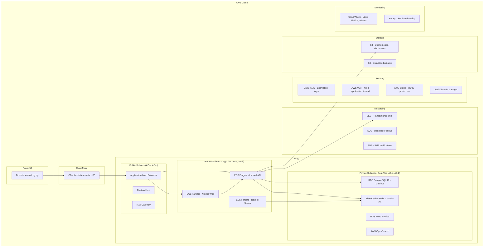

### 36.2 AWS Services

| Service | Purpose | Configuration |
|---|---|---|
| **ECS Fargate** | Container orchestration | 3 services: API, Web, Reverb; auto-scaling |
| **RDS PostgreSQL 16** | Primary database | db.r6g.xlarge, Multi-AZ, 100GB gp3 |
| **RDS Read Replica** | Reporting queries | db.r6g.large, same AZ as primary |
| **ElastiCache Redis 7** | Cache, queues, sessions, Reverb pub/sub | cache.r6g.large, Multi-AZ, cluster mode |
| **S3** | File storage | Standard for uploads; Glacier for archives |
| **CloudFront** | CDN | 10+ edge locations; S3 + ALB origins |
| **Route 53** | DNS | Primary domain + health checks + failover |
| **ALB** | Load balancing | HTTP/2, WebSocket support, sticky sessions for Reverb |
| **WAF** | Web application firewall | OWASP top 10 rules, rate limiting |
| **Shield Standard** | DDoS protection | Automatic |
| **KMS** | Encryption key management | CMKs for DB, S3, Secrets |
| **Secrets Manager** | Credential storage | DB passwords, API keys, JWT secrets |
| **SES** | Email | Transactional + marketing (separate IP pools) |
| **SNS** | SMS | OTP, critical alerts |
| **CloudWatch** | Logging + Metrics | All services; custom metrics for business KPIs |
| **X-Ray** | Distributed tracing | Request tracing across services |
| **ECR** | Container registry | API, Web, Reverb images |
| **CodePipeline** | CI/CD | GitHub → Build → Deploy |
| **Certificate Manager** | SSL/TLS | Wildcard cert for *.errandboy.ng |

### 36.3 ECS Task Definitions

```json
{
  "family": "errand-boy-api",
  "networkMode": "awsvpc",
  "requiresCompatibilities": ["FARGATE"],
  "cpu": "2048",
  "memory": "4096",
  "executionRoleArn": "arn:aws:iam::xxx:role/ecsTaskExecutionRole",
  "taskRoleArn": "arn:aws:iam::xxx:role/errand-boy-api-task",
  "containerDefinitions": [
    {
      "name": "laravel-api",
      "image": "xxx.dkr.ecr.af-south-1.amazonaws.com/errand-boy-api:latest",
      "portMappings": [
        { "containerPort": 9000, "protocol": "tcp" }
      ],
      "environment": [
        { "name": "APP_ENV", "value": "production" }
      ],
      "secrets": [
        { "name": "DB_PASSWORD", "valueFrom": "arn:aws:secretsmanager:xxx:secret:db-password" }
      ],
      "logConfiguration": {
        "logDriver": "awslogs",
        "options": {
          "awslogs-group": "/ecs/errand-boy-api",
          "awslogs-region": "af-south-1",
          "awslogs-stream-prefix": "api"
        }
      },
      "healthCheck": {
        "command": ["CMD-SHELL", "php artisan health:check || exit 1"],
        "interval": 30,
        "timeout": 5,
        "retries": 3
      }
    }
  ]
}
```

### 36.4 Auto-Scaling Policies

| Service | Metric | Scale Out | Scale In |
|---|---|---|---|
| Laravel API | CPU > 70% for 3 min | +2 tasks | -1 task when CPU < 30% |
| Laravel API | Request count > 1000/min | +2 tasks | — |
| Reverb | WebSocket connections > 8000 | +1 task | -1 task when < 4000 |
| Next.js Web | CPU > 60% for 3 min | +1 task | -1 task when CPU < 20% |

---

## 37. Security Architecture

### 37.1 Security Layers

```
┌─────────────────────────────────────┐
│       AWS WAF + Shield              │  ← DDoS, SQLi, XSS at edge
├─────────────────────────────────────┤
│       CloudFront + ALB              │  ← TLS termination, header validation
├─────────────────────────────────────┤
│       Application Middleware         │  ← Auth, RBAC, Rate Limiting, CORS
├─────────────────────────────────────┤
│       Input Validation              │  ← Form Requests, Zod schemas
├─────────────────────────────────────┤
│       Business Logic                │  ← Policies, Feature Gates, Escrow
├─────────────────────────────────────┤
│       Data Layer                    │  ← Encryption at rest, parameterized queries
├─────────────────────────────────────┤
│       Audit Trail                   │  ← Immutable logs for all sensitive actions
└─────────────────────────────────────┘
```

### 37.2 Authentication & Token Security

- **Token type:** Laravel Sanctum (API tokens), stateless
- **Token expiry:** 30 days (configurable); refresh token rotation
- **Token storage:** HTTP-only, Secure, SameSite=Strict cookies (web); Keychain/Keystore (mobile)
- **Password policy:** Min 8 chars, 1 uppercase, 1 number, 1 special; bcrypt hashing
- **2FA:** TOTP (Google Authenticator compatible); optional but encouraged for KYC Tier 2+
- **Biometric:** Fingerprint/Face ID as secondary factor (mobile only)
- **Session management:** View active sessions; revoke individual or all; force logout on password change

### 37.3 Rate Limiting

```php
// app/Http/Kernel.php
// Laravel 12 rate limiting configuration

RateLimiter::for('api', function (Request $request) {
    return Limit::perMinute(60)->by($request->user()?->id ?: $request->ip());
});

RateLimiter::for('auth', function (Request $request) {
    return Limit::perMinute(5)->by($request->ip());
});

RateLimiter::for('otp', function (Request $request) {
    return Limit::perMinute(3)->by($request->user()?->id ?: $request->ip());
});

RateLimiter::for('payment', function (Request $request) {
    return Limit::perMinute(10)->by($request->user()?->id ?: $request->ip());
});

RateLimiter::for('chat', function (Request $request) {
    return Limit::perMinute(30)->by($request->user()?->id ?: $request->ip());
});
```

### 37.4 Data Encryption

| Data | Method | Key Management |
|---|---|---|
| **Passwords** | bcrypt (12 rounds) | N/A (one-way hash) |
| **BVN** | AES-256-GCM encrypted at rest | AWS KMS CMK; rotated 90 days |
| **NIN** | AES-256-GCM encrypted at rest | AWS KMS CMK; rotated 90 days |
| **Bank account numbers** | AES-256-GCM encrypted at rest | AWS KMS CMK |
| **KYC documents (S3)** | SSE-KMS server-side encryption | AWS KMS CMK |
| **Chat messages** | TLS 1.3 in transit; plaintext at rest | N/A (non-sensitive) |
| **Wallet transactions** | Immutable append-only; no encryption needed | N/A |
| **JWT secrets** | AWS Secrets Manager | Auto-rotated |
| **Database** | RDS encryption at rest | AWS KMS default key |

### 37.5 CORS Configuration

```php
// config/cors.php
return [
    'paths' => ['api/*', 'sanctum/csrf-cookie'],
    'allowed_methods' => ['GET', 'POST', 'PUT', 'PATCH', 'DELETE', 'OPTIONS'],
    'allowed_origins' => [
        env('WEB_APP_URL', 'https://errandboy.ng'),
        env('ADMIN_APP_URL', 'https://admin.errandboy.ng'),
    ],
    'allowed_origins_patterns' => [],
    'allowed_headers' => ['Content-Type', 'Authorization', 'X-Requested-With', 'Accept'],
    'exposed_headers' => ['X-RateLimit-Limit', 'X-RateLimit-Remaining'],
    'max_age' => 86400,
    'supports_credentials' => true,
];
```

### 37.6 Security Headers

```php
// App\Http\Middleware\SecurityHeaders.php
class SecurityHeaders
{
    public function handle(Request $request, Closure $next): Response
    {
        $response = $next($request);
        
        $response->headers->set('X-Frame-Options', 'DENY');
        $response->headers->set('X-Content-Type-Options', 'nosniff');
        $response->headers->set('Referrer-Policy', 'strict-origin-when-cross-origin');
        $response->headers->set('Permissions-Policy', 'camera=(), microphone=(), geolocation=(self)');
        $response->headers->set('Strict-Transport-Security', 'max-age=31536000; includeSubDomains; preload');
        $response->headers->set('Content-Security-Policy', 
            "default-src 'self'; script-src 'self' 'unsafe-inline' https://cdn.errandboy.ng; " .
            "style-src 'self' 'unsafe-inline'; img-src 'self' data: https://cdn.errandboy.ng; " .
            "connect-src 'self' wss://reverb.errandboy.ng https://api.errandboy.ng; " .
            "frame-src https://checkout.flutterwave.com https://checkout.paystack.com;"
        );
        
        return $response;
    }
}
```

### 37.7 Fraud Detection Recommendations

1. **Device Fingerprinting:** Use FingerprintJS or similar to detect multi-accounting
2. **IP Reputation:** Integration with IPQS or MaxMind for IP risk scoring
3. **Velocity Checks:** Rapid actions from same device/IP trigger manual review
4. **Payment Pattern Analysis:** ML model to detect unusual payment patterns
5. **Location Anomaly Detection:** Errander GPS vs. claimed location mismatch detection
6. **Chat Content Analysis:** Detect attempts to move transactions off-platform
7. **KYC Document Validation:** AI-based document forgery detection
8. **Social Graph Analysis:** Detect coordinated fraud rings via shared attributes

---

## 38. CI/CD Pipeline

### 38.1 Pipeline Architecture

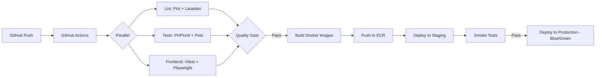

### 38.2 GitHub Actions Workflow

```yaml
# .github/workflows/deploy.yml
name: Deploy Errand Boy

on:
  push:
    branches: [main, staging]
  pull_request:
    branches: [main]

env:
  AWS_REGION: af-south-1
  ECR_REPOSITORY_API: errand-boy-api
  ECR_REPOSITORY_WEB: errand-boy-web
  ECS_SERVICE_API: errand-boy-api-service
  ECS_SERVICE_WEB: errand-boy-web-service
  ECS_CLUSTER: errand-boy-cluster

jobs:
  lint-and-test:
    runs-on: ubuntu-latest
    services:
      postgres:
        image: postgres:16
        env:
          POSTGRES_DB: errand_boy_test
          POSTGRES_USER: test
          POSTGRES_PASSWORD: test
        options: >-
          --health-cmd pg_isready
          --health-interval 10s
          --health-timeout 5s
          --health-retries 5
      redis:
        image: redis:7-alpine
        options: >-
          --health-cmd "redis-cli ping"
          --health-interval 10s
          --health-timeout 5s
          --health-retries 5
    steps:
      - uses: actions/checkout@v4
      
      - name: Setup PHP
        uses: shivammathur/setup-php@v2
        with:
          php-version: '8.3'
          extensions: pgsql, redis, gd, imagick
          coverage: xdebug
      
      - name: Install backend dependencies
        run: composer install --prefer-dist --no-progress
      
      - name: Run Laravel Pint
        run: ./vendor/bin/pint --test
      
      - name: Run Larastan (PHPStan)
        run: ./vendor/bin/phpstan analyse --no-progress
      
      - name: Run Pest tests
        run: php artisan test --parallel --coverage
        env:
          DB_CONNECTION: pgsql
          DB_HOST: localhost
          DB_PORT: 5432
          DB_DATABASE: errand_boy_test
          DB_USERNAME: test
          DB_PASSWORD: test
          REDIS_HOST: localhost
      
      - name: Setup Node.js
        uses: actions/setup-node@v4
        with:
          node-version: '22'
      
      - name: Install frontend dependencies
        working-directory: ./frontend
        run: npm ci
      
      - name: Run Vitest
        working-directory: ./frontend
        run: npm run test
      
      - name: Run Playwright E2E
        working-directory: ./frontend
        run: npx playwright test

  build-and-deploy:
    needs: lint-and-test
    if: github.event_name == 'push' && (github.ref == 'refs/heads/main' || github.ref == 'refs/heads/staging')
    runs-on: ubuntu-latest
    environment: ${{ github.ref == 'refs/heads/main' && 'production' || 'staging' }}
    steps:
      - uses: actions/checkout@v4
      
      - name: Configure AWS credentials
        uses: aws-actions/configure-aws-credentials@v4
        with:
          aws-access-key-id: ${{ secrets.AWS_ACCESS_KEY_ID }}
          aws-secret-access-key: ${{ secrets.AWS_SECRET_ACCESS_KEY }}
          aws-region: ${{ env.AWS_REGION }}
      
      - name: Login to Amazon ECR
        uses: aws-actions/amazon-ecr-login@v2
      
      - name: Build and push API image
        uses: docker/build-push-action@v5
        with:
          context: .
          file: ./Dockerfile
          push: true
          tags: ${{ steps.login-ecr.outputs.registry }}/${{ env.ECR_REPOSITORY_API }}:${{ github.sha }}
          build-args: |
            APP_ENV=${{ github.ref == 'refs/heads/main' && 'production' || 'staging' }}
      
      - name: Build and push Web image
        uses: docker/build-push-action@v5
        with:
          context: ./frontend
          file: ./frontend/Dockerfile
          push: true
          tags: ${{ steps.login-ecr.outputs.registry }}/${{ env.ECR_REPOSITORY_WEB }}:${{ github.sha }}
      
      - name: Deploy to ECS (Blue/Green)
        run: |
          aws ecs update-service \
            --cluster ${{ env.ECS_CLUSTER }} \
            --service ${{ env.ECS_SERVICE_API }} \
            --force-new-deployment
          aws ecs update-service \
            --cluster ${{ env.ECS_CLUSTER }} \
            --service ${{ env.ECS_SERVICE_WEB }} \
            --force-new-deployment
      
      - name: Wait for deployment
        run: |
          aws ecs wait services-stable \
            --cluster ${{ env.ECS_CLUSTER }} \
            --services ${{ env.ECS_SERVICE_API }} ${{ env.ECS_SERVICE_WEB }}
      
      - name: Run smoke tests
        run: |
          curl -f https://api.errandboy.ng/health || exit 1
          curl -f https://errandboy.ng || exit 1
```

---

## 39. Monitoring & Logging

### 39.1 Monitoring Stack

| Tool | Purpose |
|---|---|
| **CloudWatch** | Centralized logging, metrics, alarms |
| **CloudWatch Logs Insights** | Log querying and analysis |
| **X-Ray** | Distributed tracing across services |
| **Datadog** | APM, infrastructure monitoring, dashboards |
| **Sentry** | Error tracking and performance monitoring |
| **Horizon Dashboard** | Queue monitoring (Laravel Horizon) |
| **Pulse** | Laravel application performance monitoring |
| **Prometheus + Grafana** | Custom business metrics dashboards |
| **PagerDuty** | On-call alerting and incident management |
| **Uptime Robot** | External uptime monitoring |

### 39.2 Key Alarms

| Alarm | Metric | Threshold | Action |
|---|---|---|---|
| **High API latency** | p95 response time | > 500ms for 5 min | PagerDuty warning |
| **High error rate** | 5xx errors | > 1% for 5 min | PagerDuty critical |
| **Payment gateway down** | Payment failure rate | > 20% for 5 min | PagerDuty critical |
| **Queue backlog** | Horizon pending jobs | > 1000 for 10 min | PagerDuty warning |
| **High CPU** | ECS CPU utilization | > 85% for 10 min | Auto-scale + PagerDuty |
| **Database connections** | RDS connections | > 80% of max | PagerDuty warning |
| **Redis memory** | ElastiCache memory | > 80% | PagerDuty warning |
| **Disk space** | RDS storage | > 85% | PagerDuty warning |
| **Wallet anomaly** | Unusual withdrawal volume | > 3 std dev from mean | PagerDuty + manual review |

### 39.3 Logging Standards

```php
// Structured logging format
Log::info('Payment processed successfully', [
    'correlation_id' => request()->header('X-Correlation-ID'),
    'payment_id' => $payment->id,
    'bid_id' => $payment->bid_id,
    'provider' => $payment->provider,
    'provider_ref' => $payment->provider_ref,
    'amount' => $payment->amount,
    'user_id' => auth()->id(),
    'duration_ms' => $durationMs,
]);

// Error logging
Log::error('Payment webhook verification failed', [
    'correlation_id' => request()->header('X-Correlation-ID'),
    'provider' => 'flutterwave',
    'error' => $e->getMessage(),
    'trace' => $e->getTraceAsString(),
    'request_headers' => $request->headers->all(),
    'request_ip' => $request->ip(),
]);
```

### 39.4 Laravel Pulse Configuration

```php
// config/pulse.php
return [
    'recorders' => [
        Pulse\Recorders\SlowQueries::class => [
            'threshold' => 100, // ms
        ],
        Pulse\Recorders\SlowRequests::class => [
            'threshold' => 300, // ms
        ],
        Pulse\Recorders\Exceptions::class,
        Pulse\Recorders\Queues::class,
        Pulse\Recorders\Servers::class,
        Pulse\Recorders\SlowJobs::class => [
            'threshold' => 5000, // ms
        ],
        Pulse\Recorders\CacheInteractions::class,
        Pulse\Recorders\RedisCommands::class,
    ],
];
```

---

## 40. Environment Variables

### 40.1 Backend `.env`

```env
APP_NAME="Errand Boy API"
APP_URL=https://api.errandboy.ng
APP_ENV=production
APP_KEY=
APP_DEBUG=false
APP_LOG_LEVEL=notice
APP_TIMEZONE=Africa/Lagos

# Database
DB_CONNECTION=pgsql
DB_HOST=errand-boy-db.xxxxxxxx.af-south-1.rds.amazonaws.com
DB_PORT=5432
DB_DATABASE=errand_boy
DB_USERNAME=errand_boy_app
DB_PASSWORD=

# Redis
REDIS_HOST=errand-boy-redis.xxxxxx.af-south-1.cache.amazonaws.com
REDIS_PORT=6379
REDIS_PASSWORD=
REDIS_CLIENT=phpredis

# Queue
QUEUE_CONNECTION=redis

# Broadcasting
BROADCAST_DRIVER=reverb
REVERB_APP_ID=
REVERB_APP_KEY=
REVERB_APP_SECRET=
REVERB_HOST=reverb.errandboy.ng
REVERB_PORT=443
REVERB_SCHEME=https

# Payments - Flutterwave (Primary)
FLW_PUBLIC_KEY=
FLW_SECRET_KEY=
FLW_ENCRYPTION_KEY=
FLW_WEBHOOK_HASH=
FLW_BASE_URL=https://api.flutterwave.com/v3

# Payments - Paystack (Backup)
PAYSTACK_PUBLIC_KEY=
PAYSTACK_SECRET_KEY=
PAYSTACK_BASE_URL=https://api.paystack.co

# Firebase Cloud Messaging
FCM_SERVER_KEY=
FCM_SENDER_ID=

# AWS
AWS_ACCESS_KEY_ID=
AWS_SECRET_ACCESS_KEY=
AWS_DEFAULT_REGION=af-south-1
AWS_BUCKET=errand-boy-uploads
AWS_CDN_URL=https://cdn.errandboy.ng
AWS_KMS_KEY_ID=

# Mail (SES)
MAIL_MAILER=ses
MAIL_FROM_ADDRESS=hello@errandboy.ng
MAIL_FROM_NAME="Errand Boy"

# SMS (Termii)
TERMII_API_KEY=
TERMII_SENDER_ID="ErrandBoy"

# KYC Providers
BVN_PROVIDER=flutterwave
NIN_PROVIDER=premiumtrust

# Platform Configuration
PLATFORM_FEE_PERCENTAGE=5.0
MIN_SERVICE_FEE=500
URGENT_REQUEST_FEE=1500
OTP_EXPIRY_MINUTES=30
MAX_OTP_ATTEMPTS=3
REQUEST_EXPIRY_DAYS=7
DISPUTE_RESPONSE_HOURS=48
APPEAL_WINDOW_HOURS=72

# KYC Limits
KYC_TIER_0_MAX_WALLET=50000
KYC_TIER_0_MAX_TRANSACTION=25000
KYC_TIER_1_MAX_WALLET=200000
KYC_TIER_1_MAX_TRANSACTION=100000
KYC_TIER_2_MAX_WALLET=1000000
KYC_TIER_2_MAX_TRANSACTION=500000

# Fraud Detection
FRAUD_DETECTION_ENABLED=true
MAX_ACCOUNTS_PER_IP=3

# Session & Auth
SANCTUM_STATEFUL_DOMAINS=errandboy.ng,admin.errandboy.ng
SESSION_DRIVER=redis
SESSION_LIFETIME=120

# Horizon
HORIZON_DOMAIN=horizon.errandboy.ng
HORIZON_PATH=horizon

# Sentry
SENTRY_LARAVEL_DSN=
SENTRY_TRACES_SAMPLE_RATE=0.1

# Feature Flags
FEATURE_URGENT_REQUESTS=true
FEATURE_KYC=true
FEATURE_SUBSCRIPTIONS=true
FEATURE_BUSINESS_ACCOUNTS=true
FEATURE_REALTIME_CHAT=true
```

### 40.2 Frontend `.env.local`

```env
NEXT_PUBLIC_API_BASE_URL=https://api.errandboy.ng/v1
NEXT_PUBLIC_REVERB_HOST=reverb.errandboy.ng
NEXT_PUBLIC_REVERB_PORT=443
NEXT_PUBLIC_REVERB_SCHEME=https
NEXT_PUBLIC_REVERB_APP_KEY=
NEXT_PUBLIC_FLUTTERWAVE_PUBLIC_KEY=
NEXT_PUBLIC_GOOGLE_MAPS_API_KEY=
NEXT_PUBLIC_SENTRY_DSN=
NEXT_PUBLIC_FIREBASE_CONFIG={"apiKey":"...","projectId":"...","messagingSenderId":"...","appId":"..."}
```

### 40.3 Mobile `.env`

```env
# Android: app/build.gradle or local.properties
API_BASE_URL=https://api.errandboy.ng/v1
REVERB_HOST=reverb.errandboy.ng
REVERB_PORT=443
REVERB_SCHEME=https
REVERB_APP_KEY=
FLUTTERWAVE_PUBLIC_KEY=
GOOGLE_MAPS_API_KEY=
FIREBASE_SENDER_ID=

# iOS: Config.xcconfig
API_BASE_URL = https://api.errandboy.ng/v1
REVERB_HOST = reverb.errandboy.ng
REVERB_PORT = 443
REVERB_SCHEME = https
REVERB_APP_KEY = 
FLUTTERWAVE_PUBLIC_KEY = 
GOOGLE_MAPS_API_KEY = 
FIREBASE_SENDER_ID = 
```

---

## 41. Project Folder Structure

### 41.1 Monorepo Layout

```
errand-boy/
├── backend/                          # Laravel 12 API
│   ├── app/
│   ├── bootstrap/
│   ├── config/
│   ├── database/
│   ├── public/
│   ├── resources/
│   ├── routes/
│   ├── storage/
│   ├── tests/
│   ├── composer.json
│   ├── Dockerfile
│   ├── Dockerfile.horizon
│   └── .env.example
├── frontend/                         # Next.js 15 Web App
│   ├── app/
│   ├── components/
│   ├── hooks/
│   ├── lib/
│   ├── store/
│   ├── types/
│   ├── public/
│   ├── next.config.ts
│   ├── tailwind.config.ts
│   ├── tsconfig.json
│   ├── Dockerfile
│   └── package.json
├── mobile/                           # React Native / Flutter
│   ├── android/
│   ├── ios/
│   ├── lib/ (Flutter) or src/ (RN)
│   ├── pubspec.yaml or package.json
│   └── ...
├── admin/                            # Next.js Admin Portal (can be part of frontend/)
├── reverb/                           # Laravel Reverb Server (can be part of backend/)
├── infrastructure/                   # AWS CDK / Terraform
│   ├── stacks/
│   │   ├── vpc.ts
│   │   ├── rds.ts
│   │   ├── elasticache.ts
│   │   ├── ecs.ts
│   │   ├── s3.ts
│   │   └── cloudfront.ts
│   ├── lib/
│   └── cdk.json
├── scripts/                          # Utility scripts
│   ├── deploy.sh
│   ├── db-migrate.sh
│   └── seed-data.sh
├── docs/                             # Documentation
│   ├── errand-boy-v2.0.md           # This document
│   ├── api-reference.md
│   ├── architecture.md
│   └── onboarding.md
├── .github/
│   └── workflows/
│       ├── deploy.yml
│       ├── lint.yml
│       └── e2e.yml
├── docker-compose.yml                 # Local development
├── docker-compose.prod.yml            # Production-like local testing
├── Makefile                           # Common commands
└── README.md
```

### 41.2 Docker Compose (Local Development)

```yaml
# docker-compose.yml
version: '3.8'

services:
  # PostgreSQL
  postgres:
    image: postgis/postgis:16-3.4
    environment:
      POSTGRES_DB: errand_boy
      POSTGRES_USER: errand_boy
      POSTGRES_PASSWORD: secret
    ports:
      - "5432:5432"
    volumes:
      - postgres_data:/var/lib/postgresql/data
    healthcheck:
      test: ["CMD-SHELL", "pg_isready -U errand_boy"]
      interval: 5s
      timeout: 5s
      retries: 5

  # Redis
  redis:
    image: redis:7-alpine
    ports:
      - "6379:6379"
    volumes:
      - redis_data:/data
    healthcheck:
      test: ["CMD", "redis-cli", "ping"]
      interval: 5s
      timeout: 5s
      retries: 5

  # Laravel API
  api:
    build:
      context: ./backend
      dockerfile: Dockerfile.dev
    ports:
      - "8000:80"
    volumes:
      - ./backend:/var/www
    environment:
      APP_ENV: local
      DB_CONNECTION: pgsql
      DB_HOST: postgres
      DB_PORT: 5432
      DB_DATABASE: errand_boy
      DB_USERNAME: errand_boy
      DB_PASSWORD: secret
      REDIS_HOST: redis
      BROADCAST_DRIVER: reverb
    depends_on:
      postgres:
        condition: service_healthy
      redis:
        condition: service_healthy

  # Reverb
  reverb:
    build:
      context: ./backend
      dockerfile: Dockerfile.reverb
    ports:
      - "8080:8080"
    environment:
      REVERB_HOST: "0.0.0.0"
      REVERB_PORT: 8080
      REDIS_HOST: redis
    depends_on:
      - redis

  # Next.js Web
  web:
    build:
      context: ./frontend
      dockerfile: Dockerfile.dev
    ports:
      - "3000:3000"
    volumes:
      - ./frontend:/app
      - /app/node_modules
    environment:
      NEXT_PUBLIC_API_BASE_URL: http://localhost:8000/v1
      NEXT_PUBLIC_REVERB_HOST: localhost
      NEXT_PUBLIC_REVERB_PORT: 8080
    depends_on:
      - api

  # MinIO (S3-compatible local storage)
  minio:
    image: minio/minio
    ports:
      - "9000:9000"
      - "9001:9001"
    environment:
      MINIO_ROOT_USER: minioadmin
      MINIO_ROOT_PASSWORD: minioadmin
    command: server /data --console-address ":9001"
    volumes:
      - minio_data:/data

volumes:
  postgres_data:
  redis_data:
  minio_data:
```

---

## 42. Deployment Strategy

### 42.1 Environments

| Environment | Purpose | URL | Branch |
|---|---|---|---|
| **Local** | Development | localhost | feature/* |
| **Staging** | Pre-production testing | staging.errandboy.ng | staging |
| **Production** | Live | errandboy.ng | main |

### 42.2 Deployment Process

1. **Code Commit:** Push to GitHub branch
2. **CI Pipeline:** GitHub Actions runs lint, tests, builds
3. **Staging Deploy:** Automatic on push to `staging` branch
4. **Smoke Tests:** Automated API + E2E tests against staging
5. **Production Deploy:** Manual approval gate → Blue/Green deployment
6. **Post-Deploy:** Run migrations, clear cache, warm up
7. **Health Check:** Verify all services healthy
8. **Rollback Plan:** Automatic if health check fails

### 42.3 Database Migration Strategy

```bash
# Always run migrations before deployment
php artisan migrate --force

# For zero-downtime:
# 1. Add new columns (nullable)
# 2. Deploy code that writes to both old and new columns
# 3. Backfill data
# 4. Deploy code that reads from new columns
# 5. Drop old columns in next deployment
```

### 42.4 Blue/Green Deployment

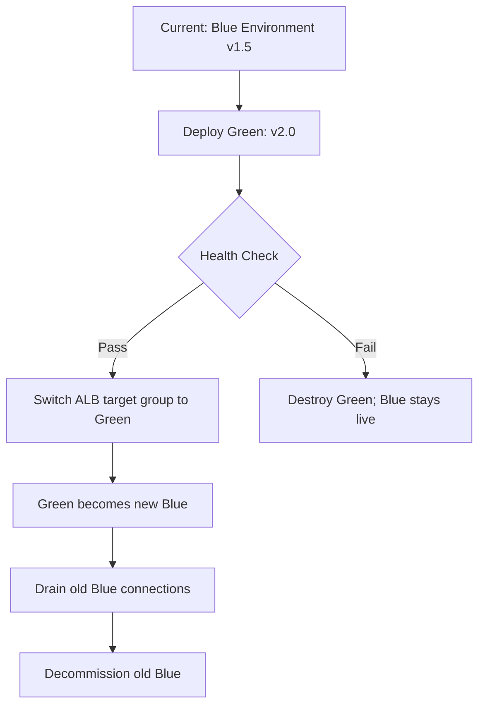

### 42.5 Rollback Plan

| Issue | Rollback Action | Time |
|---|---|---|
| **Code regression** | Revert ALB target group to previous ECS tasks | < 2 min |
| **Database migration failure** | `php artisan migrate:rollback` | < 5 min |
| **Cache corruption** | `php artisan cache:clear` + `php artisan config:clear` | < 1 min |
| **Redis failure** | ElastiCache automatic failover to replica | < 2 min |
| **RDS failure** | Promote read replica to primary (manual) | < 15 min |

---

## 43. Scaling Strategy

### 43.1 Scaling Phases

#### Phase 1: Launch (0 - 10,000 users)

- **Infrastructure:** Single ECS task per service; db.r6g.large RDS; cache.r6g.large Redis
- **Cost:** ~$800/month
- **Optimizations:** Basic caching, query optimization

#### Phase 2: Growth (10,000 - 100,000 users)

- **Infrastructure:** 3-5 ECS tasks auto-scaled; db.r6g.xlarge RDS + read replica; cache.r6g.xlarge Redis
- **Cost:** ~$2,500/month
- **Optimizations:** Redis caching layer, CDN, database connection pooling (PgBouncer)

#### Phase 3: Scale (100,000 - 1,000,000 users)

- **Infrastructure:** 10+ ECS tasks; db.r6g.2xlarge + 2 read replicas; Redis Cluster; OpenSearch
- **Cost:** ~$8,000/month
- **Optimizations:** Event sourcing for wallet transactions; CQRS for reporting; sharding consideration

#### Phase 4: Enterprise (1,000,000+ users)

- **Infrastructure:** Multi-region; database sharding by region; dedicated clusters
- **Cost:** ~$25,000+/month
- **Optimizations:** GraphQL for mobile; edge compute for matching engine

### 43.2 Performance Optimization Strategies

| Area | Strategy | Expected Improvement |
|---|---|---|
| **API Responses** | Redis cache hot data (categories, settings, plans) | 80% reduction in DB reads |
| **Request Feed** | Materialized views + Redis sorted sets for geo queries | 90% faster feed queries |
| **Images** | WebP conversion + CloudFront CDN + lazy loading | 60% bandwidth reduction |
| **Database** | PgBouncer connection pooling; read/write split | 3x more concurrent connections |
| **Queue** | Dedicated supervisors per queue; Horizon auto-scaling | 5x job throughput |
| **WebSocket** | Reverb horizontal scaling; Redis pub/sub backend | 50k concurrent connections |
| **Search** | PostgreSQL full-text search with GIN indexes | 10x faster than LIKE queries |
| **Mobile** | GraphQL for flexible queries; offline-first with sync | 40% less data transfer |

### 43.3 Database Optimization

```sql
-- Partition large tables by date
CREATE TABLE wallet_transactions_partitioned (
    LIKE wallet_transactions INCLUDING ALL
) PARTITION BY RANGE (created_at);

CREATE TABLE wallet_transactions_2026_q1 PARTITION OF wallet_transactions_partitioned
    FOR VALUES FROM ('2026-01-01') TO ('2026-04-01');

-- Archive old notifications
CREATE TABLE notifications_archive (LIKE notifications INCLUDING ALL);

-- Move notifications older than 90 days to archive
INSERT INTO notifications_archive 
SELECT * FROM notifications WHERE created_at < NOW() - INTERVAL '90 days';
DELETE FROM notifications WHERE created_at < NOW() - INTERVAL '90 days';
```

---

## 44. Future Roadmap (v3 and v4)

### 44.1 Version 3.0 (Q3-Q4 2026)

| Feature | Description | Priority |
|---|---|---|
| **Multi-Currency Support** | USD, GHS, KES in addition to NGN with real-time FX | P0 |
| **Multi-Country Expansion** | Ghana, Kenya launches with localized payment gateways | P0 |
| **GraphQL API** | Flexible API alongside REST for mobile optimization | P1 |
| **AI-Powered Matching** | ML-based errander matching using historical performance data | P1 |
| **Voice Notes in Chat** | Audio message support with transcription | P2 |
| **Advanced Analytics** | Predictive analytics; demand forecasting; heat maps | P1 |
| **Errander Insurance** | In-app accident and goods insurance subscription | P2 |
| **Loyalty Program** | Points system for frequent requesters and top erranders | P2 |
| **Automated Dispute Resolution** | AI-assisted initial dispute review and recommendation | P2 |
| **Webhook API** | Public webhooks for enterprise integrations | P1 |

### 44.2 Version 4.0 (2027)

| Feature | Description | Priority |
|---|---|---|
| **Errand Boy Logistics** | Dedicated fleet for high-volume enterprise deliveries | P0 |
| **Scheduled/Recurring Requests** | Daily/weekly standing orders for businesses | P0 |
| **Dark Stores Integration** | Partner with local stores for instant inventory access | P1 |
| **Blockchain Escrow** | Smart contract-based escrow for high-value transactions | P2 |
| **Drone Delivery (Pilot)** | Last-mile drone delivery for documents and small items | P3 |
| **Open API Platform** | Public API for third-party integrations and plugins | P1 |
| **Errand Boy Pay** | Standalone payment wallet usable outside the platform | P2 |
| **Video Verification** | Live video call for high-value delivery confirmation | P2 |
| **Carbon Offset Program** | Track and offset delivery carbon footprint | P3 |
| **Errander Academy** | Training, certification, and upskilling for erranders | P2 |

### 44.3 Technical Debt & Improvements (Ongoing)

| Area | Action | Timeline |
|---|---|---|
| **Test Coverage** | Achieve 85%+ code coverage across all services | Q3 2026 |
| **Documentation** | OpenAPI 3.1 spec; developer portal; SDKs for Node.js, Python | Q3 2026 |
| **Chaos Engineering** | Introduce Gremlin for resilience testing | Q4 2026 |
| **Accessibility** | WCAG 2.1 AA compliance for web and mobile | Q4 2026 |
| **Multi-Region DR** | Active-passive deployment in eu-west-1 | Q1 2027 |
| **Data Lake** | S3-based data lake for advanced analytics and ML | Q2 2027 |
| **SOC 2 / ISO 27001** | Security certification for enterprise customers | Q2 2027 |

---

## Appendix A: Mermaid Diagrams Index

| Diagram | Section | Description |
|---|---|---|
| Payment Flow | §3 | Requester → Wallet → Escrow → Errander |
| KYC Verification | §10 | Tier 0 → Tier 1 → Tier 2 → Tier 3 |
| Wallet Architecture | §11 | Available balance + Locked balance + Transactions |
| Escrow Flow | §11 | Sequence: Pay → Hold → Deliver → Release |
| Request Lifecycle | §15 | Draft → Open → Assigned → Completed |
| Bid Lifecycle | §16 | Pending → Accepted/Rejected/Withdrawn |
| Delivery Flow | §17 | OTP Generation → Confirmation |
| Chat Architecture | §18 | Client ↔ Reverb ↔ Redis ↔ DB |
| Matching Engine | §19 | Request → Find → Filter → Notify |
| Rating Flow | §21 | Blind submission → Reveal → Trust Score update |
| Dispute Lifecycle | §24 | Open → Response → Review → Resolution → Appeal |
| Entity Relationship | §30 | Complete database ER diagram |
| Event-Driven Architecture | §34 | Event producers → Event bus → Listeners |
| AWS Infrastructure | §36 | Full cloud architecture diagram |
| CI/CD Pipeline | §38 | GitHub → Build → Deploy → Verify |
| Blue/Green Deploy | §42 | Blue active → Deploy Green → Switch → Drain |

## Appendix B: Third-Party Integrations

| Provider | Purpose | API Version | Fallback |
|---|---|---|---|
| **Flutterwave** | Payments, BVN lookup, Payouts | v3 | Paystack |
| **Paystack** | Backup payments | v1 | None (manual) |
| **Firebase** | Push notifications, Analytics, Crashlytics | Latest | None |
| **AWS S3** | File storage | 2006-03-01 | MinIO (local) |
| **AWS SES** | Transactional email | v2 | SMTP |
| **AWS SNS** | SMS notifications | Latest | Termii |
| **Termii** | SMS OTP | v1 | Africa's Talking |
| **Google Maps** | Geocoding, Distance Matrix, Places | v3 | OpenStreetMap |
| **PremiumTrust** | NIN verification | v2 | Flutterwave NIN |
| **SendGrid** | Marketing email | v3 | SES |

## Appendix C: Glossary

| Term | Definition |
|---|---|
| **Requester** | User who posts a request for goods/services |
| **Errander** | User who fulfills requests and delivers goods |
| **Escrow** | Funds held by the platform between payment and delivery confirmation |
| **OTP** | One-Time Password — 6-digit code for delivery verification |
| **Dispute Window** | Time period after delivery when requester can raise a dispute |
| **Trust Score** | Composite 0-5 score based on performance, ratings, and reliability |
| **SLA** | Service Level Agreement — time targets for delivery milestones |
| **KYC** | Know Your Customer — identity verification process |
| **BVN** | Bank Verification Number (Nigeria) |
| **NIN** | National Identification Number (Nigeria) |
| **GMV** | Gross Merchandise Volume — total value of transactions |
| **Platform Fee** | Percentage fee charged by Errand Boy on each transaction |
| **Urgent Request** | Priority request with additional fee and shortened SLA |
| **Reverb** | Laravel's first-party WebSocket server |
| **Sanctum** | Laravel's API token authentication package |

---

_Document Version: 2.0.0 | Last Updated: June 2026 | Author: Errand Boy Engineering Team_

_This document is the single source of truth for the Errand Boy v2.0 platform. All development, design, and product decisions should reference this specification._
