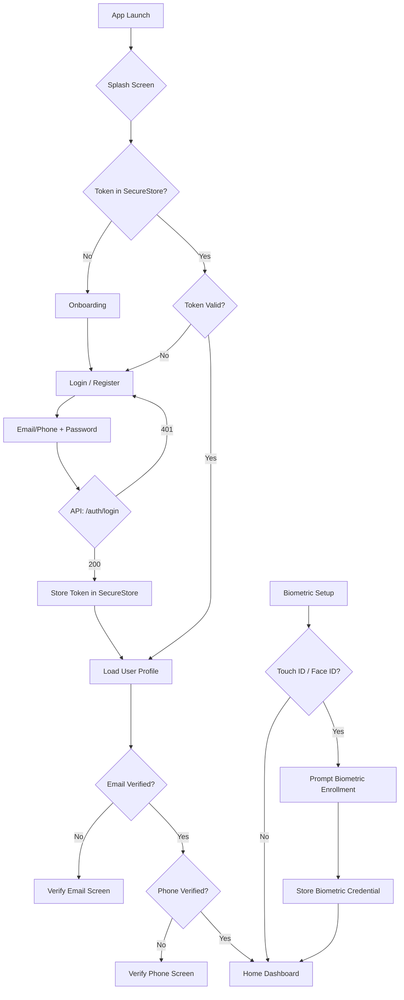

# Errand Boy Mobile — Architecture & Design Document

> **Platform:** React Native (Expo SDK) | **Audience:** Requesters + Erranders Only
> **API:** Existing Laravel Backend (`api.errandboy.ng/v1`)

---

## Phase 1: Product Architecture

### 1.1 Folder Structure

```
errand-boy-mobile/
├── app/                              # Expo Router file-based routing
│   ├── (auth)/                       # Auth group (no tab bar)
│   │   ├── _layout.tsx               # Auth layout (stack)
│   │   ├── splash.tsx                # Animated splash
│   │   ├── onboarding.tsx            # 3-slide onboarding carousel
│   │   ├── login.tsx                 # Email/phone login
│   │   ├── register.tsx              # Role selection + registration
│   │   ├── forgot-password.tsx       # Password reset request
│   │   └── reset-password.tsx        # Enter code + new password
│   ├── (tabs)/                       # Main tab navigator
│   │   ├── _layout.tsx               # Tab bar config
│   │   ├── index.tsx                 # Redirect to role-based home
│   │   ├── home.tsx                  # Dashboard (role-conditional)
│   │   ├── feed.tsx                  # Errander: nearby requests feed
│   │   ├── requests/                 # Requester stack
│   │   │   ├── index.tsx             # My requests list
│   │   │   ├── create.tsx            # Create new request
│   │   │   └── [id].tsx              # Request detail + bids
│   │   ├── wallet.tsx                # Wallet balance + history
│   │   ├── chat/                     # Chat stack
│   │   │   ├── index.tsx             # Conversation list
│   │   │   └── [id].tsx              # Chat screen
│   │   ├── notifications.tsx         # In-app notifications
│   │   └── profile/                  # Profile stack
│   │       ├── index.tsx             # My profile
│   │       ├── edit.tsx              # Edit profile
│   │       ├── addresses/            # Address management
│   │       ├── kyc.tsx               # KYC verification
│   │       ├── trust-score.tsx       # Errander trust score
│   │       └── subscriptions.tsx     # Plan management
│   ├── (modals)/                     # Modal presentations
│   │   ├── bid-form.tsx              # Submit bid modal
│   │   ├── payment.tsx               # Payment flow
│   │   ├── otp-generate.tsx          # Errander: generate OTP
│   │   ├── otp-confirm.tsx           # Requester: confirm OTP
│   │   ├── dispute-create.tsx        # Open dispute
│   │   ├── rate-user.tsx             # Post-delivery rating
│   │   └── withdraw.tsx              # Withdraw earnings
│   └── _layout.tsx                   # Root layout (auth check)
├── src/
│   ├── features/                     # Feature-based modules
│   │   ├── auth/                     # Auth screen components + hooks
│   │   ├── requests/                 # Request list/create/detail
│   │   ├── bids/                     # Bid submission/comparison
│   │   ├── wallet/                   # Funding/withdrawals
│   │   ├── delivery/                 # OTP flow
│   │   ├── chat/                     # Realtime chat
│   │   ├── disputes/                 # Dispute management
│   │   ├── ratings/                  # Star ratings + reviews
│   │   ├── subscriptions/            # Plan management
│   │   ├── kyc/                      # Identity verification
│   │   └── trust/                    # Trust score display
│   ├── components/                   # Shared UI components
│   │   ├── ui/                       # Primitives (Button, Input, Card)
│   │   ├── StatusBadge.tsx           # Request/bid status badges
│   │   ├── EmptyState.tsx            # Empty list placeholder
│   │   ├── LoadingState.tsx          # Skeleton loaders
│   │   ├── ErrorState.tsx            # Error with retry
│   │   ├── Avatar.tsx                # User avatar
│   │   ├── PriceBreakdown.tsx        # Goods + service + platform
│   │   ├── RequestCard.tsx           # Feed request card
│   │   ├── BidCard.tsx               # Bid comparison card
│   │   ├── ErranderCard.tsx          # Errander profile card
│   │   └── MapView.tsx               # Location picker/map
│   ├── hooks/                        # Custom hooks
│   │   ├── useAuth.ts                # Auth state + actions
│   │   ├── useRequests.ts            # Request queries + mutations
│   │   ├── useBids.ts                # Bid queries + mutations
│   │   ├── useWallet.ts              # Wallet queries + mutations
│   │   ├── useChat.ts                # Chat queries + WebSocket
│   │   ├── useLocation.ts            # Geolocation hook
│   │   ├── useNotifications.ts       # Push notification setup
│   │   └── useAvailability.ts        # Errander online/offline
│   ├── services/                     # API + external integrations
│   │   ├── api.ts                    # Axios instance + interceptors
│   │   ├── authService.ts            # Login/register/refresh
│   │   ├── requestService.ts         # Request CRUD
│   │   ├── bidService.ts             # Bid CRUD
│   │   ├── walletService.ts          # Wallet operations
│   │   ├── deliveryService.ts        # OTP operations
│   │   ├── chatService.ts            # Chat API + WebSocket
│   │   ├── disputeService.ts         # Dispute operations
│   │   ├── ratingService.ts          # Rating operations
│   │   ├── pushService.ts            # FCM registration
│   │   └── locationService.ts        # Background location
│   ├── store/                        # Zustand stores
│   │   ├── authStore.ts              # User + token + role
│   │   ├── locationStore.ts          # Current position
│   │   ├── availabilityStore.ts      # Errander online state
│   │   └── notificationStore.ts      # Unread count
│   ├── navigation/                   # Navigation utilities
│   │   ├── linking.ts                # Deep link config
│   │   └── guards.tsx                # Auth + role route guards
│   ├── types/                        # TypeScript definitions
│   │   ├── api.ts                    # API response envelopes
│   │   ├── user.ts                   # User, profile types
│   │   ├── request.ts                # Request, category types
│   │   ├── bid.ts                    # Bid types
│   │   ├── wallet.ts                 # Wallet, transaction types
│   │   ├── delivery.ts               # Delivery, OTP types
│   │   ├── chat.ts                   # Conversation, message types
│   │   ├── dispute.ts                # Dispute types
│   │   └── navigation.ts             # Route param types
│   ├── utils/                        # Utilities
│   │   ├── format.ts                 # Currency, date formatters
│   │   ├── validators.ts             # Zod schemas
│   │   ├── constants.ts              # App constants
│   │   └── permissions.ts            # Role-based helpers
│   └── theme/                        # Design system
│       ├── colors.ts                 # Color palette
│       ├── typography.ts             # Font scale
│       ├── spacing.ts                # Spacing scale
│       ├── shadows.ts                # Shadow tokens
│       └── index.ts                  # Combined theme
├── assets/                           # Static assets
│   ├── images/                       # Onboarding, logos
│   ├── fonts/                        # Custom fonts
│   └── animations/                   # Lottie animations
├── app.json                          # Expo config
├── eas.json                          # EAS Build config
├── babel.config.js
├── tsconfig.json
└── package.json
```

### 1.2 State Management Strategy

```
┌─────────────────────────────────────────────────────────┐
│                    State Architecture                     │
│                                                          │
│  ┌──────────┐  ┌──────────┐  ┌──────────────────────┐  │
│  │  Zustand  │  │  Zustand  │  │    Zustand           │  │
│  │  Auth     │  │ Location  │  │  Availability        │  │
│  │  Store    │  │  Store    │  │  Store               │  │
│  │          │  │          │  │                       │  │
│  │ • user   │  │ • lat    │  │ • isOnline            │  │
│  │ • token  │  │ • lng    │  │ • lastUpdate          │  │
│  │ • role   │  │ • heading│  │ • serviceRadius       │  │
│  │ • kycTier│  │ • speed  │  │                       │  │
│  └────┬─────┘  └────┬─────┘  └───────────┬───────────┘  │
│       │              │                    │              │
│       │    ┌─────────┴─────────┐          │              │
│       │    │   React Query      │          │              │
│       │    │  (TanStack Query)  │          │              │
│       │    │                    │          │              │
│       │    │ • useRequests()    │          │              │
│       │    │ • useBids()        │          │              │
│       │    │ • useWallet()      │          │              │
│       │    │ • useChat()        │          │              │
│       │    │ • useDisputes()    │          │              │
│       │    │ • useRatings()     │          │              │
│       │    │ • useNotifications │          │              │
│       │    └─────────┬─────────┘          │              │
│       │              │                    │              │
│  ┌────┴──────────────┴────────────────────┴──────────┐  │
│  │                 API Layer (Axios)                   │  │
│  │  • Token interceptor + auto-refresh                │  │
│  │  • Offline queue (background sync)                 │  │
│  │  • Request deduplication                           │  │
│  │  • Optimistic updates                              │  │
│  └────────────────────────────────────────────────────┘  │
└─────────────────────────────────────────────────────────┘

State Types:
  Server State  → React Query (cached, synced, stale-while-revalidate)
  Client State  → Zustand (auth tokens, location, UI state)
  Form State    → React Hook Form + Zod (per-form, not global)
  URL State     → React Navigation params (route-specific state)
```

### 1.3 API Layer Design

```typescript
// src/services/api.ts

// Axios instance with:
// - Base URL: https://api.errandboy.ng/v1
// - Token interceptor: injects Bearer token from SecureStore
// - Refresh interceptor: 401 → refresh token → retry
// - Offline queue: failed requests queued via NetInfo
// - Request dedup: identical GET requests share a promise

// React Query configuration:
const queryClient = new QueryClient({
  defaultOptions: {
    queries: {
      staleTime: 30_000,        // 30s before refetch
      gcTime: 5 * 60_000,        // 5min garbage collection
      retry: 2,                  // Retry twice on failure
      refetchOnWindowFocus: true, // Refetch when app resumes
    },
    mutations: {
      retry: 1,
    },
  },
});

// Optimistic update pattern:
const useAcceptBid = () => {
  const queryClient = useQueryClient();
  return useMutation({
    mutationFn: (bidId: string) => api.post(`/bids/${bidId}/accept`),
    onMutate: async (bidId) => {
      // Cancel outgoing refetches
      await queryClient.cancelQueries({ queryKey: ['bids', bidId] });
      // Snapshot previous value
      const previous = queryClient.getQueryData(['bids', bidId]);
      // Optimistically update
      queryClient.setQueryData(['bids', bidId], (old) => ({
        ...old, status: 'accepted',
      }));
      return { previous };
    },
    onError: (_err, _bidId, context) => {
      // Rollback on error
      queryClient.setQueryData(['bids', bidId], context?.previous);
    },
    onSettled: () => {
      queryClient.invalidateQueries({ queryKey: ['bids'] });
    },
  });
};
```

### 1.4 Navigation Design

```
Root Navigator (Stack)
│
├── (auth) — Auth Stack [shown when no token]
│   ├── Splash Screen
│   ├── Onboarding (3 slides, skip-able)
│   ├── Login
│   ├── Register
│   ├── Forgot Password
│   └── Reset Password
│
├── (tabs) — Main Tab Navigator [shown when authenticated]
│   │
│   ├── Home Tab (Stack)
│   │   ├── Dashboard (role-conditional)
│   │   ├── Request Detail [id]
│   │   └── Active Job Detail [bidId]
│   │
│   ├── Feed Tab (Stack) [Errander only]
│   │   ├── Nearby Requests
│   │   ├── Request Detail
│   │   └── Bid Form (modal)
│   │
│   ├── Requests Tab (Stack) [Requester only]
│   │   ├── My Requests
│   │   ├── Create Request
│   │   └── Request Detail + Bids
│   │
│   ├── Wallet Tab (Stack)
│   │   ├── Wallet Dashboard
│   │   ├── Transaction History
│   │   └── Withdraw (modal)
│   │
│   ├── Chat Tab (Stack)
│   │   ├── Conversations List
│   │   └── Chat Screen [id]
│   │
│   └── Profile Tab (Stack)
│       ├── My Profile
│       ├── Edit Profile
│       ├── Addresses
│       ├── KYC Verification
│       ├── Trust Score (Errander)
│       ├── Subscriptions
│       ├── Notifications
│       └── Settings
│
└── (modals) — Modal Stack [presented over tabs]
    ├── Payment Screen
    ├── OTP Generate (Errander)
    ├── OTP Confirm (Requester)
    ├── Dispute Create
    ├── Rate User
    └── Image Viewer

Tab Bar Configuration:
┌──────────┬──────────┬──────────┬──────────┬──────────┐
│  Home    │  Feed*   │  Wallet  │  Chat    │ Profile  │
│  🏠      │  📋      │  💰      │  💬      │  👤      │
└──────────┴──────────┴──────────┴──────────┴──────────┘
* Requester sees "Requests" tab instead of "Feed"
```

### 1.5 Authentication Flow



**Biometric Flow:**
- On first login, prompt user to enable biometric unlock
- Store encrypted token in SecureStore with biometric requirement
- On subsequent launches, show biometric prompt → auto-login
- Fallback to manual login if biometric fails 3 times

### 1.6 Push Notification Flow

```
Backend Event → FCM → Device → Notification Handler
                                    │
                    ┌───────────────┼───────────────┐
                    │               │               │
              App Foreground   App Background    App Killed
                    │               │               │
              In-app Banner   System Tray      System Tray
              + Reverb WS     Notification     Notification
                    │               │               │
              Tap → Navigate  Tap → Deep Link  Tap → Deep Link
              to Screen       to Screen        to Screen

Notification Types + Deep Link Targets:
┌────────────────────────┬────────────────────────────────┐
│ Type                   │ Deep Link                       │
├────────────────────────┼────────────────────────────────┤
│ new_request            │ errandboy://feed                │
│ bid_received           │ errandboy://requests/{id}       │
│ bid_accepted           │ errandboy://jobs/{bidId}        │
│ payment_confirmed      │ errandboy://jobs/{bidId}        │
│ delivery_otp_generated │ errandboy://requests/{id}/otp   │
│ delivery_confirmed     │ errandboy://jobs/{bidId}        │
│ dispute_opened         │ errandboy://disputes/{id}       │
│ payout_sent            │ errandboy://wallet              │
│ chat_message           │ errandboy://chat/{convoId}      │
│ kyc_approved           │ errandboy://profile             │
│ funds_received         │ errandboy://wallet              │
└────────────────────────┴────────────────────────────────┘
```

### 1.7 Realtime Chat Architecture

```
┌─────────────────────────────────────────────────────┐
│                  Chat Architecture                    │
│                                                      │
│  ┌──────────┐    WebSocket     ┌──────────────────┐ │
│  │  Mobile   │◄──────────────►│  Laravel Reverb   │ │
│  │  Client   │   (Pusher       │  Server           │ │
│  │           │    Protocol)    │                   │ │
│  │  • Send   │                │  • Auth channel   │ │
│  │  • Receive│                │  • Broadcast msg  │ │
│  │  • Typing │                │  • Presence       │ │
│  └────┬─────┘                │  • Persist to DB  │ │
│       │                       └────────┬─────────┘ │
│       │                                │           │
│  ┌────┴────────────────────────────────┴──────┐    │
│  │              React Query Cache              │    │
│  │  • Messages cached per conversation        │    │
│  │  • Optimistic send (show immediately)      │    │
│  │  • Rollback on WebSocket error             │    │
│  │  • Pagination via cursor (before_id)       │    │
│  └────────────────────────────────────────────┘    │
└─────────────────────────────────────────────────────┘
```

---

## Phase 2: User Flows

### 2.1 Requester Flows

#### Registration
```
Splash → Onboarding → Register Screen
  → Enter: Name, Email, Phone, Password, Role=requester
  → API: POST /auth/register
  → Auto-login → Verify Email (OTP screen)
  → Verify Phone (OTP screen)
  → KYC Tier 1 (BVN — optional but encouraged)
  → Home Dashboard
```

#### Login
```
Login Screen → Enter Email/Phone + Password
  → API: POST /auth/login
  → [Optional] Biometric prompt
  → Home Dashboard
```

#### Request Creation
```
Home Tab → "Create Request" FAB
  → Request Form Screen
    → Select Category (chips/tiles)
    → Enter Title
    → Enter Description
    → Set Location (auto-detect or pick on map)
    → Set Budget Hint (optional)
    → Upload Photos (camera/gallery, max 5)
    → Toggle Urgent (+₦1,500)
  → Preview screen (review before posting)
  → API: POST /requests
  → Navigate to Request Detail
  → [Background] Erranders notified via FCM + Reverb
```

#### Bid Selection
```
My Requests → Tap Request → Request Detail Screen
  → Bids List (sorted by: total amount / trust score)
  → Each Bid Card shows:
    • Errander name, trust score badge, completed orders
    • Goods amount + Service fee + Platform fee = Total
    • Estimated delivery time
    • Note from errander
  → Tap "Compare" to see side-by-side comparison
  → Tap "Accept" on chosen bid
  → Confirmation dialog with price breakdown
  → API: POST /bids/{id}/accept
  → Other bids auto-rejected
  → Navigate to Payment Screen
```

#### Payment
```
Payment Modal
  → Shows price breakdown:
    • Goods Amount: ₦X,XXX
    • Service Fee: ₦X,XXX
    • Platform Fee (5%): ₦XXX
    • Urgent Fee (if applicable): ₦1,500
    • Total: ₦X,XXX
  → Select payment method:
    • Wallet (instant)
    • Card / Bank Transfer (Flutterwave checkout)
  → Wallet Payment:
    • API: POST /payments/initiate { bid_id, method: "wallet" }
    • Immediate success → Request status updates
  → Card Payment:
    • API: POST /payments/initiate { bid_id, method: "card" }
    • Open Flutterwave WebView
    • Webhook confirms → Request status updates
  → Navigate to Request Detail (status: in_progress)
  → Chat auto-opened with assigned errander
```

#### Delivery Confirmation
```
Request Detail → Status: delivered (errander generated OTP)
  → OTP Confirm Screen (modal)
  → "Enter the 6-digit code provided by your errander"
  → 6-digit input (auto-advancing fields)
  → API: POST /deliveries/{bidId}/confirm { otp }
  → Success: "Delivery Confirmed!"
    • Dispute window: X hours
    • Window closes: [timestamp]
  → Failure: "Invalid OTP — 2 attempts remaining"
  → Request status → completed (after window closes)
```

#### Dispute
```
Request Detail → "Raise Dispute" button (visible during window)
  → Dispute Form Modal
    → Select reason (dropdown: items not as described, wrong items, damaged, etc.)
    → Enter description
    → Upload evidence (photos, max 5)
  → API: POST /disputes { delivery_id, reason, description }
  → "Dispute opened. Admin will review within 24 hours."
  → Request status → disputed
  → Funds remain in escrow until resolution
  → Notifications sent to errander + admin
```

### 2.2 Errander Flows

#### KYC Verification
```
Profile → KYC Section → Upgrade KYC
  → Tier 0 (Email + Phone) — done during registration
  → Tier 1 (BVN):
    • Enter BVN + Date of Birth
    • API: POST /kyc/verify/tier-1
    • Name match check (auto)
    • Approved → limits increased
  → Tier 2 (NIN + Selfie):
    • Enter NIN
    • Take selfie (liveness check)
    • API: POST /kyc/verify/tier-2
    • Admin review → approved/rejected
  → Tier 3 (Address):
    • Upload utility bill / bank statement
    • API: POST /kyc/verify/tier-3
    • Admin review
```

#### Request Discovery
```
Feed Tab → Nearby Requests Feed
  → Map View (toggle) — see requests as pins
  → List View — scrollable cards sorted by distance
  → Filters:
    • Category (multi-select chips)
    • Radius (slider: 1-50 km)
    • Budget Range (min-max)
    • Urgent Only toggle
    • Sort: Distance / Newest / Highest Budget
  → Pull-to-refresh
  → Each card shows:
    • Title, description preview
    • Category badge, distance
    • Budget hint, urgency badge
    • Requester name, bids count
  → Tap card → Request Detail
```

#### Bidding
```
Request Detail → "Place Bid" FAB
  → Bid Form Modal:
    • Goods Amount (₦) — how much the goods cost
    • Service Fee (₦) — your charge (min ₦500)
    • Platform Fee (auto-calculated: 5% of total)
    • Total (auto-summed)
    • Delivery Estimate (date/time picker)
    • Optional Note
  → API: POST /requests/{id}/bids
  → Bid placed → "Bid Submitted!"
  → Requester notified
  → Bid appears in "My Bids" list
```

#### Job Fulfillment
```
Home Tab → Active Jobs section
  → Job Card shows:
    • Requester name, request title
    • SLA timer ("Deliver by 3:00 PM")
    • Status: accepted / in_progress / delivered
  → Tap job → Job Detail Screen
    → Chat with requester
    → View navigation route (Maps)
    → "Mark Started" (SLA: started_at)
    → "Mark Arrived" (GPS verification)
    → "Generate OTP" (when at location)
      → API: POST /deliveries/{bidId}/generate-otp
      → 6-digit code displayed
      → Verbally share with requester
    → Wait for requester to confirm
    → Status updates in real-time via Reverb
```

#### Delivery (Errander View)
```
Job Detail → "Generate OTP" button (appears when payment confirmed)
  → GPS check: must be within 500m of delivery location
  → API: POST /deliveries/{bidId}/generate-otp
  → OTP Display Screen:
    • Large 6-digit code
    • 30-minute countdown timer
    • "Regenerate" button (max 3 times)
    • Instructions: "Show this code to the requester"
  → Status → delivered
  → Wait for requester confirmation or dispute window closure
  → Earnings credited to wallet
```

#### Withdrawal
```
Wallet Tab → Available Balance
  → "Withdraw" button
  → Withdrawal Form:
    • Amount (₦1,000 minimum)
    • Bank Code (searchable dropdown)
    • Account Number
    • Account Name (auto-verified)
    • Fee: 1.5% capped at ₦200
    • Net amount displayed
  → API: POST /wallet/withdraw
  → "Withdrawal initiated. Funds arrive within 24 hours."
  → Transaction appears in history
```

---

## Phase 3: Screen Inventory

### 3.1 Authentication (7 screens)
| # | Screen | Route | Description |
|---|---|---|---|
| 1 | Splash | `/splash` | Animated logo, auto-navigate based on auth state |
| 2 | Onboarding | `/onboarding` | 3-slide carousel: Fast Errands, Escrow Safe, Earn Money |
| 3 | Login | `/login` | Email/phone + password, biometric prompt, forgot link |
| 4 | Register | `/register` | Name, email, phone, password, role selector |
| 5 | Verify Email | `/verify-email` | OTP input (6 digits), resend timer |
| 6 | Verify Phone | `/verify-phone` | OTP input (6 digits), resend timer |
| 7 | Forgot Password | `/forgot-password` | Email input → code sent |
| 8 | Reset Password | `/reset-password` | Code + new password + confirm |

### 3.2 Requester Screens (12 screens)
| # | Screen | Route | Description |
|---|---|---|---|
| 9 | Requester Home | `/(tabs)/home` | Active requests, recent activity, quick actions |
| 10 | My Requests | `/(tabs)/requests` | Paginated list, filter by status |
| 11 | Create Request | `/requests/create` | Form: category, title, desc, location, budget, photos, urgent |
| 12 | Request Detail | `/requests/[id]` | Full request info, bids list, status timeline |
| 13 | Compare Bids | `/requests/[id]/compare` | Side-by-side bid comparison |
| 14 | Payment | `/modals/payment` | Price breakdown, method selector, process payment |
| 15 | Confirm Delivery | `/modals/otp-confirm` | OTP input to confirm delivery |
| 16 | Open Dispute | `/modals/dispute-create` | Reason, description, evidence upload |
| 17 | My Disputes | `/disputes` | List of disputes with status |
| 18 | Dispute Detail | `/disputes/[id]` | Full dispute info, responses, resolution |
| 19 | Rate Errander | `/modals/rate-user` | Star rating + aspects + review text |
| 20 | Chat | `/chat/[id]` | Realtime messaging with assigned errander |

### 3.3 Errander Screens (12 screens)
| # | Screen | Route | Description |
|---|---|---|---|
| 21 | Errander Home | `/(tabs)/home` | Active jobs, earnings summary, trust score |
| 22 | Request Feed | `/(tabs)/feed` | List/Map view, category filter, radius |
| 23 | Place Bid | `/modals/bid-form` | Goods amount, service fee, delivery estimate |
| 24 | My Bids | `/bids` | All submitted bids with status |
| 25 | Active Job | `/jobs/[bidId]` | SLA timer, actions (start/arrive/OTP), chat |
| 26 | Generate OTP | `/modals/otp-generate` | 6-digit code, countdown, regenerate |
| 27 | Earnings | `/earnings` | Charts: weekly/monthly/YT, breakdown |
| 28 | Withdraw | `/modals/withdraw` | Amount, bank details, fee calculation |
| 29 | Trust Score | `/profile/trust-score` | Score breakdown, tier badge, component graphs |
| 30 | Performance | `/profile/performance` | Completion rate, on-time %, avg rating |
| 31 | Rate Requester | `/modals/rate-user` | Star rating + aspects + review text |
| 32 | Chat | `/chat/[id]` | Realtime messaging with requester |

### 3.4 Shared Screens (10 screens)
| # | Screen | Route | Description |
|---|---|---|---|
| 33 | Notifications | `/notifications` | In-app notification list, grouped by date |
| 34 | Wallet | `/(tabs)/wallet` | Balance, locked, available, quick actions |
| 35 | Transactions | `/wallet/transactions` | Paginated, filterable by type |
| 36 | Fund Wallet | `/wallet/fund` | Amount input, Flutterwave checkout |
| 37 | Chat List | `/(tabs)/chat` | Conversation list with unread badges |
| 38 | Profile | `/(tabs)/profile` | Avatar, stats, menu links |
| 39 | Edit Profile | `/profile/edit` | Name, phone, avatar upload |
| 40 | Addresses | `/profile/addresses` | CRUD saved addresses |
| 41 | KYC | `/profile/kyc` | Tier progress, document upload |
| 42 | Subscriptions | `/profile/subscriptions` | Plan comparison, subscribe/cancel |

**Total: 42 screens**

---

## Phase 4: UI/UX Design System

### 4.1 Design Inspiration
The design combines the best elements of:
- **Uber** — Map-based feed, real-time tracking, smooth transitions
- **Bolt** — Clean cards, quick actions, bold CTAs
- **Glovo** — Category tiles, vibrant colors, playful illustrations
- **Fiverr** — Trust badges, profile cards, rating stars, transparent pricing

### 4.2 Color Palette

```
┌─────────────────────────────────────────────────────────┐
│                    Color System                          │
│                                                          │
│  Primary (Errand Boy Green)                              │
│  ┌───────┬───────┬───────┬───────┬───────┐              │
│  │ #00A86B│ #00C076│ #00D980│ #00E68A│ #00F294│              │
│  │  P900  │  P700  │  P500  │  P300  │  P100  │              │
│  └───────┴───────┴───────┴───────┴───────┘              │
│                                                          │
│  Secondary (Deep Navy)                                   │
│  ┌───────┬───────┬───────┬───────┬───────┐              │
│  │ #0A1628│ #132238│ #1C2E48│ #253A58│ #2E4668│              │
│  └───────┴───────┴───────┴───────┴───────┘              │
│                                                          │
│  Accent (Amber — Urgency, Alerts)                        │
│  ┌───────┬───────┐                                       │
│  │ #FF6B00│ #FF8533│                                       │
│  └───────┴───────┘                                       │
│                                                          │
│  Neutrals                                                 │
│  ┌──────────┬──────────┬──────────┬──────────┐          │
│  │ #FFFFFF  │ #F8F9FA  │ #E9ECEF  │ #CED4DA  │          │
│  │  White   │ Gray-50  │ Gray-100 │ Gray-200 │          │
│  ├──────────┼──────────┼──────────┼──────────┤          │
│  │ #ADB5BD  │ #6C757D  │ #495057  │ #212529  │          │
│  │ Gray-300 │ Gray-400 │ Gray-500 │ Gray-600 │          │
│  └──────────┴──────────┴──────────┴──────────┘          │
│                                                          │
│  Semantic                                                 │
│  • Success: #00C853 (Green)                              │
│  • Warning: #FFD600 (Yellow)                             │
│  • Error:   #FF1744 (Red)                                │
│  • Info:    #2979FF (Blue)                               │
│                                                          │
│  Dark Mode                                                │
│  • Background: #0A1628 → #132238 (cards)                 │
│  • Text: #FFFFFF → #ADB5BD (secondary)                   │
│  • Primary adapts: P300-P500 become primary              │
└─────────────────────────────────────────────────────────┘
```

### 4.3 Typography

```
Font Family: Inter (UI) + JetBrains Mono (numbers/code)

Scale:
┌────────┬────────┬──────────┬─────────────────────┐
│ Name   │ Size   │ Weight   │ Usage               │
├────────┼────────┼──────────┼─────────────────────┤
│ xs     │ 12px   │ Regular  │ Captions, metadata  │
│ sm     │ 14px   │ Regular  │ Body, descriptions  │
│ base   │ 16px   │ Regular  │ Default text        │
│ lg     │ 18px   │ Medium   │ Subheadings         │
│ xl     │ 20px   │ Semibold │ Card titles         │
│ 2xl    │ 24px   │ Bold     │ Section headers     │
│ 3xl    │ 30px   │ Bold     │ Screen titles       │
│ 4xl    │ 36px   │ Bold     │ Hero numbers        │
│ 5xl    │ 48px   │ Bold     │ OTP code display    │
└────────┴────────┴──────────┴─────────────────────┘

Line Heights: 1.2 (headings), 1.5 (body)
```

### 4.4 Design Tokens

```typescript
// Spacing
export const spacing = {
  xs: 4, sm: 8, md: 16, lg: 24, xl: 32, '2xl': 48, '3xl': 64,
} as const;

// Border Radius
export const radius = {
  sm: 6, md: 12, lg: 16, xl: 24, full: 9999,
} as const;

// Shadows (iOS + Android)
export const shadows = {
  sm: { shadowColor: '#000', shadowOffset: { w: 0, h: 1 }, shadowOpacity: 0.05, shadowRadius: 2, elevation: 1 },
  md: { shadowColor: '#000', shadowOffset: { w: 0, h: 2 }, shadowOpacity: 0.1, shadowRadius: 4, elevation: 3 },
  lg: { shadowColor: '#000', shadowOffset: { w: 0, h: 4 }, shadowOpacity: 0.15, shadowRadius: 8, elevation: 5 },
} as const;

// Animation Durations
export const timing = {
  fast: 150, normal: 300, slow: 500,
} as const;
```

### 4.5 Component Library

#### Buttons
```
┌────────────────────────────────────────────┐
│  Primary Button                             │
│  ┌──────────────────────────────┐          │
│  │       Create Request          │  h: 52   │
│  └──────────────────────────────┘  r: 12   │
│  bg: primary-500, text: white              │
│                                             │
│  Secondary Button                           │
│  ┌──────────────────────────────┐          │
│  │       View Details            │  h: 48   │
│  └──────────────────────────────┘  r: 12   │
│  bg: transparent, border: primary-500      │
│                                             │
│  Ghost Button                               │
│  ┌──────────────────────────────┐          │
│  │         Cancel                │  h: 44   │
│  └──────────────────────────────┘  r: 12   │
│  bg: transparent, text: gray-400           │
│                                             │
│  FAB (Floating Action Button)              │
│        ┌────┐                               │
│        │  + │  64×64, r: 32                │
│        └────┘  bg: primary-500             │
│        shadow: lg                           │
└────────────────────────────────────────────┘
```

#### Cards
```
┌────────────────────────────────────────────┐
│  Request Card                               │
│  ┌──────────────────────────────────────┐  │
│  │ [URGENT] Food & Groceries            │  │
│  │                                      │  │
│  │ Buy groceries from Shoprite Ikeja    │  │
│  │ Need milk, bread, eggs, butter...    │  │
│  │                                      │  │
│  │ 📍 Ikeja, Lagos  🕐 2h ago  ₦5,000  │  │
│  │                       3 bids · Adeola│  │
│  └──────────────────────────────────────┘  │
│  r: 12, shadow: sm, bg: white              │
│                                             │
│  Bid Card                                   │
│  ┌──────────────────────────────────────┐  │
│  │ 👤 John D.  ⭐4.3  42 orders         │  │
│  │                                      │  │
│  │ Goods: ₦4,500  Service: ₦1,500      │  │
│  │ Platform: ₦300  Total: ₦6,300       │  │
│  │                                      │  │
│  │ 🕐 Deliver by 3:00 PM               │  │
│  │ "I know Shoprite Ikeja well..."      │  │
│  │                                      │  │
│  │       [Compare]    [Accept Bid]      │  │
│  └──────────────────────────────────────┘  │
└────────────────────────────────────────────┘
```

#### Status Badges
```
┌──────────┬──────────┬──────────┬──────────┐
│  ● Open  │ ● Assigned│ ● InProg │ ● Done   │
│  Green   │  Blue    │  Amber   │  Navy    │
├──────────┼──────────┼──────────┼──────────┤
│ ● Dispute│ ● Pending│ ● Active │ ● Paid   │
│  Red     │  Gray    │  Green   │  Green   │
└──────────┴──────────┴──────────┴──────────┘
```

#### Empty States
```
┌────────────────────────────────────────────┐
│              📋                             │
│        No requests yet                      │
│   Tap + to create your first request        │
│                                             │
│       [Create Request]                      │
└────────────────────────────────────────────┘
```

#### Loading States
```
Skeleton screens matching card layouts:
┌────────────────────────────────────────────┐
│  ▓▓▓▓▓▓▓▓▓▓▓▓▓▓▓▓▓▓  ▓▓▓▓▓▓               │
│  ▓▓▓▓▓▓▓▓▓▓▓▓▓▓▓▓▓▓▓▓▓▓▓▓▓▓▓▓▓▓           │
│  ▓▓▓▓▓▓▓▓▓▓▓▓▓▓▓▓▓▓▓▓▓▓▓▓▓▓▓▓▓▓           │
│  ▓▓▓▓▓▓▓▓▓▓      ▓▓▓▓▓▓▓▓▓▓               │
└────────────────────────────────────────────┘
(Pulsing animation, 1.5s cycle)
```

#### Error States
```
┌────────────────────────────────────────────┐
│              ⚠️                             │
│        Something went wrong                 │
│   Unable to load requests. Check your       │
│   internet connection and try again.        │
│                                             │
│          [Retry]    [Go Home]               │
└────────────────────────────────────────────┘
```

### 4.6 Dark Mode
- System-preference detection via `useColorScheme()`
- Manual toggle in Settings
- All colors adapt: backgrounds invert, text contrasts, cards darken
- Primary/accent colors remain vibrant (adjusted saturation)
- Images get subtle dark overlay

---

## Phase 5: Production Folder Structure

```
errand-boy-mobile/
├── app/                                    # Expo Router (file-based)
│   ├── (auth)/                             # 8 screens
│   ├── (tabs)/                             # 5 tab stacks
│   │   ├── home.tsx
│   │   ├── feed.tsx
│   │   ├── requests/
│   │   ├── wallet.tsx
│   │   ├── chat/
│   │   └── profile/
│   ├── (modals)/                           # 7 modal screens
│   └── _layout.tsx
│
├── src/
│   ├── features/                           # Feature modules
│   │   ├── auth/
│   │   │   ├── components/                 # LoginForm, RegisterForm, OtpInput
│   │   │   ├── hooks/                      # useLogin, useRegister, useBiometric
│   │   │   └── schemas/                    # Zod validation schemas
│   │   ├── requests/
│   │   │   ├── components/                 # RequestCard, RequestForm, PhotoUploader
│   │   │   ├── hooks/                      # useRequests, useCreateRequest
│   │   │   └── schemas/
│   │   ├── bids/
│   │   │   ├── components/                 # BidCard, BidForm, BidComparison
│   │   │   ├── hooks/                      # useBids, usePlaceBid, useAcceptBid
│   │   │   └── schemas/
│   │   ├── wallet/
│   │   │   ├── components/                 # BalanceCard, TransactionItem, FundForm
│   │   │   ├── hooks/                      # useWallet, useTransactions, useWithdraw
│   │   │   └── schemas/
│   │   ├── delivery/
│   │   │   ├── components/                 # OtpDisplay, OtpInput, DeliveryTimer
│   │   │   └── hooks/                      # useGenerateOtp, useConfirmDelivery
│   │   ├── chat/
│   │   │   ├── components/                 # MessageBubble, ChatInput, ConversationItem
│   │   │   ├── hooks/                      # useConversations, useMessages, useRealtimeChat
│   │   │   └── services/                   # WebSocket client
│   │   ├── disputes/
│   │   │   ├── components/                 # DisputeCard, DisputeForm, EvidenceUploader
│   │   │   └── hooks/                      # useDisputes, useCreateDispute
│   │   ├── ratings/
│   │   │   ├── components/                 # StarRating, RatingForm, ReviewCard
│   │   │   └── hooks/                      # useRatings, useSubmitRating
│   │   ├── kyc/
│   │   │   ├── components/                 # KycTierCard, DocumentUploader, SelfieCapture
│   │   │   └── hooks/                      # useKyc, useVerifyKyc
│   │   ├── trust/
│   │   │   ├── components/                 # TrustScoreGauge, ScoreBreakdown, TierBadge
│   │   │   └── hooks/                      # useTrustScore
│   │   └── subscriptions/
│   │       ├── components/                 # PlanCard, PlanComparison, BillingToggle
│   │       └── hooks/                      # usePlans, useSubscribe
│   │
│   ├── components/                         # Shared UI components
│   │   ├── ui/                             # Primitives
│   │   │   ├── Button.tsx                  # Primary, Secondary, Ghost, FAB variants
│   │   │   ├── Input.tsx                   # Text, Phone, Amount, OTP variants
│   │   │   ├── Card.tsx                    # Standard card wrapper
│   │   │   ├── Badge.tsx                   # Status badge (color-mapped)
│   │   │   ├── Chip.tsx                    # Filter/tag chip
│   │   │   ├── Avatar.tsx                  # User avatar with fallback
│   │   │   ├── Skeleton.tsx                # Skeleton loader
│   │   │   ├── Divider.tsx                 # Horizontal divider
│   │   │   └── IconButton.tsx              # Circular icon button
│   │   ├── StatusBadge.tsx                 # Request/bid status badges
│   │   ├── EmptyState.tsx                  # Empty list placeholder
│   │   ├── ErrorState.tsx                  # Error with retry button
│   │   ├── LoadingOverlay.tsx              # Full-screen loading spinner
│   │   ├── PriceBreakdown.tsx              # Goods + service + platform
│   │   ├── RequestCard.tsx                 # Feed request card
│   │   ├── BidCard.tsx                     # Bid comparison card
│   │   ├── ErranderCard.tsx                # Errander profile summary
│   │   ├── MapView.tsx                     # Map with markers
│   │   ├── PullToRefresh.tsx               # Pull-to-refresh wrapper
│   │   └── ImagePicker.tsx                 # Camera/gallery selector
│   │
│   ├── hooks/                              # Global hooks
│   │   ├── useAuth.ts
│   │   ├── useLocation.ts
│   │   ├── useNotifications.ts
│   │   ├── useAvailability.ts
│   │   ├── useNetwork.ts                   # Online/offline detection
│   │   └── useDebounce.ts
│   │
│   ├── services/                           # API + integrations
│   │   ├── api.ts                          # Axios instance
│   │   ├── authService.ts
│   │   ├── requestService.ts
│   │   ├── bidService.ts
│   │   ├── walletService.ts
│   │   ├── deliveryService.ts
│   │   ├── chatService.ts
│   │   ├── disputeService.ts
│   │   ├── ratingService.ts
│   │   ├── pushService.ts
│   │   └── locationService.ts
│   │
│   ├── store/                              # Zustand stores
│   │   ├── authStore.ts
│   │   ├── locationStore.ts
│   │   └── availabilityStore.ts
│   │
│   ├── types/                              # TypeScript types
│   │   ├── api.ts
│   │   ├── user.ts
│   │   ├── request.ts
│   │   ├── bid.ts
│   │   ├── wallet.ts
│   │   ├── delivery.ts
│   │   ├── chat.ts
│   │   ├── dispute.ts
│   │   └── navigation.ts
│   │
│   ├── utils/
│   │   ├── format.ts                       # Currency, date, distance
│   │   ├── validators.ts                   # Zod schemas
│   │   ├── constants.ts                    # API URLs, limits, enums
│   │   └── permissions.ts                  # Role-based checks
│   │
│   └── theme/
│       ├── colors.ts
│       ├── typography.ts
│       ├── spacing.ts
│       └── index.ts
│
├── assets/
│   ├── images/                             # Onboarding, empty states
│   ├── fonts/                              # Inter, JetBrains Mono
│   └── animations/                         # Lottie (splash, loading)
│
├── app.json                                # Expo config
├── eas.json                                # EAS Build
├── tsconfig.json
├── babel.config.js
└── package.json
```

---

## Build Plan: Module-by-Module

### Module 1: Project Scaffolding + Auth
- Expo Router setup, theme, navigation shell
- Login, Register, Onboarding screens
- API client, auth store, token management
- Biometric auth

### Module 2: Requester Core
- Dashboard, Create Request, My Requests
- Request Detail with bids
- Payment flow

### Module 3: Errander Core
- Feed (List + Map), Place Bid, My Bids
- Active Jobs, Delivery OTP
- Earnings + Withdrawal

### Module 4: Communication
- Chat list + detail
- Push notifications
- In-app notifications

### Module 5: Trust & Profile
- KYC verification screens
- Rating flow
- Trust score display
- Profile management
- Addresses

### Module 6: Advanced
- Dispute management
- Subscriptions
- Dark mode
- Offline support
- Deep linking
